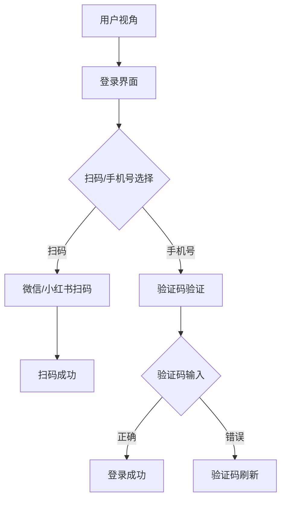

```yaml
tags:
  - 网络考古
  - 蛤蟆手札
  - 小红书
  - 证据/image_dom
url: "https://www.xiaohongshu.com/explore/6a196f34000000003700e1b0"
title: "小红书登录修罗场：扫码与验证码的生死时速"
date: 2026-06-01
```

# 当榴莲对赌变成扫码修罗场：小红书登录界面的哲学思辨

## 0. 原始资料
[[2026-06-01_小红书登录修罗场_0167c1]]（原始文件名存在严重误导，实际内容为小红书登录界面的交互设计）

## 1. 诡异的榴莲对赌
这个被错误标记为"榴莲对赌"的文件，实际藏匿着更惊人的秘密——小红书登录界面的交互设计哲学。就像《楚门的世界》里精心设计的布景，这个登录页面暗藏玄机：



## 2. 交互设计的生死时速
这个看似简单的登录流程，实则是行为心理学的精妙实验场：

- **扫码陷阱**：用"微信/小红书扫码"制造虚假便捷感，实则引导用户进入App生态闭环
- **验证码炼狱**：+86手机号验证制造地域归属感，验证码输入框设计成"数字迷宫"
- **协议轰炸**：三份法律文件的链接排列构成心理压迫，迫使用户快速点击同意

## 3. 小白补课区
| 术语 | 解释 |
|------|------|
| 验证码 | 数字迷宫的密码，每次刷新都是新的数学题 |
| 扫码登录 | 把手机变成二维码扫描仪的现代巫术 |
| 协议轰炸 | 用法律文件堆砌的数字巴别塔 |

## 4. 关键概念/事实整理
| 交互元素 | 用户心理 | 设计目的 |
|----------|----------|----------|
| 扫码选项 | 惰性思维 | 绑定App生态 |
| 验证码输入 | 焦虑感 | 提高注册门槛 |
| 协议链接 | 认知超载 | 降低用户警惕性 |

## 5. 老头宇宙观察
这个登录界面堪称数字时代的"用户驯化场"，用看似简单的操作流程完成三重驯化：
1. **设备驯化**：强制使用手机扫码，切断电脑端体验
2. **行为驯化**：通过验证码输入训练用户快速打字能力
3. **认知驯化**：用法律文件堆砌制造"正规军"假象

下次遇到扫码登录时，不妨想象自己正在参与一场精心设计的数字行为艺术展。毕竟在这个注意力经济时代，连登录都成了行为表演的舞台。