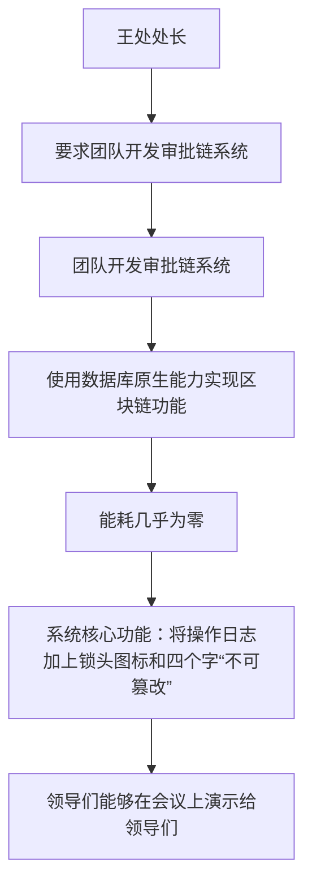
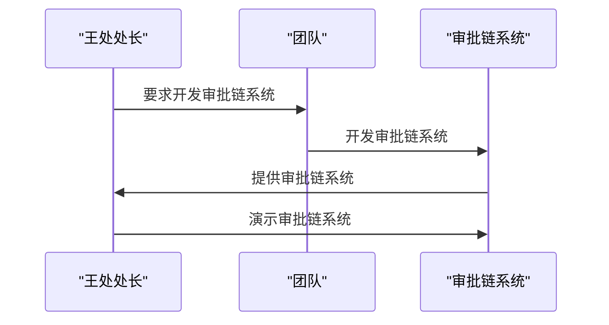

---
tags:
  - 稍后阅读
  - 蛤蟆手札
  - 抖音
  - 证据/rich_dom
url: "https://www.douyin.com/video/7646082737879902705"
title: "王处六一职场奇谈"
date: 2026-06-01
---

# 王处六一职场奇谈：如何用审批链技术让领导们爱不释手

## 0. 原始资料

本地证据：[[2026-06-01_王处六一职场奇谈_b7d42a]]

## 1. 背景

在职场中，领导们经常会要求我们做一些让他们爱不释手的事情。王处六一职场奇谈中，王处处长要求他的团队在两周内开发出一个基于区块链技术的审批链系统，让他能够在会议上演示给领导们。

## 2. 解决方案

王处的团队花了两周时间开发出了一个审批链系统。这个系统使用了数据库原生能力来实现区块链的功能，能耗几乎为零。系统的核心功能是将操作日志加上一个锁头图标和四个字“不可篡改”，使得领导们能够在会议上演示给领导们。

## 3. 小白补课区

### 什么是区块链？

区块链是一种分布式数据库技术，能够记录和验证数据的完整性和可靠性。

### 什么是审批链？

审批链是一种基于区块链技术的审批系统，能够记录和验证审批流程的完整性和可靠性。

### 什么是锁头图标？

锁头图标是一种图标，表示数据的不可篡改性。

## 4. 关键概念/事实整理

| 项 | 描述 |
| --- | --- |
| 区块链 | 分布式数据库技术，记录和验证数据的完整性和可靠性 |
| 审批链 | 基于区块链技术的审批系统，记录和验证审批流程的完整性和可靠性 |
| 锁头图标 | 表示数据的不可篡改性 |

## 5. 结论

王处六一职场奇谈中，王处的团队开发出了一个基于区块链技术的审批链系统，让领导们能够在会议上演示给领导们。这个系统使用了数据库原生能力来实现区块链的功能，能耗几乎为零。系统的核心功能是将操作日志加上一个锁头图标和四个字“不可篡改”，使得领导们能够在会议上演示给领导们。

