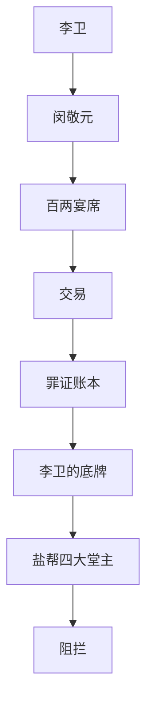
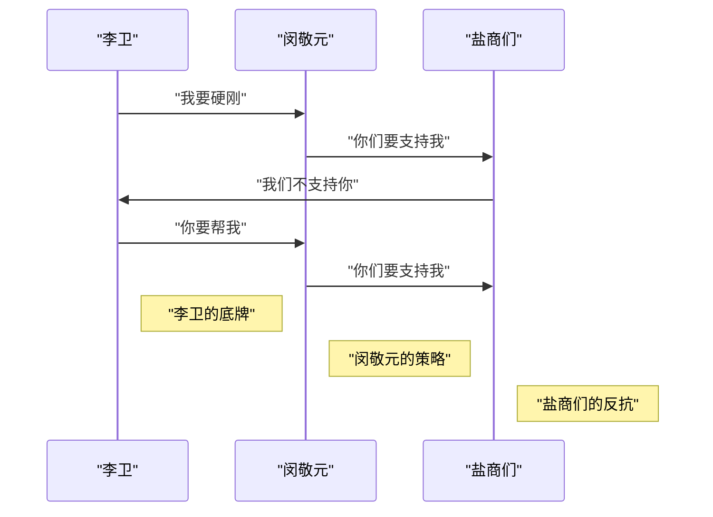

---
tags:
  - 稍后阅读
  - 蛤蟆手札
  - 抖音
  - 历史深度解读
  - 清朝官场
  - 权谋术
  - 清朝历史
  - 官场权谋
  - 盐商文化
  - 李卫
  - 证据/toc_metadata
url: "https://www.douyin.com/video/7643086768098561295"
title: "盐宴迷局：一场百两宴席的功绩暗战"
date: 2026-05-30
---

## 0. 原始资料
本地证据：[[2026-05-30_盐宴迷局：一场百两宴席的功绩暗战_553012]]

## 1. 盐宴迷局：一场百两宴席的功绩暗战

在清朝官场中，权谋术和权力游戏是常见的现象。李卫和闵敬元的故事就是其中一个典型的例子。李卫是一位出身市井的官员，他被任命为扬州盐道御史。他的任务是征收盐税，但他却遇到了强大的盐商们的反抗。

## 2. 李卫的困境

李卫面临着一个艰难的选择。他可以选择妥协，降低盐税的征收量，但这会让他失去权力和声誉。或者，他可以选择硬刚，坚持征收原定的盐税，但这会让他面临着强大的反抗和压力。

## 3. 闵敬元的策略

闵敬元是一位经验丰富的官员，他知道如何利用权力和权谋术来达到自己的目的。他策划了一场百两宴席，邀请李卫和盐商们参加。这个宴席本质上是一种交易，闵敬元希望通过这个宴席来换取李卫的支持和合作。

## 4. 李卫的反应

李卫在宴席上表现出了一种淡然的态度，他知道自己手里有一个底牌，那就是盐帮老帮主手里那份记录着所有贪腐罪证的账本。李卫决定利用这个底牌来换取自己的利益。

## 5. 结局

李卫和闵敬元的故事以一种意想不到的结局结束。李卫通过摇骰子赢得了罪证账本，但却被盐帮四大堂主阻拦。这个结局表明了李卫和闵敬元之间的权力游戏和权谋术。

### 小白补课区

*   清朝官场的权谋术和权力游戏
*   李卫和闵敬元的故事
*   盐商们的反抗和压力
*   李卫的困境和选择
*   闵敬元的策略和交易

### 关键概念/事实整理

| 项 | 内容 |
| --- | --- |
| 李卫 | 出身市井的官员，扬州盐道御史 |
| 闵敬元 | 经验丰富的官员，策划了百两宴席 |
| 盐商们 | 强大的反抗和压力 |
| 罪证账本 | 盐帮老帮主手里那份记录着所有贪腐罪证的账本 |
| 权谋术 | 清朝官场中常见的现象 |
| 权力游戏 | 李卫和闵敬元之间的权力游戏和权谋术 |

### Mermaid 语法绘制图表

