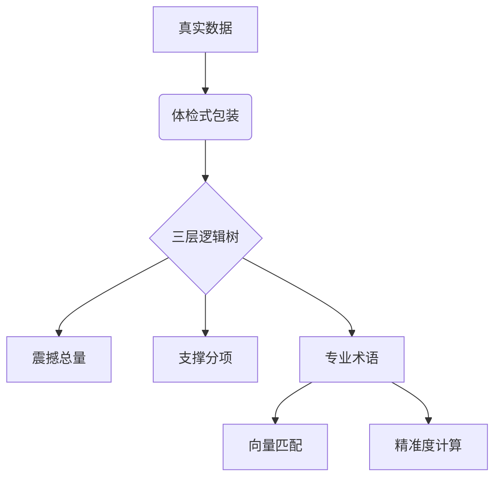
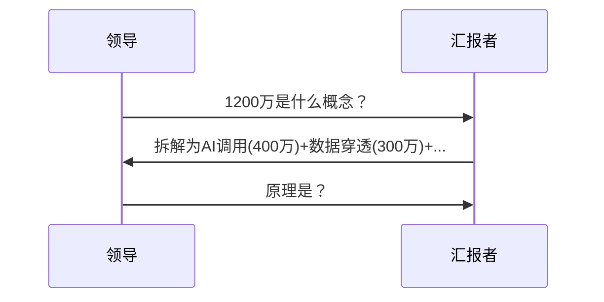
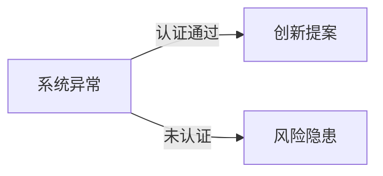
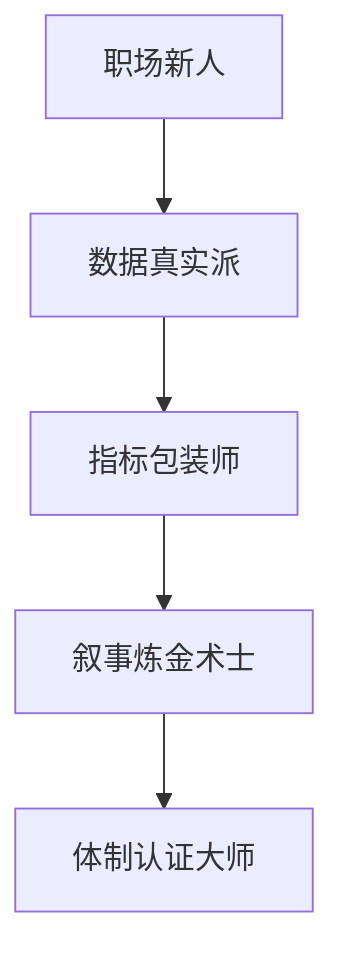

---
tags:
  - 职场心法
  - 向上管理
  - 数据叙事
  - 老头宇宙
url: "https://v.douyin.com/O2OLyICORs4/"
title: "职场蛤蟆祥的三层汇报心法：从三十条数据到百万级大屏"
date: 2026-06-18
---

# 🐸 职场蛤蟆祥的三层汇报心法：从三十条数据到百万级大屏

## 📜 0. 原始资料
本地证据：[[2026-06-18_逐层收口汇报心法_1ccd6d]]

## 🧠 1. 汇报心法的底层逻辑
蛤蟆祥在《职场心法》中揭示的"三层收口"理论，本质是**职场叙事炼金术**。就像把一锅寡淡的白粥，通过添加香菇、瑶柱、火腿，变成价值千金的佛跳墙。



## 🧩 2. 三层收口实战指南

### 🎯 第一层：制造惊叹
> "王处，我们系统日均处理1200万条数据！"

- **心法**：用系统日志噪音（页面加载、安全日志等）构建"数据瀑布"
- **案例**：将6万真实请求×200倍，生成1200万"有效数据"
- **道具**：实时跳动数据大屏（建议使用ECharts制作动态地图）

### 🧩 第二层：构建理解
> "这1200万包含AI调用、数据穿透等核心模块"



### 🔒 第三层：专业收口
> "具体采用向量匹配算法，精准度达98.7%"

- **术语武器库**：语义分析、知识图谱、分布式存储
- **安全距离**：在领导说"继续"后立即停止，避免进入审计层

## 🧪 3. Bug变勋章的辩证法


**认证路径**：
1. 被领导表扬的异常（如Redis卡顿）
2. 会议记录中的"创新实践"（如GBK/UTF-8混存）
3. 已形成文档的解决方案（如视频转码失败）

## 🛠️ 4. 实战工具箱

### 📊 数据包装器
```python
def data_enhancer(real_data):
    # 添加系统噪音
    noise = real_data * 200
    # 构建三层结构
    total = noise + random.randint(1,100)
    core_metrics = {
        "AI调用": total * 0.33,
        "数据穿透": total * 0.25,
        "安全校验": total * 0.15
    }
    return {
        "总量": total,
        "分项": core_metrics,
        "术语": ["向量匹配", "语义分析"]
    }
```

### 🖥️ 大屏制作指南
1. 使用ECharts制作全国辐射地图
2. 添加实时跳动的"心跳曲线"
3. 设置3个AI创新指标展示区

## 📚 5. 职场生存法则
> "真正的信息化，有时不在代码里，在汇报PPT中"

- **认知转换**：指标≠事实，是精心设计的"最佳状态"
- **视觉心法**：用大屏地图替代真实业务范围
- **时间管理**：永远比Deadline提前24小时完成

## 🧭 6. 修行地图


蛤蟆祥已沉入数据池继续参悟：如何把三十条真实业务数据，炼成百万级数字化丰碑？（呱~🐟）