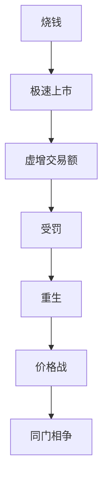

---
tags:
  - 商业案例
  - 瑞幸咖啡
  - 资本运作
  - 蛤蟆手札
  - 抖音
  - 证据/asr_full
url: "https://www.douyin.com/video/7648197704526466313"
title: "瑞幸翻盘记"
date: 2026-06-07
---

# 瑞幸翻盘记：从烧钱到涅槃重生

## 0. 原始资料

本地证据：[[2026-06-07_瑞幸翻盘记_3adb6d]]

## 1. 传说中的“烧钱”之道

瑞幸咖啡的创始人陆正耀，曾经是租车行的老板，他利用资本的力量，烧钱往死里烧，首杯免费买二送一，拉一个新用户，还能再送你一杯。这种策略，让瑞幸在短短一年内，开到了2073家店，创下了18个月极速上市的纪录。

## 2. “破戒受罚”之劫

然而，瑞幸的“烧钱”之道，并没有带来长久的成功。公司因虚增22亿交易额遭浑水做空，公司受罚、高管出局、市值崩塌、被迫退市。这是“过度依赖资本催熟，忽视商业本质”所致之天劫，险些形神俱灭。

## 3. “涅槃重生”之术

关键在于“产品力”与“运营力”的双修。瑞幸通过推出“生椰拿铁”等爆款产品，引爆市场，同时调整运营，实现万店规模的健康增长，方得浴火重生。

## 4. “同门相争”之局

原班底另立“库迪咖啡”，像素级复刻瑞幸早年打法，发起惨烈价格战。当前两方缠斗，反而让道友们（消费者）坐享了“9块9”的咖啡福利。此局仍在演化中。

## 5. 蛤蟆的总评

此故事堪称一部活生生的“商业修仙”警示录。仙尊可悟得：“资本可助你一日千里，产品与运营方是护体金身。而‘诚信’二字，更是修仙路上最为珍贵的灵根。”



## 3. 小白补课区

### 1. 什么是“烧钱”之道？

“烧钱”之道是指通过大量的资金投入，来快速扩张业务，达到极速上市的目的。

### 2. 为什么“烧钱”之道会失败？

“烧钱”之道会失败，因为它忽视了商业本质，过度依赖资本催熟，导致公司的长期发展受到了影响。

### 3. 什么是“涅槃重生”之术？

“涅槃重生”之术是指通过产品力与运营力的双修，来实现公司的浴火重生。

## 4. 关键概念/事实整理

| 项 | 内容 |
| --- | --- |
| 瑞幸咖啡 | 2018年1月在北京正式亮相 |
| 废除加盟费 | 2022年开始 |
| 废除装修补贴 | 2022年开始 |
| 废除设备补贴 | 2022年开始 |
| 废除亏损承担 | 2022年开始 |
| 废除总部扛 | 2022年开始 |

```markdown
| 项 | 内容 |
| --- | --- |
| 瑞幸咖啡 | 2018年1月在北京正式亮相 |
| 废除加盟费 | 2022年开始 |
| 废除装修补贴 | 2022年开始 |
| 废除设备补贴 | 2022年开始 |
| 废除亏损承担 | 2022年开始 |
| 废除总部扛 | 2022年开始 |
```