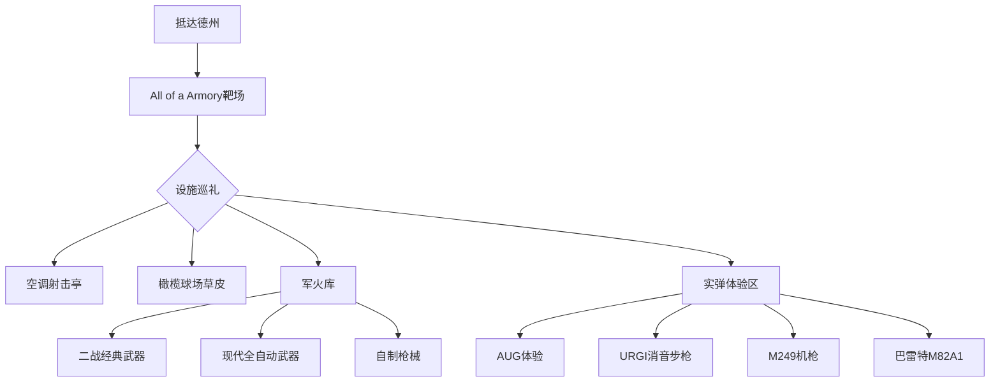
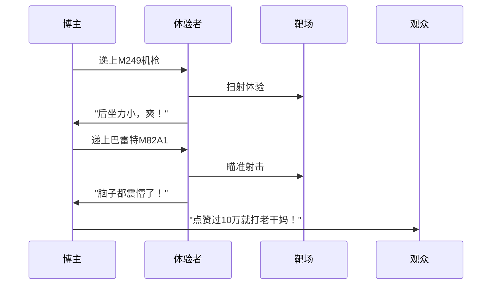
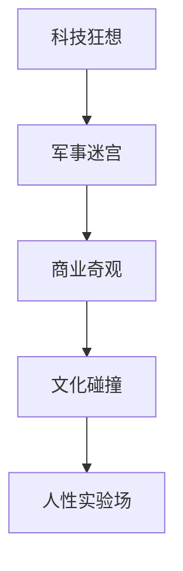

---
tags:
  - 博物志
  - 美国探店
  - 枪械文化
  - 硬核体验
  - 社会与商业
url: "https://www.bilibili.com/video/BV1Y2LE6mEQw/?spm_id_from=333.1007.tianma.1-2-2.click&vd_source=abcbd618d643306f1befd240be64b31c"
title: "德州华人靶场大冒险：2200万人民币的枪械帝国揭秘"
date: 2026-05-30
---
---

# 🚨 德州华人靶场大冒险：2200万人民币的枪械帝国揭秘

## 🧾 0. 原始资料
本地证据：[[2026-05-30_德州华人靶场探秘手记_3802ae]]

## 🧠 1. 硬核体验地图


## 🔫 2. 枪械体验速写


## 📚 3. 小白补课区
### 德州持枪三定律
| 法规类型 | 具体规定 | 特殊说明 |
|---------|---------|---------|
| 自动武器 | 1986年前注册合法转让 | 海豹突击队用枪需追溯历史 |
| 民用枪械 | 无需背景调查 | 但需遵守州级规定 |
| 靶场运营 | 需持生产执照 | 自制枪械有严格限制 |

### 枪械体验红黑榜
| 枪械型号 | 体验指数 | 黑点预警 |
|---------|---------|---------|
| AUG | ⭐⭐⭐⭐ | 扳机重、人机功效差 |
| URGI | ⭐⭐⭐ | 气吹式废气吸入 |
| M249 | ⭐⭐⭐⭐⭐ | 后坐力小，扫射爽 |
| 巴雷特M82A1 | ⭐⭐⭐ | 脑震荡级后坐力 |

## 🧰 4. 实操指南
### 枪械体验三步曲
1. **装备检查**  
   - 确认枪械保险状态
   - 检查弹夹装填情况
   - 戴好耳部保护装备

2. **射击流程**  
   ```mermaid
   graph LR
   A[拉栓上膛] --> B[瞄准靶心]
   B --> C[扣动扳机]
   C --> D[退弹检查]
   ```

3. **安全守则**  
   - 永远确认枪口指向安全方向
   - 未射击时保持手指在扳机护圈外
   - 严禁对移动物体射击

## 📌 5. 彩蛋时刻
博主老李的终极承诺：


## 🧩 6. 末法时代的狂悖烟火气
当2200万人民币的枪械帝国遇上德州的烈日，这场硬核体验就像：

从空调射击亭到橄榄球场草皮，从二战经典到现代重武器，这个华人靶场既是枪械爱好者的天堂，也是观察美国社会的棱镜。下次若想体验这种"反差爽感"，不妨在国内寻找合规射击馆，但记得——安全永远是第一位的！