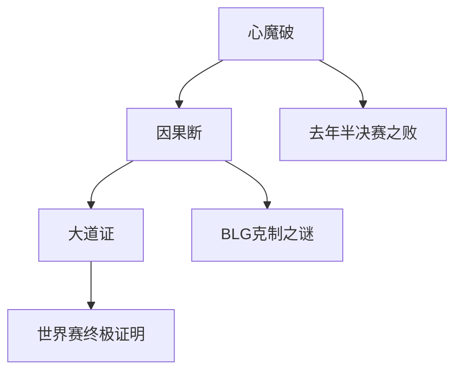
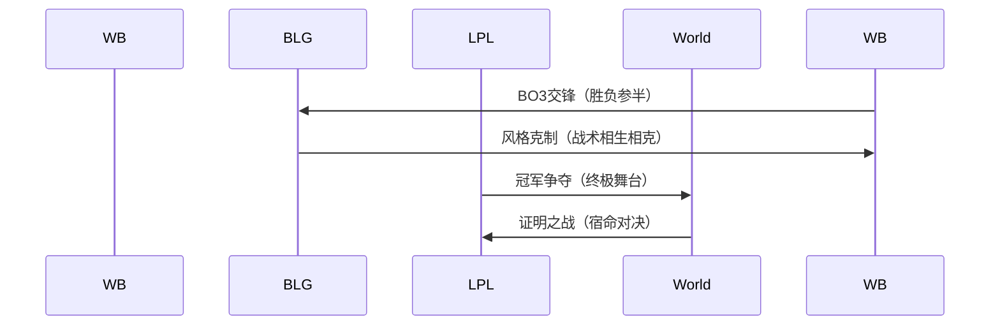

---
tags:
  - 电竞心法
  - S赛前瞻
  - 战队博弈
  - 电子竞技
  - LPL战队
url: "https://www.bilibili.com/video/BV1xx411c7m9/"
title: "电竞江湖风云录：S赛前的战队心魔与宿敌因果"
date: 2026-05-31
---

# 🎮 电竞江湖风云录：S赛前的战队心魔与宿敌因果

呱呱！各位少侠且看——这可不是什么武侠秘籍，而是电子竞技版的《葵花宝典》！今天咱们要拆解的，是LPL赛区战队在S赛前的"修心录"，看看这些电竞修士们如何破心魔、断因果、证大道！

---

## 🧠 0. 原始资料
[[2026-05-31_电竞江湖风云录_S赛前的战队心魔与宿敌因果_cb5b56]]

---

## 🧩 1. 电竞江湖三大心法

### 心法一：斩心魔
> "去年半决赛之败，已成心魔"  
就像武侠小说里被点中穴道，这些战队正经历着"心魔劫"。选手们反复回放那些操作画面，就像温书生反复温习《葵花宝典》的残页，既要记住教训，又不能被心魔反噬。

### 心法二：辨因果
> "对手风格相克，吃过许多苦头"  
这就像《天龙八部》里少林与逍遥派的克制关系。Weibo战队与BLG的恩怨，堪比金庸笔下的门派相克，每次交手都像在解一道《九阴真经》的谜题。

### 心法三：证大道
> "让LPL的欢呼声响彻伦敦"  
这不仅是夺冠，更是要像张无忌在光明顶大会那样，用实力证明LPL赛区的统治力。每个选手都渴望在世界赛的"武林大会"上，证明自己是真正的"天下第一"。

---

## 🧪 2. 战队博弈沙盘推演

---

## 📘 3. 小白补课区

| 术语 | 白话解释 |
|------|----------|
| S赛 | 电子竞技界的"武林大会"，全球战队终极对决 |
| LPL | 中国赛区的"少林武当"，培养顶尖战队的摇篮 |
| BLG | "北境狼盟"，以凶悍打法著称的战队 |
| 心魔 | 选手心中挥之不去的失败阴影 |
| 因果 | 战队间战术克制的宿命纠缠 |

---

## 📚 4. 关键概念/事实整理

| 战队 | 心魔 | 因果 | 目标 |
|------|------|------|------|
| Weibo | 去年半决赛失利 | BLG克制 | 世界赛夺冠 |
| BLG | LPL内战失利 | Weibo克制 | 证明最强 |
| LPL | 未获世界赛冠军 | 区域竞争 | 区域荣耀 |

---

## 🧙‍♂️ 5. 修心心得

1. **破心魔三式**：  
   - 回忆杀：反复观看失败录像  
   - 模拟战：针对性训练破局  
   - 心魔转化：把遗憾变成动力

2. **断因果四法**：  
   - 战术解构：拆解对手核心打法  
   - 阵容调整：针对克制选手  
   - 心态管理：保持"无招胜有招"  
   - 资源整合：教练组情报分析

3. **证大道五境**：  
   - 国内称王 → 区域争锋 → 世界舞台 → 宿命对决 → 传奇永存

---

## 🧩 6. 修行建议

1. 建议收藏原视频，观察选手们如何演绎"侠客行"
2. 重点关注Weibo与BLG的战术博弈，就像看《倚天屠龙记》里的门派对决
3. 在"丹炉间