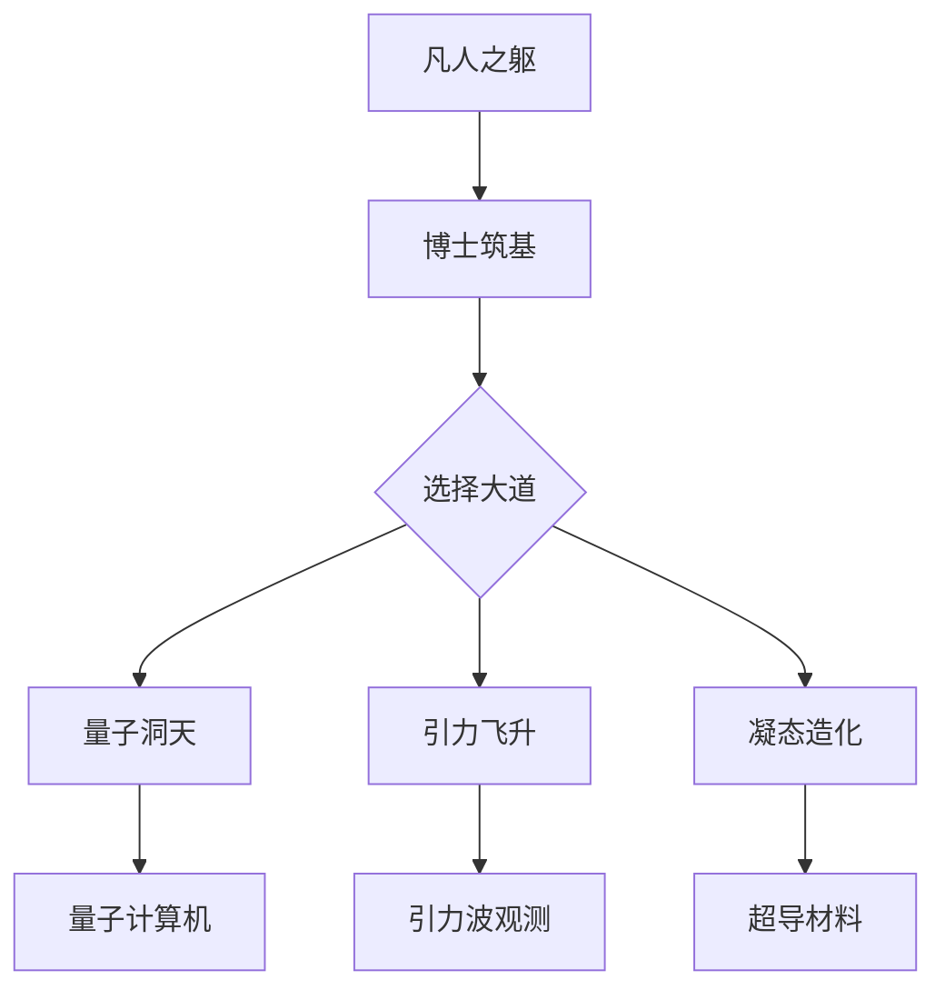
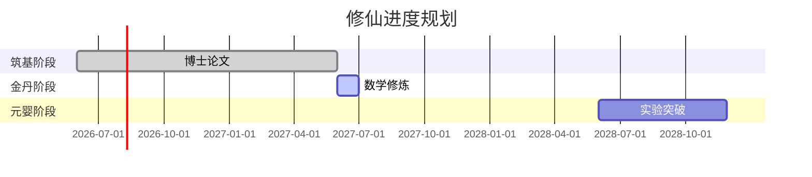

---
tags:
  - 诺贝尔奖
  - 物理学修仙
  - 科研路径
  - 游戏隐喻
url: "https://www.bilibili.com/video/BV11FRqBJEZG/"
title: "诺奖物理学修仙指南：从博士筑基到引力波飞升的三重天"
date: 2026-06-01
---

# 诺奖物理学修仙指南：从博士筑基到引力波飞升的三重天

（呱！本蛤蟆发现仙尊在B站刷到"赛博炼丹术"，特来整理这份《诺奖物理学修仙心法》！）

## 🐸 蛤蟆祥的修仙手札

### 🔮 修仙三重境界


### 📜 修仙必备法器
| 修仙境界 | 必备法器 | 修炼要点 |
|----------|----------|----------|
| 筑基期   | 博士文凭 | 数理基础修炼 |
| 金丹期   | 数学功法 | 微分几何/张量分析 |
| 元婴期   | 计算机 | Python/Matlab |
| 化神期   | 实验设备 | 激光干涉仪/粒子加速器 |

### 🧪 修仙心法口诀
> **"道基天定先筑基，大道三千择其一，数学为引勤修炼，量子引力凝态齐。"**

## 🧠 小白补课区

### 量子洞天
量子计算通过量子比特叠加态实现并行计算，就像《我的世界》中同时操控多个平行宇宙。当前热门方向包括：
- 量子霸权实验
- 量子纠错编码
- 量子算法优化

### 引力飞升
引力波探测如同宇宙心跳监测仪：
```sequence
探测器 --> 激光干涉: 发射激光
激光干涉 --> 镜面: 反射激光
镜面 --> 数据分析: 计算干涉图谱
数据分析 --> 发现: 捕捉时空涟漪
```

### 凝态造化
凝聚态物理的终极目标是实现：
- 零电阻超导体
- 室温量子态
- 拓扑绝缘体

## 📚 修仙资源推荐

### 入门典籍
| 修仙方向 | 推荐典籍 | 修炼难度 |
|----------|----------|----------|
| 量子计算 | 《量子计算讲义》 | ⭐⭐⭐⭐ |
| 引力物理 | 《时空几何》 | ⭐⭐⭐⭐⭐ |
| 凝聚态 | 《固体物理导论》 | ⭐⭐⭐ |

### 修炼场所
- **筑基场所**：高校物理系
- **金丹炉**：国家重点实验室
- **元婴池**：国际期刊（Nature/Science）

## 🧾 修仙进度表



## 0. 原始卷轴
[[2026-06-01_诺奖物理学修仙指南_77ec4c]]