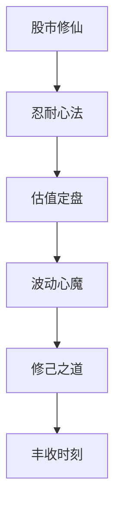
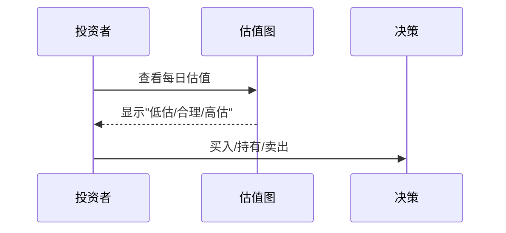

---
tags:
  - 投资心法
  - 蛤蟆手札
  - B站
  - 证据/transcript
url: "https://www.bilibili.com/video/BV1aQVQ6iEts/"
title: "股市修仙传：如何熬过95%的垃圾时间，抓住5%的高光时刻？"
date: 2026-06-01
---

# 股市修仙传：如何熬过95%的垃圾时间，抓住5%的高光时刻？

## 0. 原始资料
本地证据：[[2026-06-01_股市修仙传熬过95垃圾时间抓住5高光时刻_bb3261]]

## 1. 修仙者必看的股市心法
蛤蟆道友在池畔参悟的这段"股市修仙传"，堪称现代版《道德经》。让我们用修仙视角解构这段投资心法：

### 2. 九阳真经：五大心法口诀
#### 忍耐心法（95%的垃圾时间）
> "股市不奖赏跑得最快的人，只奖赏最后仍在战场的人"

- **案例**：上证指数从2600点反弹至3000点仅用6天，但下跌过程却折磨了3个月
- **心法**：像修仙者筑基一样，熬过漫长的"垃圾时辰"

#### 估值定盘（价值罗盘）
> "用股息率当罗盘，7%的分红比牛市更实在"

#### 波动心魔（市场考验）
> "每次下跌都是市场在为下一次上涨铺路"

- **心魔表现**：看到2600点时恐慌割肉，错过3000点反弹
- **破魔心法**：把波动当作修仙路上的"心魔劫"

#### 修己之道（战胜自我）
> "投资的本质是修己，不是斗法"

- **心魔清单**：
  - FOMO（错失恐惧）
  - 捕风捉影
  - 情绪化操作
- **破魔心法**：建立投资纪律，像修仙者守戒一样

#### 丰收时刻（5%的高光）
> "短暂的丰收，是漫长修行的奖赏"

- **丰收案例**：白酒行业5天暴涨40%，验证价值投资逻辑
- **心法**：丰收时保持清醒，避免"乐极生悲"

## 3. 小白补课区
### 什么是"垃圾时间"？
- 股市95%的时间处于震荡/下跌状态
- 投资者容易在此阶段失去信心
- 比如：2023年A股3个月持续下跌

### 什么是"高光时刻"？
- 股市5%的上涨时间
- 常常在长期下跌后突然爆发
- 案例：2023年6月白酒行业暴涨

## 4. 关键概念整理
| 心法 | 修炼要点 | 修仙类比 |
|------|----------|----------|
| 忍耐 | 熬过95%垃圾时间 | 筑基期 |
| 估值 | 用股息率定盘 | 炼气诀 |
| 波动 | 把下跌当考验 | 心魔劫 |
| 修己 | 战胜情绪波动 | 守戒 |
| 丰收 | 抓住5%上涨 | 金丹期 |

## 5. 修行任务清单
- [ ] 查看每日估值图（公众号/APP）
- [ ] 建立"投资忍耐日志"
- [ ] 模拟3个月"垃圾时间"投资
- [ ] 制作"心魔记录表"
- [ ] 每月复盘投资决策

> 🐸蛤蟆道友温馨提示：股市修仙，贵在坚持。记住，真正的金丹不是暴涨，而是熬过漫长寒冬后的顿悟。