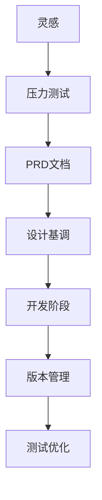
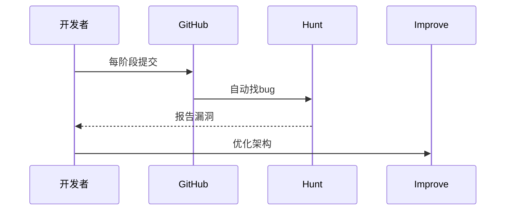

# 程序员的极简工作流秘籍：从灵感到产品的武功心法

## 0. 原始资料
[[2026-06-07_vibecoding工作流秘籍_e280f3]]

## 1. 为什么你的代码像玩具？
想象你是个厨子，别人用米其林三星的流程做菜，你却直接把食材往锅里一扔。这就是为什么你的web项目像玩具，而大佬的作品能变成成熟产品——差在**工作流**！

## 2. 四步成神心法
### 第一式：给想法做体检（Star Pressure Test）
别急着写代码！先用AI给你的创意做"CT扫描"。就像医生给病人做压力测试，AI能发现你没意识到的漏洞。比如：
- 用户真的需要这个功能吗？
- 有没有更简单的实现方式？
- 后续维护会不会变成噩梦？

### 第二式：PRD文档炼金术
用Cloud的Plan Mode把想法变成"产品说明书"。就像给建筑画施工图，AI能帮你：
- 拆解功能模块
- 设计用户流程
- 预判技术难点

### 第三式：设计基调定乾坤
别让产品"裸奔"！用Design工具给它穿上衣服：
1. 颜色搭配：像给角色选皮肤
2. 页面布局：像编排舞台布景
3. 交互设计：像设计舞蹈动作

### 第四式：开发阶段的武功秘籍

## 3. 小白补课区
| 术语 | 生活化解释 |
|------|------------|
| PRD | 产品说明书，像菜谱一样详细 |
| TDD | 先写测试用例再写代码，像先画靶子再射箭 |
| Git | 时间机器，能回滚到任何开发阶段 |
| CI/CD | 自动化流水线，像自动售货机一样稳定 |

## 4. 关键概念/事实整理
| 步骤 | 工具/方法 | 作用 |
|------|-----------|------|
| 灵感阶段 | Star Pressure Test | 筛选优质创意 |
| 文档阶段 | Cloud Plan Mode | 生成PRD |
| 设计阶段 | Design工具 | 确定产品基调 |
| 开发阶段 | GitHub + Hunt | 版本管理和测试 |
| 优化阶段 | Improve | 架构重构 |

## 5. 彩蛋：大佬的隐藏心法
- **代码洁癖**：像整理房间一样维护代码
- **文档优先**：写文档比写代码更早开始
- **测试先行**：用测试驱动开发，确保每个功能都经得起考验

下次写代码前，先问自己：我是想做玩具还是造火箭？选择正确的武功心法，让你的代码从"玩具"进化成"神器"！🚀