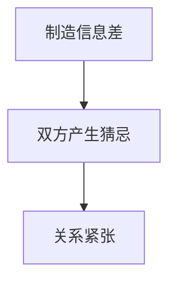
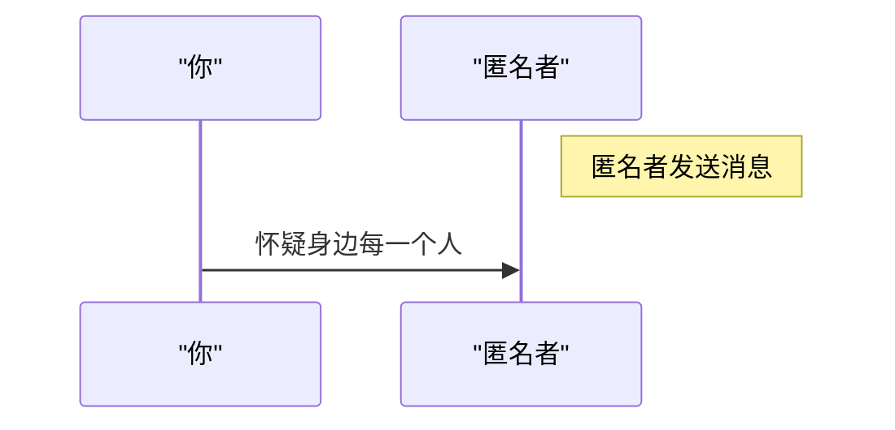
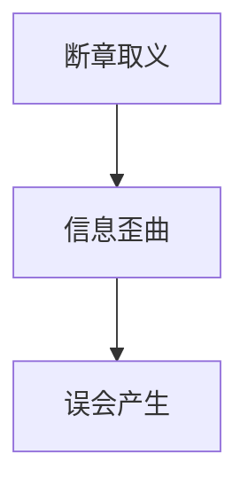
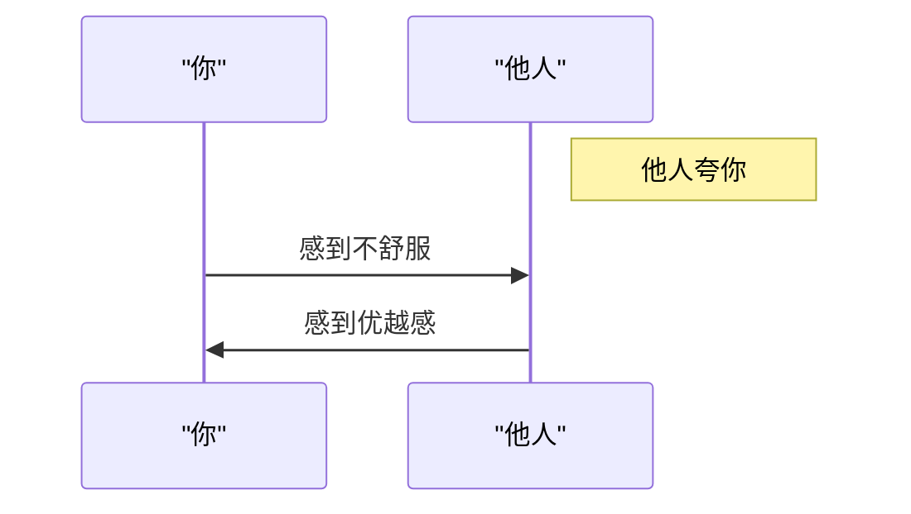
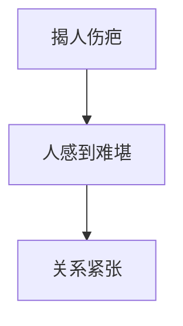
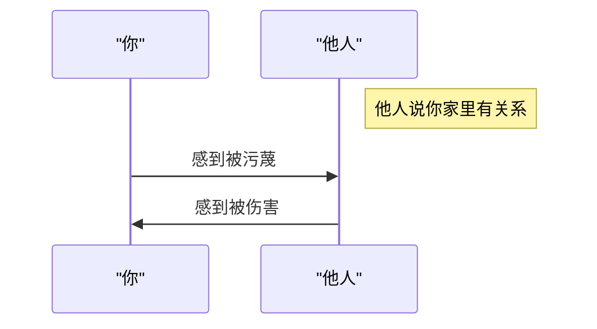
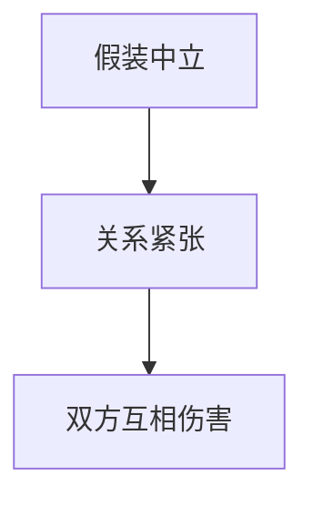
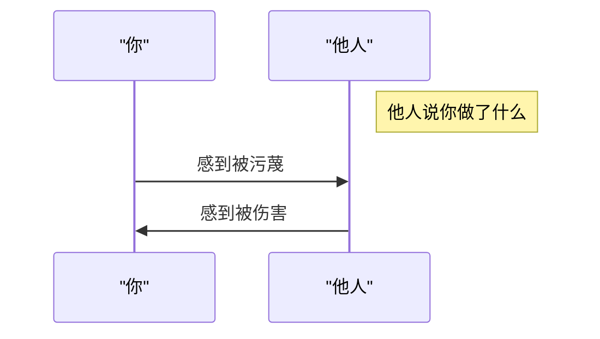
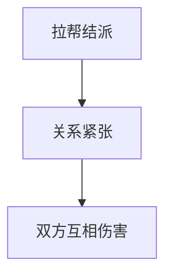

---
tags:
  - 稍后阅读
  - 蛤蟆手札
  - 抖音
  - 证据/asr_full
url: "https://www.douyin.com/video/7647019353644223785"
title: "识别挑拨离间的九种套路"
date: 2026-06-07
灵气浓度: "温和警醒"
分流方向: "思辨录（认知与方法）"
证据等级: "asr_full"
---

# 识别挑拨离间的九种套路：如何避免被他人操纵

在生活中，我们常常会遇到一些挑拨离间的行为，这些行为可能会让我们感到困惑和痛苦。然而，了解这些挑拨离间的套路，可以帮助我们避免被他人操纵。

## 0. 原始资料

* 本地证据：[[2026-06-07_识别挑拨离间的九种套路_e62091]]

## 1. 制造信息差

制造信息差是挑拨离间的一种常见手段。它涉及到制造信息不透明，导致双方之间产生猜忌。例如，班长可能会对你说“你说你有事不去参加活动”，而你可能会对班长说“班长不尊重我”。这种情况下，信息不透明会导致双方之间产生猜忌。

### 图表

## 2. 匿名暗示

匿名暗示是一种挑拨离间的方法，涉及到在你面前暗示某些信息，而不留下任何痕迹。例如，你可能会收到一条陌生消息，听说有人在背后说你和班长关系不正常。这种情况下，你会怀疑身边每一个人。

### 图表

## 3. 断章取义

断章取义是一种挑拨离间的方法，涉及到从信息中截取某些片段，而不考虑前因后果。例如，某人可能会说“你说开会完全是浪费时间”，而不考虑前面的背景信息。这种情况下，信息会被歪曲，导致误会产生。

### 图表

## 4. 一踩一捧

一踩一捧是一种挑拨离间的方法，涉及到在你面前夸某人，在某人面前夸你。这种情况下，关系会变得紧张，双方会互相疏远。

### 图表

## 5. 揭人伤疤

揭人伤疤是一种挑拨离间的方法，涉及到在公开场合提及某人的痛处或失败。这种情况下，人会感到难堪，关系会变得紧张。

### 图表

## 6. 放大利益

放大利益是一种挑拨离间的方法，涉及到将公平竞争扭曲为“抄袭”或“内定”。这种情况下，利益冲突会被放大，导致误会产生。

### 图表

## 7. 假装中立

假装中立是一种挑拨离间的方法，涉及到表面上劝和，私下却添油加醋，煽风点火。这种情况下，关系会变得紧张，双方会互相伤害。

### 图表

## 8. 嫁祸无痕

嫁祸无痕是一种挑拨离间的方法，涉及到事故发生时，将责任转移给他人。这种情况下，责任会被歪曲，导致误会产生。

### 图表

## 9. 拉帮结派

拉帮结派是一种挑拨离间的方法，涉及到先给你扣上“我们讨厌他”的帽子，让你加入小圈子，最终被孤立。这种情况下，关系会变得紧张，双方会互相伤害。

### 图表

## 3. 小白补课区

挑拨离间的套路通常涉及到制造信息差、匿名暗示、断章取义、等等。这些套路可以让我们感到困惑和痛苦，但是了解它们可以帮助我们避免被他人操纵。

## 4. 关键概念/事实整理

| 套路 | 描述 |
| --- | --- |
| 制造信息差 |制造信息不透明，导致双方之间产生猜忌 |
| 匿名暗示 |在你面前暗示某些信息，而不留下任何痕迹 |
| 断章取义 |从信息中截取某些片段，而不考虑前因后果 |
| 一踩一捧 |在你面前夸某人，在某人面前夸你 |
| 揭人伤疤 |在公开场合提及某人的痛处或失败 |
| 放大利益 |将公平竞争扭曲为“抄袭”或“内定” |
| 假装中立 |表面上劝和，私下却添油加醋，煽风点火 |
| 嫁祸无痕 |事故发生时，将责任转移给他人 |
| 拉帮结派 |先给你扣上“我们讨厌他”的帽子，让你加入小圈子，最终被孤立 |

## 🎯 下一步修行功课

制作个人防套路口径清单