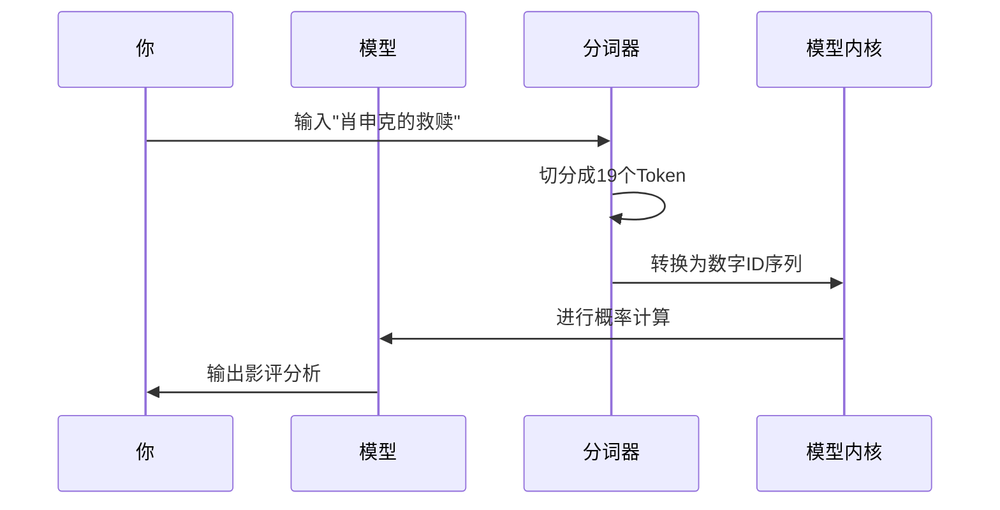
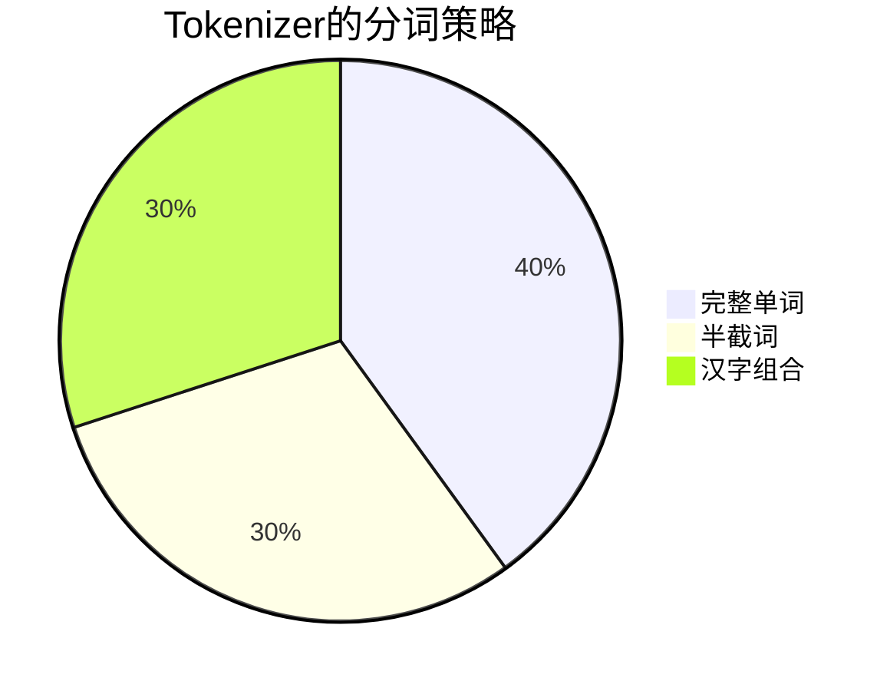
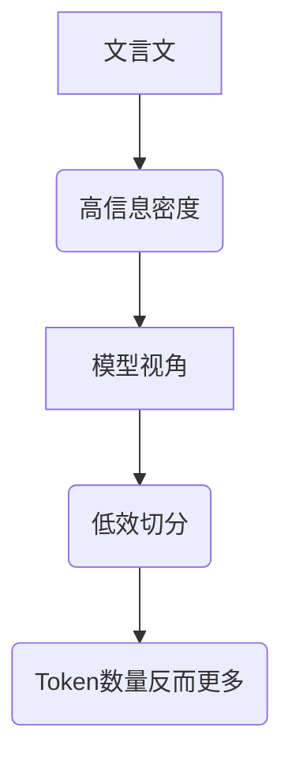
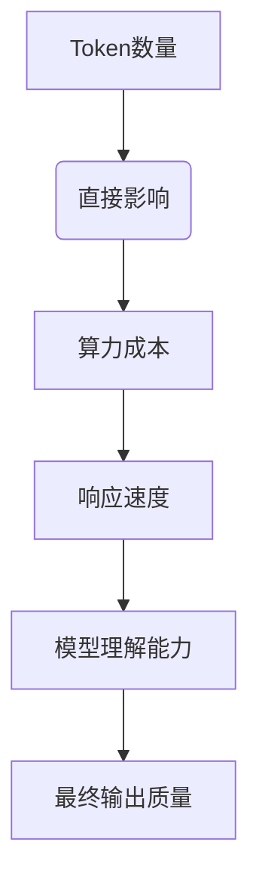

---
tags:
  - AI吃字怪
  - Token玄学
  - B站视频解析
  - 模型算力
  - 语言处理
url: "https://www.bilibili.com/video/BV1zU5X6nE8i"
title: "AI吃字怪：文言文反而喂不饱它？Token的玄学世界揭秘"
date: 2026-06-01
---

# AI吃字怪：文言文反而喂不饱它？Token的玄学世界揭秘

## 0. 原始资料
[[2026-06-01_字更少反而更费token的Token玄学_abc7fb]]

## 1. 你见过这样的AI吗？


## 2. Token的诡异特性
### 2.1 字少≠Token少
```mermaid
graph TD
    A[文言文"据此文而对"] --> B(被切分成7个Token)
    C[白话文"根据以上内容回答"] --> D(被切分成5个Token)
```

### 2.2 语言的Token饥荒
| 语言类型 | 相同字符数 | Token数量 | 效率损失 |
|----------|------------|------------|----------|
| 西班牙语 | 10字符     | 5 Token    | 50%      |
| 中文     | 10字符     | 20 Token   | 200%     |
| 英文     | 10字符     | 8 Token    | 80%      |

## 3. 小白补课区
### 3.1 Tokenizer的三重人格


### 3.2 模型的"视觉障碍"
```mermaid
graph LR
    A[输入"9.1和9.9哪个大？"] --> B(被切分为4个Token)
    B --> C[模型看到的是]
    C --> D["9", ".", "1", "和", "9", ".", "9", "哪个", "大", "？"]
    D --> E[无法进行数值比较]
```

## 4. 现实中的Token陷阱
### 4.1 文言文的反直觉现象


### 4.2 中文的Token困境
```mermaid
graph LR
    A[中文"人工智能"] --> B(被切分为4个Token)
    C[英文"AI"] --> D(被切分为1个Token)
    B --> E(效率损失300%)
    D --> E
```

## 5. 突破Token魔咒的3个方法
1. **建立专属词典**：像教小孩认字一样，给模型建立专属词汇表
2. **预训练优化**：用特定领域语料重新训练分词器
3. **混合输入法**：关键术语用英文标注，正文用中文

## 6. Token经济学的启示


## 7. 你可能不知道的冷知识
- 早期模型处理中文时，每个汉字平均消耗1.8个Token
- 同一个词在不同语境下可能被切分为不同Token
- 模型的"上下文长度"实质是Token数量的硬上限

## 8. 给AI写提示词的3个建议
1. **建立Token意识**：像管理内存一样管理输入长度
2. **善用英文术语**：技术名词用英文标注更高效
3. **分段输入法**：把长文本拆成多个Token友好型段落

> 🐟🐟🐟 今日份冷知识：当你对AI说"肖申克的救赎"时，它实际看到的是一串19个数字ID组成的密码。下次再遇到AI"装傻"，不妨想想是不是Token在作怪？