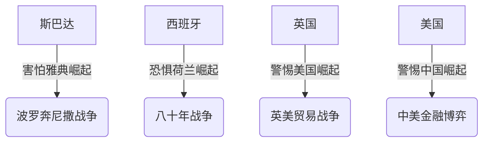
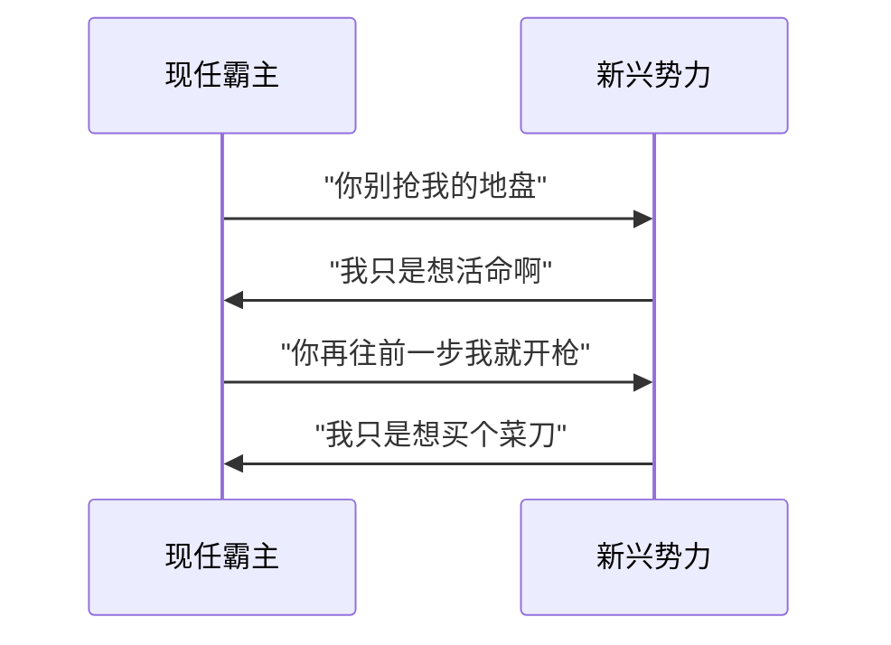
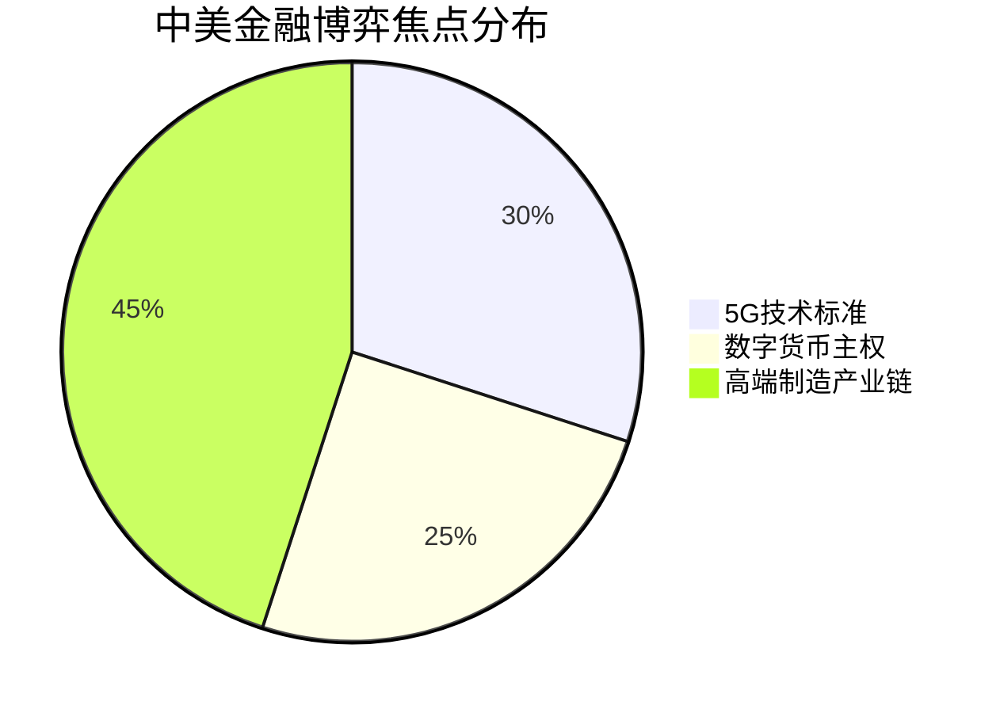
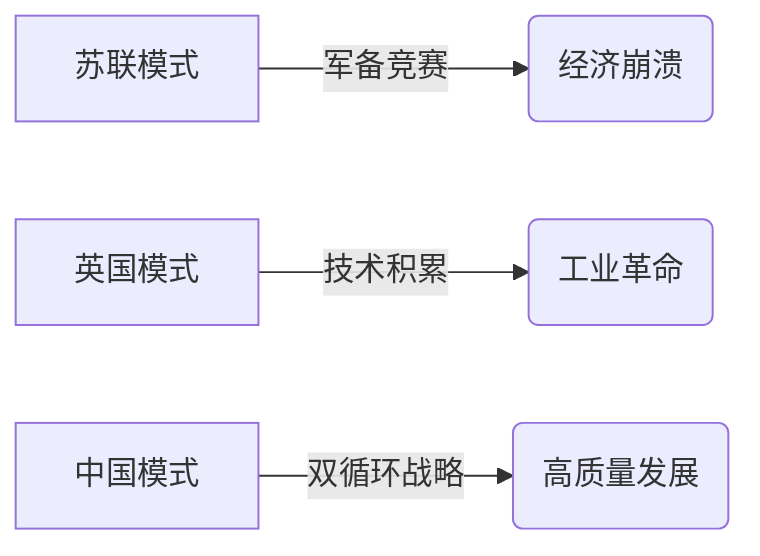

```yaml
---
tags: [历史博弈, 金融战争, 修西底德陷阱]
url: "https://www.douyin.com/video/7646377719890054434"
title: "中美金融博弈：从修西底德陷阱看现代商业战争"
date: 2026-06-07
---
```

# 中美金融博弈：从修西底德陷阱到现代版「老钱vs新钱」

## 0. 原始资料
本地证据：[[2026-06-07_中美金融博弈修西底德陷阱_7b7cb5]]

## 1. 历史剧本杀：老钱与新钱的永恒战争


你有没有发现一个神奇的历史规律？每当新贵开始挑战老钱的饭碗时，战争就不可避免。这不是阴谋论，而是刻在人类DNA里的生存本能。就像老钱家族聚会时，突然来了个会玩手机的熊孩子，老钱们的第一反应不是教他用手机，而是想办法让他滚去玩泥巴。

## 2. 修西底德陷阱的现代演绎


这个2500年前的希腊剧本，居然完美复刻在现代商业战场上。当荷兰用股票交易所挑战西班牙的黄金帝国时，当英国用工业革命颠覆荷兰的海上霸权时，当美国用美元体系取代英镑霸权时，我们总能看到相似的剧情。

## 3. 小白补课区
### 修西底德陷阱的三个致命信号
| 信号 | 典型案例 | 现代映射 |
|------|----------|----------|
| 新势力开始制定新规则 | 雅典建立提洛同盟 | 中国推动RCEP |
| 旧霸主恐惧失去话语权 | 斯巴达封锁雅典港口 | 美国制裁华为 |
| 双方体系差异过大 | 西班牙vs荷兰 | 美国vs中国 |

### 历史教训的三重启示
1. **恐惧比仇恨更危险**：老钱害怕的不是新钱多有钱，而是新钱可能改变游戏规则
2. **闷头发展才是王道**：英国学荷兰学了半个世纪才敢挑战，而苏联急吼吼地军备竞赛反而自毁
3. **规则制定权才是终极战场**：从提洛同盟到WTO，谁掌握规则制定权谁就掌握话语权

## 4. 当代金融战争的三大战场


现在的金融战争早已不是简单的贸易战，而是三个维度的立体博弈：
- **技术标准战场**：5G/6G通信协议、量子计算专利
- **金融规则战场**：数字货币发行权、跨境支付体系
- **产业链战场**：芯片制造、新能源电池、稀土材料

## 5. 现代版「广积粮缓称王」
朱元璋的生存智慧在商业战场上依然闪耀。对比苏联的「军备竞赛」和英国的「闷声发大财」，我们终于明白：


真正的商业战争不是比谁嗓门大，而是比谁活得久。就像老钱家族的传家宝，不是靠抢来的，是靠代代相传的智慧积累来的。

## 6. 给普通人的生存指南
1. **学会观察历史周期**：当新贵开始制定新规则时，就是老钱最危险的时刻
2. **投资未来技术**：关注那些可能改变游戏规则的领域（如AI、量子计算）
3. **保持战略定力**：不要被短期波动牵着走，记住「闷声发大财」的智慧

下次当你刷到「中美冲突不可避免」的视频时，不妨换个角度看：这或许就是人类文明演进的必经之路，就像老钱家族总会被新贵挑战，但文明的火种却在冲突中不断传承。