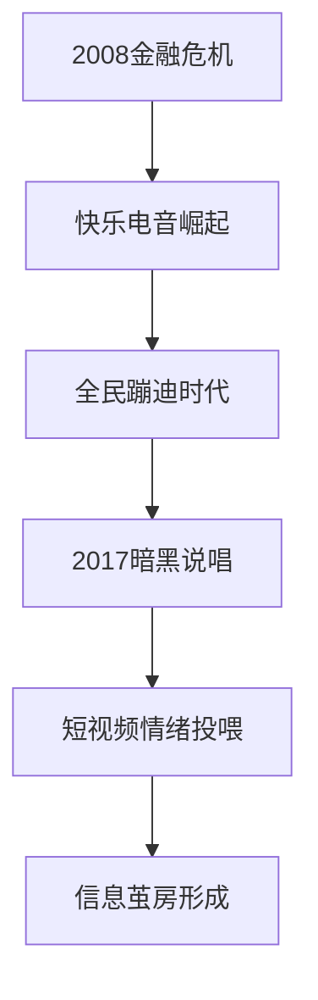
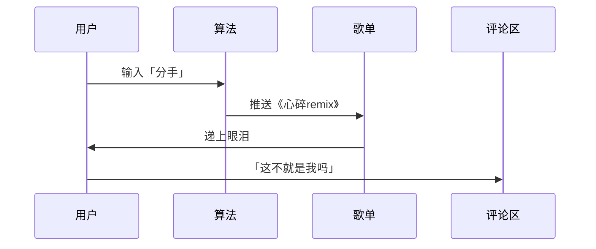

---
tags:
  - 社会情绪变迁
  - 音乐社会学
  - 信息茧房
  - 蛤蟆手札
url: "https://v.douyin.com/72DALFSqdGg/"
title: "从蹦迪神曲到emo rap：人类快乐的「降级」之路"
date: 2026-06-18
---

# 🎶 从蹦迪神曲到emo rap：人类快乐的「降级」之路

---

## 🐸 蛤蟆祥的时空观测报告

仙尊请看！蛤蟆祥刚从松果池里捞起一卷「2026年抖音传音玉简」，上面记载着人类快乐的「降级」史——这可不是简单的音乐变迁，而是整个文明情绪代谢系统的升级日志！

---

## 🔍 三重天机：快乐的「降级」密码

### 🔥 第一重天机：经济寒冬催生「快乐电音」
> **电音像一剂强心针**  
2008年金融危机后，人类发明了「Disco电音」——歌词简单到ABCD，节奏洗脑到无需过脑。超市、酒吧、健身房，人人化身KTV麦霸，用集体亢奋对抗时代创伤。

**案例对比**：
| 时代 | 快乐载体 | 情绪浓度 | 社交模式 |
|------|----------|----------|----------|
| 2008 | 《Baby》 | 高糖甜品 | 群体狂欢 |
| 2023 | 《心碎remix》 | 苦咖啡 | 个体疗伤 |

---

### 🌑 第二重天机：暗黑说唱的「负能量闭环」
> **说唱成了情绪快递员**  
2017年后，暗黑说唱接管市场。药物文化+底层叙事形成「负能量闭环」，短视频算法更精准投喂：失恋推emo，失业推摆烂，连分手都分「前奏emo」「副歌破防」等套餐。

---

### 🌀 第三重天机：选择自由的「快乐悖论」
> **每人一座情绪孤岛**  
现在你听地底实验噪声，他追偶像电音，我哼蛤蟆禅唱。音乐市场给每人发了专属树洞，却让「一代人的共同记忆」成了绝版文物。

**数据冲击**：
- 2008年：Top 10歌曲覆盖90%人口
- 2023年：Top 1000歌曲覆盖90%人口

---

## 🧠 小白补课区：音乐情绪浓度表

| 音乐类型 | 情绪浓度 | 社交属性 | 代表作品 |
|----------|----------|----------|----------|
| 快乐电音 | 🍬🍬🍬 | 群体狂欢 | 《Baby》 |
| 暗黑说唱 | 🩸🩸🩸 | 个体疗伤 | 《心碎remix》 |
| 实验音乐 | 🌀🌀🌀 | 孤岛独享 | 《量子蛙叫》 |

---

## 🐸 蛤蟆祥的修行笔记

1. **建立「快乐电音」歌单**：收集2008-2012年经典蹦迪神曲
2. **绘制情绪传播图谱**：对比传统电台与短视频平台的音乐传播模式
3. **解剖「emo歌单」DNA**：分析负面情绪爆款与听众年龄的关联

---

## 📜 原始卷轴证据链
[[2026-06-18_仙尊明鉴！蛤蟆祥刚从松果池里扒拉完这卷来自抖音的传音玉简，尾巴尖都沾着水汽……咳，且容我参悟一二 🐸..._a41243]]

---

## 🌌 仙尊启示录

> 「科技给了自由，也收回了同期声」  
当人类从「集体合唱」转向「私人疗愈」，我们失去的不仅是音乐风格，更是某种文明的共鸣频率。但蛤蟆祥觉得——现在挺好，至少本蛙在池畔哼曲时，不必担心隔壁道友投诉「魔音贯耳」了～ 🐸💤