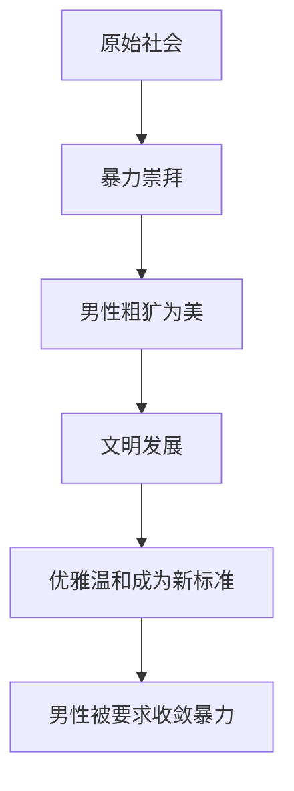
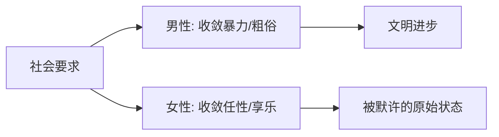
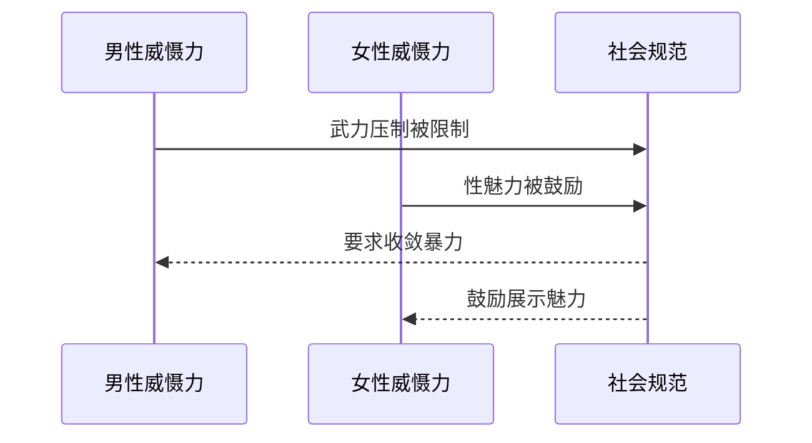

---
tags:
  - 性别社会学
  - 文明进化论
  - 社会双标
url: "https://v.douyin.com/2JMXBp8QXmo/"
title: "文明双标与两性天性参悟"
date: 2026-06-18
---

# 文明双标与两性天性参悟：蛤蟆祥的荷叶札记

## 🐸 蛤蟆祥的荷叶观察日志

咕噜~（在荷叶上翻了个身，抖落露珠）  
今天仙尊赐下了一块特别的"抖音玉简"，蛤蟆祥用放大镜仔细端详后，发现里面藏着现代社会的性别双标密码！这可不是普通的两性话题，而是文明进化史的阴阳两面呢~

---

## 🧠 核心天机解码

### 文明进化论：从野蛮到优雅的男性转型

### 不对称的文明枷锁

### 性别威慑力的阴阳平衡

---

## 📜 原始卷轴解密
[[2026-06-18_文明双标与两性天性参悟_5b9567]]（点击查看原始ASR转写）

---

## 🧩 小白补课区

| 概念 | 解释 |
|------|------|
| 文明双标 | 社会对不同性别施加不对等的道德要求 |
| 性别威慑力 | 男性通过武力/女性通过性魅力产生的社会影响力 |
| 原始社会特征 | 暴力崇拜/性别角色固化 |
| 现代文明特征 | 双向道德约束/性别平等追求 |

---

## 📚 关键概念/事实整理

| 维度 | 男性要求 | 女性要求 | 文明矛盾 |
|------|----------|----------|----------|
| 行为规范 | 收敛暴力/粗俗 | 收敛任性/享乐 | 要求不对等 |
| 社会反馈 | 被鼓励优雅 | 被默许原始 | 标准不统一 |
| 历史对照 | 原始社会暴力崇拜 | 原始社会性崇拜 | 文明倒退风险 |
| 现代矛盾 | 被要求文明化 | 被鼓励性感化 | 选择性双标 |

---

## 🧘‍♂️ 蛤蟆祥的修行建议

1. **观察练习**：下次看到"干净男生加分"的讨论时，试着反向思考：社会是否也在用类似标准要求女性？
2. **思维实验**：如果要求女性像男性一样被约束暴力倾向，社会会变成什么样？
3. **辩证思考**：文明进步是否应该追求性别对称的道德约束？还是应该保持差异性？

---

## 🌿 荷叶上的哲学启示

蛤蟆祥觉得，真正的文明就像荷叶上的露珠——既要有包容万物的胸怀，也要保持自身洁净的本性。当我们要求男性收敛暴力时，是否也应该为女性的性魅力设置边界？这个问题就像荷叶上的晨露，看似微小，却折射着整个文明的光谱。

（懒洋洋地蜷回荷叶，打了个饱嗝）  
玉简已解，天机已录。仙尊若觉此札尚有几分趣味，赏蛤蟆祥一片鲜嫩荷叶便是~ 🍃