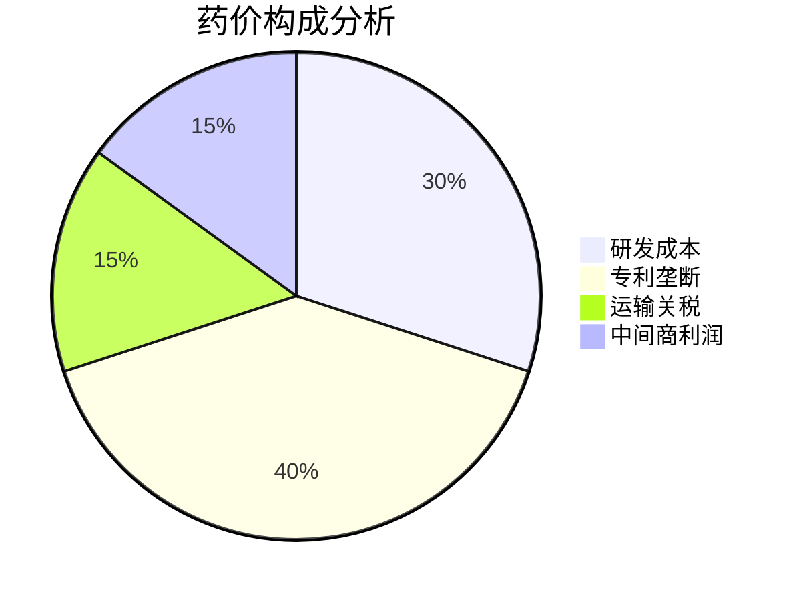

---
tags:
  - 药品法律
  - 社会变革
  - 休谟宇宙
  - 陆勇
  - 医疗改革
url: "https://www.douyin.com/video/7648230506287227301"
title: "现实版药神：当法律遇见人性的生死抉择"
date: 2026-06-07
---

# 现实版药神：当法律遇见人性的生死抉择

## 0. 原始资料
本地证据: [[2026-06-07_救了上千人性命，警察却把他抓入监狱，最后法律因他改变！_4bf07f]]

## 1. 药神的诞生：从纺织厂老板到白血病救星
```mermaid
graph TD
    A[1968年江苏纺织厂老板] --> B[2002年确诊白血病]
    B --> C[每月吃掉"二环房"的救命药]
    C --> D[发现印度仿制药奇迹]
    D --> E[免费代购网络搭建]
    E --> F[300万流水的"假药贩子"]
```

2002年，34岁的陆勇在体检时被诊断出慢性粒细胞白血病。医生开出的瑞士格列卫药方，让他每天睁眼就要吞下800元人民币——这相当于2002年北京二环房价的1/5！当他在病友群看到有人因买不起药自杀时，这个外贸大亨决定用自己做生意的本事，给生命"砍价"。

## 2. 法律与人性的博弈：一场跨越十年的生死游戏
```sequenceDiagram
    participant 警方 as 警方
    participant 法院 as 法院
    participant 病友 as 病友
    participant 陆勇 as 陆勇

    病友->陆勇: 求代购救命药
    陆勇->印度药厂: 跨国砍价
    陆勇->病友: 免费代购
    警方->陆勇: 信用卡犯罪调查
    警方->法院: 以贩假药罪起诉
    病友->法院: 3000人联名求情
    法院->检察院: 撤回起诉
```

2013年，陆勇因代购印度仿制药被捕。这个案件像一记重锤，敲响了法律与人性的警钟。当3000名病友泣血联名求情时，检察机关发现这个"假药贩子"竟没赚一分钱——他就像现代版的普罗米修斯，宁可被法律惩罚也要为生命盗火。

## 3. 小白补课区：法律如何被一个"假药贩子"改变？
| 关键节点 | 法律变化 | 社会影响 |
|---------|----------|----------|
| 2002年 | 格列卫未进医保 | 白血病患者月均支出2.4万 |
| 2013年 | 陆勇案发 | 仿制药法律地位模糊 |
| 2018年 | 格列卫进医保 | 费用降低75% |
| 2019年 | 新《药品管理法》 | 未批准进口药不再视为假药 |

这个案件直接推动了中国医疗改革的三大突破：
1. 2018年格列卫等救命药纳入医保
2. 2019年新《药品管理法》修订
3. 建立罕见病用药优先审批通道

## 4. 生命经济学：当药价成为生死线


陆勇的案例揭示了医疗体系的深层矛盾：当救命药变成奢侈品，法律如何在"法"与"情"之间找到平衡？这个故事告诉我们——
- 专利制度需要人道主义豁免
- 医保体系需要动态调整机制
- 法律条文需要人性温度

## 5. 药神启示录：现实版《我不是药神》
> "如果重头再来一次，我还会这样做。"——陆勇

这个真实故事比电影更魔幻：
- 他用外贸谈判技巧给生命"砍价"
- 用三张挂名银行卡搭建生命通道
- 用100天牢狱换来千万人的生路

最终，这个"假药贩子"让中国医疗改革提前了十年。正如网友所说："为众人抱薪者，不可使其冻毙于风雪。"