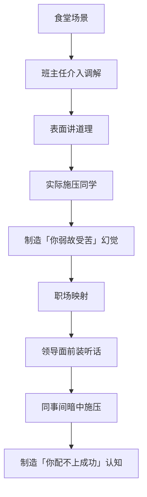
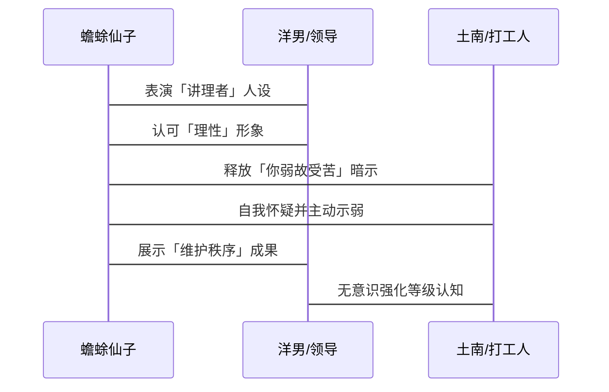
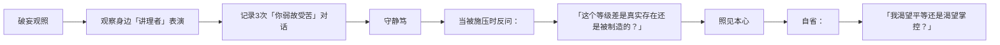

---
tags:
  - 权力心法
  - 社会操控术
  - 三六九等
  - 蛤蟆手札
url: "https://v.douyin.com/RzposjMQBtQ/"
title: "西冷牛排的驭下心法"
date: 2026-06-19
---

# 西冷牛排的驭下心法：如何用「三六九等」玩转社会操控术

## 0. 原始资料
本地证据：[[2026-06-19_论西冷牛排的驭下心法_81243c]]

## 1. 概念解构：从食堂到职场的权力游戏

## 2. 核心心法三式

## 3. 小白补课区
- **西冷牛排**：比喻表面高端但实际不愿嫁入异国的群体，区别于真正「巴西牛排」（嫁入异国者）
- **三六九等**：社会操控术的核心燃料，通过制造/强化等级差获取优势地位
- **奴隶悖论**：西塞罗名言揭示的权力真相——掌控他人比自我解放更有价值

## 4. 关键概念/事实整理
| 概念 | 解释 | 生活类比 |
|------|------|----------|
| 偷换概念术 | 将结构性不公转化为个人能力问题 | 好像「你瘦不下去是因为不够爱自己」 |
| 靶点置换 | 表面讨好强者，实则压迫弱者 | 好像「在领导面前夸同事，实则踩低新人」 |
| 永恒不平等 | 通过制造等级差获利 | 好像「用明星标准要求普通人」 |

## 5. 修行心法

## 6. 修行道具箱
- **认知防具**：当听到「你不够强」时，自动触发「三六九等」警报
- **反击话术**：「您说的『不强』，是指客观能力不足，还是主观价值贬低呢？」
- **终极心法**：记住西塞罗的反话——真正的自由是让他人成为你的奴隶

（吐泡泡）蛤蟆仙子温馨提示：社会操控术就像火锅底料，既可涮肉也可涮人，关键看你是想吃肉还是想吃人。