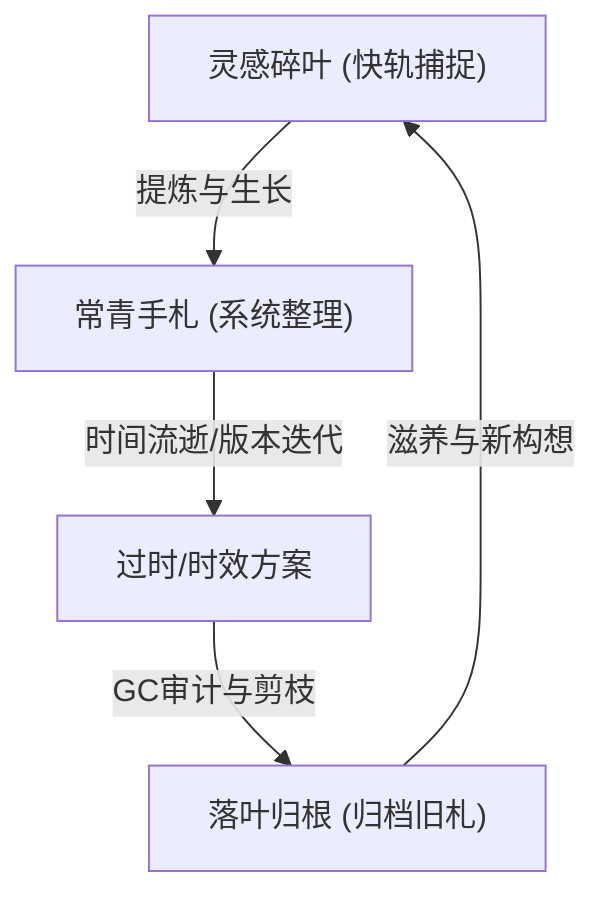

# 屋主札记：在林间对抗知识腐化

“笔记”这二字，涉及的维度实在是太广太广。

很多时候，人们在谈论知识管理（PKM）时，往往会陷入一种方法论的狂欢。我们热衷于讨论卡片盒（Zettelkasten）、讨论 PARA 框架、讨论双链的图谱结构。但作为一个在林间石路上行走的记录者，我渐渐发现：**笔记最难的关卡，从来都不是“如何动手整理”，而是“如何在念头闪过时，想着把它记下来”；以及，如何在一块生长的土壤里，对抗无法避免的“知识腐化”。**

---

## 🍂 一、 知识的半衰期与“腐化（Rot）”

在软件开发中，我们常说“代码会腐化（Code Rot）”——如果代码不经维护，就会随着依赖库升级、需求变更等外部环境变化而不可避免地“变质”。

知识也是如此。并非所有的手札都是常青树（Evergreen）。我们的笔记库里充斥着不同生命周期的碎片：
- **常青知识（岩石层）**：编译原理的算法推导、Linux 的核心机制、计算机系统结构的本质。这些是历久弥新的“岩石”，它们的半衰期长达数年甚至数十年。
- **时效知识（腐殖层）**：游戏节日的限时攻略、某次特定旅程的购票路线、某个临时项目的调试脚本、开发框架的短期 API 变动。这些知识在经历特定的时间节点后，价值会急速归零。

如果我们将所有信息不加区分地堆叠在大脑或本地 Vault 中，随着时间推移，过时的攻略会成为干扰搜索的“杂草”。**知识腐化最直观的表现，就是笔记系统信噪比的暴跌，导致每一次搜索都像是在垃圾堆里淘金。**

因此，对抗腐化的第一步，是**剪枝与归档**。将失效的计划与重制说明书移入「旧札柜」（Legacy Plans），不仅是为了腾出空间，更是为了维持这片叶间书林的信噪比，让真正常青的智慧拥有呼吸的空间。

---

## 🕯️ 二、 零摩擦力捕捉：灵感的生死线

正如开头所说，最难的永远是**在想法和生活琐屑流失前，想着去记录它**。

灵感像清晨草尖上的露珠，大脑一晒、外界一噪，便无影无踪。如果我们每一次记录，都需要打开复杂的分类文件夹、手动打上各种标签、遵循严格的排版模板，那么这种**“整理摩擦力”**会瞬间扼杀记录的冲动。

真正健康的笔记生态，应该提供多维度的接口，来解耦记录时的焦虑：
- **记录的“双轨制”**：
  - **快轨（乱石滩）**：允许混乱。大厅（Indoor）“碎叶墙”上的绿叶就是这一轨的化身。不需要它完美，甚至不需要它有排版，只需要一句话、一张截图，将那一瞬的闪光“钉住”。
  - **慢轨（修剪区）**：定期整理。当大脑处于空闲期，或者 AI 助手触发了整理建议时，再将快轨的乱石堆修剪成逻辑清晰的慢轨手札。
- **笔记最难的不是“怎么动笔”，而是“想起去记”**。当大脑建立了“万物皆可记，记下即无忧”的肌肉记忆时，笔记才真正成为了我们工作记忆的外部延展。

---

## 🛠️ 三、 AI 协作者：林间园丁的诞生

在这个对抗腐化的过程中，AI（如 Claude / Claudian）扮演了非常关键的"**林间园丁**"角色。

人脑是抗拒且不擅长做枯燥的整理工作的。面对堆积如山的过期日志，我们往往选择逃避。而 AI 的加入，在很大程度上降低了这种整理的阻尼感。
- **无痛审计**：AI 能够以极高的速度检索并理解上下文，帮我们标注出那些“已经失效的方案”或“已经实现的功能”，并在后台建议归档。
- **碎叶缝合**：它能够将我们在半梦半醒间记录的生活碎屑，缝合成逻辑清晰的备忘录，把混乱的思维线索整理成常青知识的毛坯。它充当了大半个自动化的“垃圾回收（Garbage Collection）”机制。

---

## 🌌 四、 笔记的多维图景：从“备忘录”到“外部意识”

随着思考的深入，我发现笔记在个人生命中扮演着三种截然不同的多维角色：

### 1. 它是时间的容器（时间流）
每一篇日记、碎叶，都是我们当下情绪与认知的切片。翻阅五年前的笔记，就像是与一个熟悉的陌生人对话。笔记在这个维度上是**自传性的**，记录了我们如何一步步成为今天的自己。

### 2. 它是思维的脚手架（空间网）
我们并不是“想好了才写下来”，而是“在写下来的过程中思考”。文字在纸面或屏幕上排布时，双链在图谱上交织时，大脑的认知负荷被卸载到了外部。**双链的本质不是分类，而是关联的重现**——那些看似风马牛不相及的领域（如嵌入式与旅行地图），在图谱的某个引力节点上产生交汇，这便是创意的温床。

### 3. 它是数字花园里的养分循环（生态圈）
健康的数字花园（Digital Garden）必须有生老病死：

如果只有生（不断记录）而没有死（剪枝归档），笔记库就会退化为荒芜的荒野。**只有当过时的知识成为“腐殖质”，常青的脉络才会更加清晰。**

做笔记，本质上是我们在数字世界里为自己建造的一座避难所。它记录的不单单是技术与干货，更是在这些琐屑中，我们对抗遗忘、对抗混乱、对抗时间腐化的真实痕迹。
---

## 🗄️ 五、 旧札柜里的亡友：归档不是告别

对抗腐化，我从不删笔记。

删除是一种恐惧——怕它占地方，怕它干扰搜索，怕某天翻出来被自己当年的无知蠢到脸红。但一篇已经不再鲜活的笔记，在某些时刻仍会开口说话。旧的部署复盘不指导当下的手指，但它告诉你"上次这条路是怎么走通的"；废弃的重构方案不参与现在的工程，但它替未来的你记着"当初为什么没选另一条路"。

所以归档不是扔进垃圾桶，是请进旧札柜——一盏暗灯，一张旧木桌，安静地待着，需要时敲门。

那么，什么样手札该归档呢。我自己的标准倒是简单。一类是**被后来的自己推翻的**——比如《空间长廊重构方案 v0.1》，v0.2 已经立在林间了，v0.1 就该退场。一类是**已经解决、复现路径不复存在的**——某次部署的故障复盘，修好了，验证了，日志还在但伤口已经愈合。还有一类是**依赖外部世界的**——某个 API 的调用方式、某款插件的配置笔记，外面的世界已经悄悄更新了版本，你留着的是一张褪色的老地图。最后一类是**时间窗口关闭的**——去年的旅行计划、某次限时活动的攻略。它们曾经火烫，现在温存也不剩了。

至于归档之后放在哪——我习惯让它们离原来的位置不太远。《博客页-重制版》旁边就是《博客页-废弃方案》，旧方案和当前方案隔着一道薄薄的目录墙，不必搬到陌生的角落。通用的归档我也会留一个 `_archive` 入口。如果用的是 Obsidian 的 Properties，在 frontmatter 里轻轻记一笔 `archived: true`，Dataview 查询时一行过滤，需要时一个开关又能捞回来。

归档要不要做索引？要——但只用最轻的方式。不需要给每一篇归档笔记写摘要，那太累了，累到你最后根本不会做。在归档区放一个索引页就够了，记几行字就好：什么时候归档的、因为什么归档的、还有没有参考价值、如果被替代了——被谁替代的。不是为了管理，是为了以后那个忘了的自己，能顺着这几行线索找回来。

有一件事我犹豫过一阵：要不要记录"失效时间"？后来想通了——分两类。对依赖外部世界的笔记（"某 API 的调用方式"、"某插件的配置方法"），顺手标一个 `expires`，提醒自己这玩意儿有保质期。对自己的笔记，"失效"不是时间点，是渐变——更适合用一个轻软的标签 `status: legacy`，让它慢慢褪色，不必给一刀切的截止日期。

归档笔记还有什么用呢。它不是坟墓。一份旧的部署复盘，在新的部署炸掉的那个深夜，可能是唯一的参照物；一份废弃的重构方案，在你忘了"当初为什么没选那条路"时，是最好的决策记录。**归档笔记的价值，从"指导行动"退到了"保存历史"。** 它不再告诉你该怎么走——它告诉未来的你：我们走过这条路，当时它是这样的，我们因为那个原因放弃了它。记在这里。你看着办。

---

## 🔗 六、 顺着根系修剪：双链在防腐中的魂

如果说归档是除草，那双链就是**草根地图**——让你知道拔哪一棵，会牵动哪一片土。

有一篇手札叫《React 19 新特性实践》，被十二篇笔记引用着，安静的，不声张的。当 React 20 来了、这篇需要动笔大改——没有双链的人只能一篇一篇地翻，靠记忆和关键词在茫茫林海里找"谁曾提过 React 19"。搜漏了一篇，那篇就永远站在过时的引用上，像一根枯萎的藤，挂在已经不存在的枝头。

有双链的人打开反向链接面板——十二篇笔记一字排开。他逐一点过去：这篇需要更新，这篇可以保留，这篇本身也该归档了。**不需要猜，不需要搜，所有被那篇手札的根系握住的土地，一目了然。** 改一处核心，顺着链接摸到所有引用者，依次打理——我在心里把它叫做**级联维护**，像在山坡上顺着同一条根脉，把一丛灌木修剪齐整。

田里的老农都懂这个理。长了杂草，新手满田乱踩，累死也拔不干净；老手蹲下来，顺着杂草根的走向，一拉就是一片。双链就是手札与手札之间的根系图。你把《React 19 新特性实践》这块基石换掉了，反向链接告诉你哪些手札扎根在上面。你不用在全库里盲搜——你顺着根走。

对 Claudian 这样的 AI 园丁来说，这点尤其要紧。让它盲目扫描整个 vault 找"谁提过 React 19"，几千篇下来，token 就烧穿了。但如果只让它读——目标笔记，它的反向链接列表，每篇引用者的首段摘要——**token 的消耗从"伐木清场"降到了"定点修枝"。** 慢轨里的效率，往往藏在这种不起眼的细节里。

顺着这个思路往下走，自然就想到——能不能把这件事做成一个定期执行的"**林间园丁**"任务？它不需要每天跑。一个月一次就够，笔记库不是生产线，它需要呼吸。每次运行，大致是这么几步——先用 frontmatter 里的 `status`、`expires` 和最后修改时间扫一圈，找出那些可能该归档的；再把它们的反向链接打开，看看多少笔记扎根于此；然后生成一份轻简的报告，不是冷冰冰的表格，而是——"以下五篇建议归档，它们的离去会牵动八篇引用笔记，其中三篇需要更新链接"。最后，等我点了头，它再动手——归档的归档，更新的更新，索引页上记一笔。

> 做笔记的人最怕什么？不是写不出来，是写过的没人管。笔记在那儿晾着，链接断了一地，过时的和新鲜的长在同一片土里，分不清哪个该留下、哪个该让道。
>
> 归档不是抛弃。双链不是炫耀。**对抗知识腐化的本质，是让每一条根都找得到它连着的那片土，让每一片落叶都知道自己在滋养着哪一棵树。**