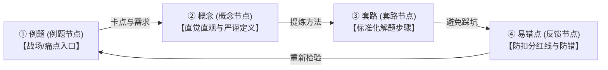

# 屋主札记：自顶向下，以“问题”为路标的知识拓荒

在这个信息的洪流席卷一切的时代，关于“如何学习”的讨论，往往和“如何做笔记”一样，陷入了一种方法论的精致陷阱。我们被灌输了太多“系统性”、“打地基”、“从零开始”的宏大叙事。

但在经历了无数次对着厚重的教材发呆、在干瘪的公式里消磨掉最后一丝好奇心后，作为一个在知识森林里负重前行的拓荒者，我终于认可并确立了自己的本能直觉：**最好的学习方式，从来都不是从定义出发的“自底向上”；而是从痛点出发、以问题为路标的“自顶向下”。**

---

## 🧭 一、 概念的诞生：世界并非先有定义，后有世界

在传统的学院派教育中，学习路径是一条极其死板的“爬坡线”：
$$\text{核心定义} \longrightarrow \text{定理推导} \longrightarrow \text{经典算法} \longrightarrow \text{课后习题}$$

这种设计假设人脑是一台完美的计算机，可以先加载所有的“前置依赖（Definitions）”，然后再去执行高级任务（Solving Problems）。但这种反人性的设计，忽略了人脑最底层的驱动机制——**正反馈的饥饿感**。

### 编程与开发的隐喻
在软件开发中，没有哪个程序员会把一本 1000 页的 API 参考手册从第一页背到最后一页才开始写代码。
* **反人性的学法**：在不知道为什么要用它的情况下，强行死记硬背库函数里的每一个接口和参数。这种学习不仅痛苦，且大脑很快就会启动防御性遗忘。
* **自然的学法**：我要实现一个特定功能，我写下一段逻辑，卡住了；为了解决这个麻烦，我去检索，发现早已有现成的库函数实现了它；我调用它，屏幕亮起，功能实现。那一瞬间的“成就感（正反馈）”是无法替代的。随后，我自然会产生好奇：“为什么这几行代码能运行？它的底层是怎么实现的？”

再比如，我们想要为一款 3D 大世界游戏（如《原神》或《洛克王国》）写一个屏幕地图位置追踪的工具：
如果让你先花半年时间去死啃《计算机视觉原理》，研究 SIFT（尺度不变特征变换）算法的极值检测、高斯差分金字塔与特征点描述子……你大概率会在第十分钟就彻底放弃，并认定自己不适合搞技术。
相反，如果借助 AI 的思路，先快速搭出一个能跑的视觉追踪 Demo，哪怕它很不完美。当你亲眼看着屏幕上的定位框跟着角色移动时，那一刻的**正反馈**会瞬间把你的求知欲点燃。这时你才会心甘情愿地去钻研：“为什么它能对准？哦，原来是 SIFT 算法在起作用啊，它在算尺度空间极值。” 

**先入战场受创，再回头去认兵器。这种退一步的认知，绝非绕远路的折腾，而是为了在满手汗水与泥沙中，彻底看清手里的每件兵器究竟是为哪个具体的伤口而生的。此时，SIFT 不再是一个死气沉沉的考点，而是一把解决你手中具体麻烦的“屠龙宝刀”。**

---

## 🕯️ 二、 概念是问题的余震：重建知识诞生的第一现场

我时常想，如果这个世界上没有任何麻烦，也就不会需要任何概念。
**每一个学术概念，都是某个具体麻烦被人类反复揉捏、解决后，给这套解法起的名字。**

如果我们跳过“麻烦”，直接去背“名字”，那就是买椟还珠。若跳过问题而直接去背定义，那便像是在未见妖魔之前，先去背诵一遍法器谱。法器虽然精妙锋利，可手中并无敌手，心中亦无实境，又怎会明白它在暗夜里为何要发出森然的冷光？

在《编译原理》的学习中，这种对比尤为刺眼：

### 1. FIRST 集合的诞生
* **干瘪的定义**：$\text{FIRST}(\alpha)$ 是从 $\alpha$ 推导出的句型开头可能出现的终结符集合。
* **真实的场景**：我正在写一个语法分析器。现在面前有两条岔路（产生式分支），但我只有“近视眼”，每次只能往前看一个字符（Lookahead 1）。当看到字符 $a$ 时，我怎么知道该选哪条路？
* **解法**：我需要算一下每条路展开后，可能露出来的第一个字符是什么。这个“第一眼能看到的终结符列表”，就是 **FIRST 集合**。

### 2. FOLLOW 集合的诞生
* **干瘪的定义**：$\text{FOLLOW}(A)$ 是指能紧跟在非终结符 $A$ 右侧的终结符集合。
* **真实的场景**：分析栈顶的非终结符 $A$ 宣布它要“隐形消失”（$A \to \varepsilon$）。它这一消失，本来排在它后面的符号就要顶上来面对当前输入。那我怎么知道它该不该消失？
* **解法**：我得查一查，在所有的句型里，到底谁有资格站在 $A$ 的右边当保镖。这个“右贴身保镖的集合”，就是 **FOLLOW 集合**。

### 3. 左递归的诞生
* **干瘪的定义**：若存在推导 $A \Rightarrow^* A\alpha$，则文法含有左递归。
* **真实的场景**：我写了一个递归下降分析程序，还没来得及读入任何字符，程序就陷入了自己调用自己、栈内存无限膨胀的死循环（鬼打墙）。
* **解法**：因为产生式的最左边又是它自己。为了打破这道无限套娃的枷锁，我们对其进行重构，这便诞生了**左递归**的消除。

**无论是高等数学里的拉格朗日中值定理，还是线性代数里的特征值与特征向量，概莫能外。** 只要我们还原了“问题发生的第一现场”，干瘪的定义就会瞬间复活，并在接下来的问题演练中充满生命力。

---

## 🛠️ 三、 从题目出发：不是轻视基础，而是为基础“召魂”

当认可了“自顶向下”的学习观后，我的 Obsidian 库的结构也随之发生了质变。它不再是一个静态的“百科词条库”，而是一个**动态的“知识炼金工坊”**。

这套工坊通过以下四个层级，构建了一个完美的认知闭环：



1. **题目是入口（战场）**：我们不从第一章开始推演。我们直接看大题（如 `Ex4.8`、`Ex4.21`）。在真实的战场上被痛击、被卡住，产生强烈的“求知饥饿感”。
2. **概念是解释（引路人）**：顺着题目里的双链，跳转到概念节点。这里不打官腔，用“幽灵车厢”、“路口导航”等直观比喻迅速在人脑中建立画面感，再用严谨公式定点解惑。
3. **套路是路径（罗盘）**：有了概念的理解，将其固化为可以机械执行的标准化解题步骤（例如：判断文法不是 LL(1) 的四步法）。
4. **易错点是反馈（护栏）**：收集历届同学和自己在实践中踩过的雷（如：不同产生式千万不能用逗号分隔，Obsidian 的 Mermaid 节点别用数字列表开头），设置红线。

有人或许会心生迟疑，认为“先做题、先写 Demo”不过是功利的权宜之计，是在逃避地基的搭建。但在知识的荒野里，我渐渐发觉：自顶向下的快，若没有“回流（Feedback Loop）”的支撑，确实会沦为浮沙筑台的快。但如果我们在每一次冲锋受阻或大题做毕后，能折返回头，去系统地拷问：它召唤了哪些底层的定理？我是在哪一个台阶摔倒的？这套概念是为了解决哪种特定的学术麻烦而被发明的？它有哪些判分的红线？——这便不是逃避基础，而是在废墟中为基础“召魂”。

在这种“回流”中，我认可的自顶向下学习路径，是一个有自我迭代能力的闭环：

```text
先遇到问题 ──> 产生卡点 ──> 召唤概念 ──> 建立直觉 ──> 回到定义 ──> 总结套路 ──> 记录易错 ──> 再回到问题
```

每一个双链都不是装饰，而是一条回路；每一个概念节点都不只是定义，而是一个被题目召唤出来的解释器。**知识若不被调用，很快就会腐化成记忆深处的空壳。而题目、项目、反馈、复盘，就是让知识防腐的盐。**

---

## 🌌 四、 与自己的学习本能和解

在漫长的求学生涯里，我曾反复陷入自我怀疑：看着旁人从第一章系统啃完大部头教材，我会担心自己是不是走得太跳跃；看着旁人先做一年地基才做项目，我会怀疑自己是不是不够扎实。

可现在我终于明白：这就是我的学习本能。

我需要问题，我需要具体的场景，我需要有回音的正反馈。
我需要先看见山，才愿意去拆解登山杖的受力；先看见河，才愿意去算桥梁的剪力；先遇到拦路的妖魔，才愿意翻开法术谱的扉页。

这并不意味着我拒绝底层。恰恰相反，只有当底层与眼前的麻烦相连时，我才愿意真正走向深渊。我是一个自顶向下的拓荒者，我从不等待系统被赐予，我是在问题的碎叶与废墟里，亲手野蛮生长出我的系统。它有它的根系，也有它的来路。

---

## 🕯️ 五、 此后行路：以问题为灯，以概念为器

此后在编译原理、数理大课、或是大世界的视觉定位项目里，我都将如此行路。

先去碰壁，先做出一个残缺却有心跳的 Demo，拿到真实的回音。再回头追问原理，沉淀为套路，把伤口记入易错点，并将这一路的痕迹完整放回 Obsidian。

这不是反系统，而是用麻烦浇灌出系统；这不是轻基础，而是让基础回到它本该服务的场景。**这更不是偷懒，这是在承认：人需要一点火光，才愿意在夜里走很长的路。**

---
> **屋主记于林下**：编译原理 Chapter 4 重构既毕，回首向来，概念因题而生，题因概念而解，此之谓自顶向下。记之以防腐，防的不是法门失效，而是来日风雨一多，忘了自己本就如此行路。
