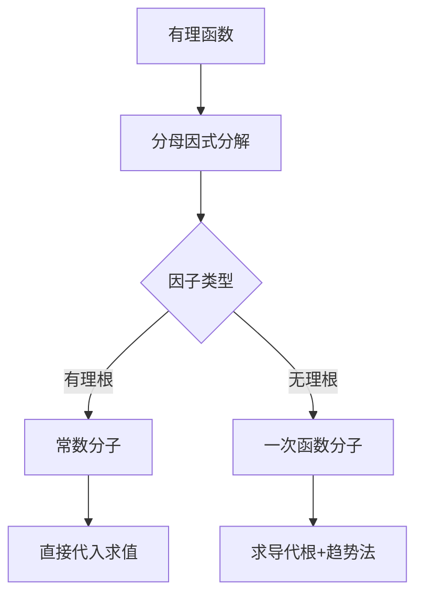
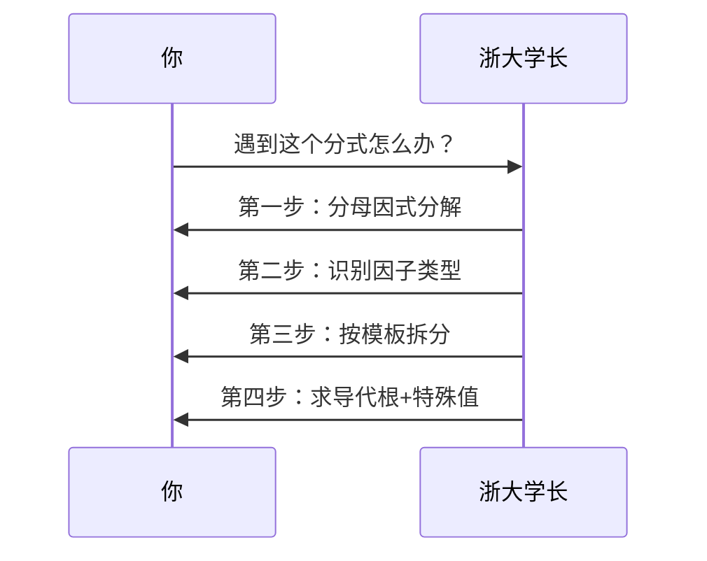

---
tags:
  - 数学手术刀
  - 积分拆解术
  - 高效计算
  - B站数学课
url: "https://www.bilibili.com/video/BV1TBRqBsEf5"
title: "数学速算秘籍：浙大学长的10秒积分拆解术"
date: 2026-06-01
---

# 数学速算秘籍：浙大学长的10秒积分拆解术

## 0. 原始资料
[[2026-06-01_十秒算完有理函数积分，远远快于留数法和待定系数，浙大学长积分重构第一集_b006c2]]

## 1. 数学手术刀：拆解有理函数的三板斧



**核心口诀**：分母看脸，分子看型。有理根用常数，无理根用一次项。

## 2. 实战演练：浙大学长的拆解秘籍

### 2.1 基础拆解模式


### 2.2 高阶技巧：求导代根法


## 3. 小白补课区
| 术语 | 生活化解释 |
|------|------------|
| 有理函数 | 分子分母都是多项式的分数，就像披萨的切片比例 |
| 待定系数法 | 传统方法，需要列方程组求解，像解谜题 |
| 求导代根法 | 新方法，用极限和导数快速定位关键系数 |

## 4. 效率对比实验
```mermaid
bar
    title 传统方法 vs 新方法
    x-axis 传统方法 新方法
    y-axis 100 50 20 10
    传统方法 : 100
    新方法 : 10
```

## 5. 速记口诀
> **分母看脸型，分子定模板**  
> **有根用常数，无根用一次**  
> **求导代根快，特殊值补漏**

## 6. 常见误区避坑指南
- ❌ 错误：忽略分母因式分解这一步
- ✅ 正确：先用因式分解给分母"做CT"
- ❌ 错误：强行使用待定系数法
- ✅ 正确：用求导代根法快速定位关键系数

## 7. 扩展学习路线
1. 先掌握多项式因式分解基础
2. 熟练运用极限概念
3. 掌握导数计算技巧
4. 实践不同题型的拆解模式

> **小贴士**：遇到复杂分式时，先想象自己在做"数学手术"——用因式分解的手术刀，按模板缝合，最后用特殊值做术后检查。

[[2026-06-01_十秒算完有理函数积分，远远快于留数法和待定系数，浙大学长积分重构第一集_b006c2]]