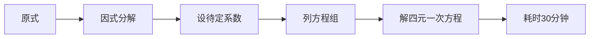
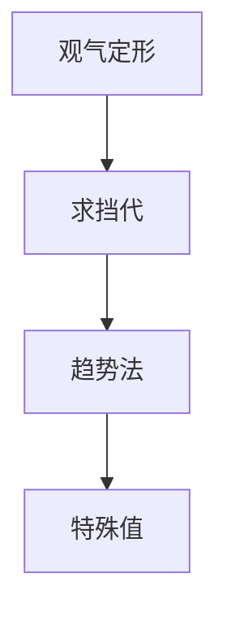
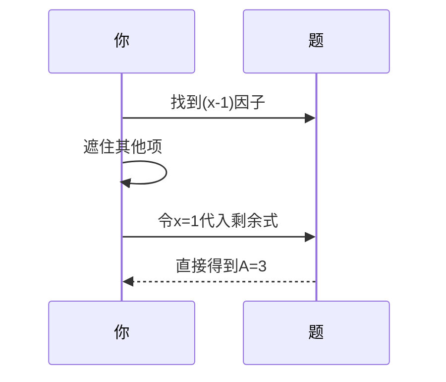

---
tags:
  - 高等数学
  - 积分技巧
  - 快速计算
  - 心法口诀
  - 证据/subtitle_full
url: "https://www.bilibili.com/video/BV1TBRqBsEf5"
title: "蛤蟆手札：有理函数积分拆解术"
date: 2026-06-01
---

# 蛤蟆手札：有理函数积分拆解术，四招搞定待定系数！

蛤蟆道人最近在池塘边修炼时，发现一道高等数学题卡住了不少修士——有理函数积分拆解。今天就用咱们道门心法，把这道坎儿变成三分钟通关的副本！

## 0. 原始资料
本地证据：[[2026-06-01_有理函数积分速算心法_b482f8]]

## 1. 传统解法有多难？
传统解法就像用铁锹挖金矿：

## 2. 道门心法四式
蛤蟆道人独创的"四式破阵法"，让解题速度提升十倍！

### 第一式：观气定形（看分母定结构）
> 口诀：**"分母有理根，分子常数蹲；无理根出现，分子一次跟"**

- 有理根因子 `(x-a)^n` → 对应 `A/(x-a) + B/(x-a)^2 + ...`
- 无理根因子 `x²+px+q` → 对应 `(Cx+D)/(x²+px+q)`

### 第二式：求挡代（秒杀系数）
> 口诀：**"求谁挡谁，代入零点"**

### 第三式：趋势法（破高阶因子）
> 口诀：**"X奔无穷远，系数比高低"**

当遇到 `(x-1)^2` 时：
1. 左右两边都展开为 `1/x` 级数
2. 比较 `1/x` 项系数
3. 得到方程 `A+C=0`

### 第四式：特殊值（补全方程）
> 口诀：**"X=0最省力，X=-6更神速"**

- 令x=0：直接得到方程 `B=3`
- 令x=-6：让分母为0，轻松解出D=2

## 3. 小白补课区
| 术语 | 解释 |
|------|------|
| 有理函数 | 分子分母都是多项式的分数函数 |
| 待定系数法 | 通过设未知数解方程组的方法 |
| 因式分解 | 把多项式拆成简单因子相乘 |

## 4. 关键概念/事实整理
| 步骤 | 方法 | 适用场景 | 时间成本 |
|------|------|----------|----------|
| 1. 观气定形 | 分母分析 | 所有情况 | 10秒 |
| 2. 求挡代 | 代入零点 | 单重因子 | 5秒/项 |
| 3. 趋势法 | 比较无穷远项 | 高阶因子 | 15秒 |
| 4. 特殊值 | 代入简单值 | 补全方程 | 10秒/值 |

## 5. 实战演练
**例题**：拆解 `(3x+5)/[(x-1)(x+2)^2]`

1. **观气定形**：分母有单因子(x-1)和二重因子(x+2)
2. **求挡代**：
   - 求A：遮住(x+2)²项，令x=1 → A= (3*1+5)/[(1+2)²] = 8/9
   - 求B：遮住(x-1)项，令x=-2 → B= (3*(-2)+5)/[(-2-1)] = (-1)/(-3)=1/3
3. **趋势法**：令x→∞，比较1/x项系数得 C= -A = -8/9
4. **特殊值**：令x=0验证所有系数

## 6. 修行建议
- 每日练习3道真题（推荐2019数二、2025数二）
- 制作"心法口诀"闪卡，随身携带
- 用不同颜色标记四式应用区域

> 🐸 修士们，记住：数学不是解题机器，而是发现规律的艺术。这四式心法，正是先辈们从万千题海中提炼的精华，比单纯刷题更值得参悟！