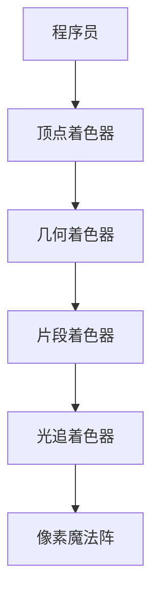
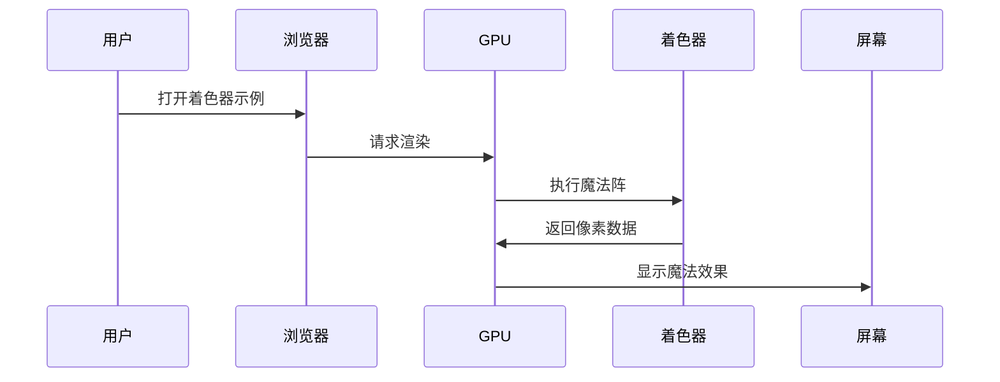

---
tags:
  - GLSL着色器
  - 图形学
  - 编程教程
  - 技艺录（技术与工具）
  - B站教程
url: "https://www.bilibili.com/video/BV15j5r6CE5J/?"
title: "掌握GLSL着色器编程 从入门到精通（中文配音）"
date: 2026-06-12
---

# 🧙‍♂️GLSL着色器：让代码在屏幕上跳舞的魔法咒语

## 0. 原始资料
- 本地证据：[[2026-06-12_掌握GLSL着色器编程从入门到精通_f3b3d5]]

## 1. 神秘咒语说明书



## 2. 代码炼金术士的入门仪式

```glsl
// 顶点着色器咒语
#version 300 es
in vec3 aPosition;
void main() {
    gl_Position = vec4(aPosition, 1.0);
}

// 片段着色器咒语
#version 300 es
precision highp float;
out vec4 fragColor;
void main() {
    fragColor = vec4(1.0, 0.0, 0.0, 1.0); // 红色咒语
}
```

## 3. 小白补课区
- **着色器**：GPU的魔法咒语，控制每个像素的命运
- **GLSL**：图形编程的炼金术语言，比JavaScript更古老但更强大
- **渲染管线**：从3D模型到2D屏幕的传送门阵列

## 4. 关键概念/事实整理

| 魔法阵型 | 功能 | 典型应用场景 |
|---------|------|-------------|
| 顶点着色器 | 控制顶点位置 | 模型变形/动画 |
| 片段着色器 | 控制像素颜色 | 材质/光影效果 |
| 几何着色器 | 创建新几何体 | 粒子系统/动态细节 |
| 光追着色器 | 模拟光线行为 | 实时光影/反射 |

## 5. 实操咒语书

```bash
# 安装WebGL开发环境
npm install -g glslify
glslify init my-shader-project

# 编译着色器
glslify build vertex.glsl fragment.glsl -o shader.js

# 在浏览器中施展魔法
python -m http.server 8080
```

## 6. 常见问题解咒手册



## 7. 进阶修炼路线图

1. **青铜阶段**：掌握基础语法与颜色魔法
2. **白银阶段**：精通纹理采样与光照计算
3. **黄金阶段**：实现动态阴影与屏幕后处理
4. **王者阶段**：开发自定义渲染引擎核心

> 🎯 修炼建议：从Three.js的着色器示例开始，逐步过渡到原生WebGL开发，最终挑战Vulkan/DirectX级的底层渲染魔法。