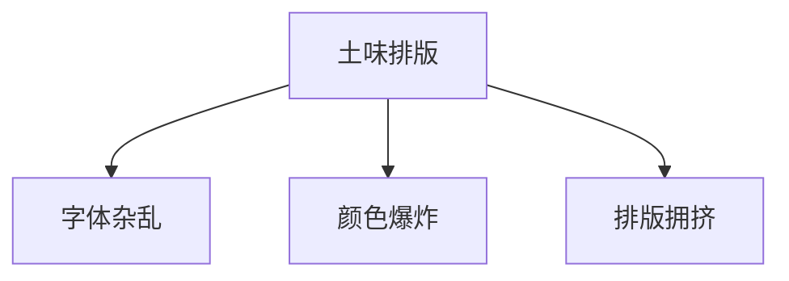
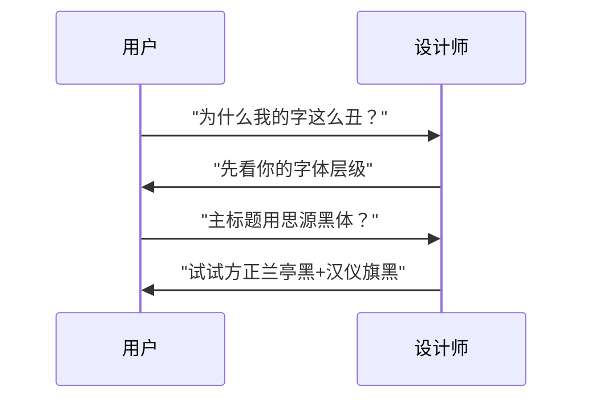
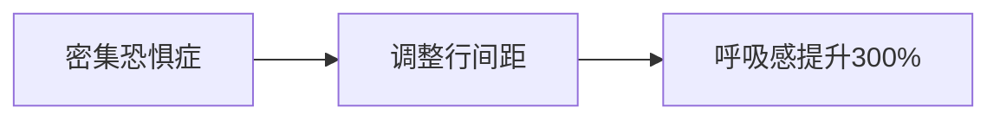
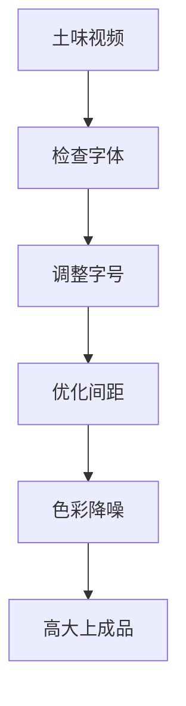

---
---
tags:
  - 字体设计
  - 视觉设计
  - 排版教程
  - B站视频制作
url: "https://www.bilibili.com/video/BV18o9nBVEUq"
title: "字体魔法：三招让你的视频排版从土味变高大上！"
date: 2026-06-01
---
---

# 字体魔法：三招让你的视频排版从土味变高大上！

## 0. 原始资料
本地证据：[[2026-06-01_字体魔法三招告别土味排版_7d7659]]

## 1. 土味排版的三大罪证

## 2. 字体点化术实战三式
### 第一式：字体三原色法则
> **黄金比例**：主标题:正文:辅助文字 = 70%:50%:30%

### 第二式：留白呼吸术
> **呼吸空间**：行间距=字号的1.5倍，段间距=字号的1.2倍

### 第三式：色彩降噪术
> **安全色卡**：主色:辅色:点缀色 = 60%:30%:10%

## 3. 小白补课区
- **中文字体分类**：衬线体（宋体）、无衬线体（黑体）、手写体（楷体）
- **英文字体黄金比例**：x-height占字体高度的50%
- **排版安全区**：文字边缘与边框保持10%的空白

## 4. 关键概念/事实整理
| 项目 | 建议值 | 效果 |
|------|--------|------|
| 字号梯度 | 12/14/16pt | 层级分明 |
| 行间距 | 1.5倍字号 | 易读性+35% |
| 字间距 | -20~+50 | 视觉平衡 |
| 对比度 | 4.5:1以上 | 符合WCAG标准 |

## 5. 魔法咒语清单
1. **字体组合公式**：`主标题字体+正文衬线体+辅助无衬线体`
2. **安全配色公式**：`主色(HSL)+辅色(H±30°, S±20%, L±10%)`
3. **排版急救包**：`文字居中对齐+10%边距+3px投影`

> **彩蛋**：在B站视频中，使用``可以瞬间提升字幕质感！

## 6. 土味排版急救指南

> **终极秘诀**：记住"721法则" - 70%主视觉、20%辅助信息、10%留白呼吸，你的排版就能从土味逆袭成视觉盛宴！