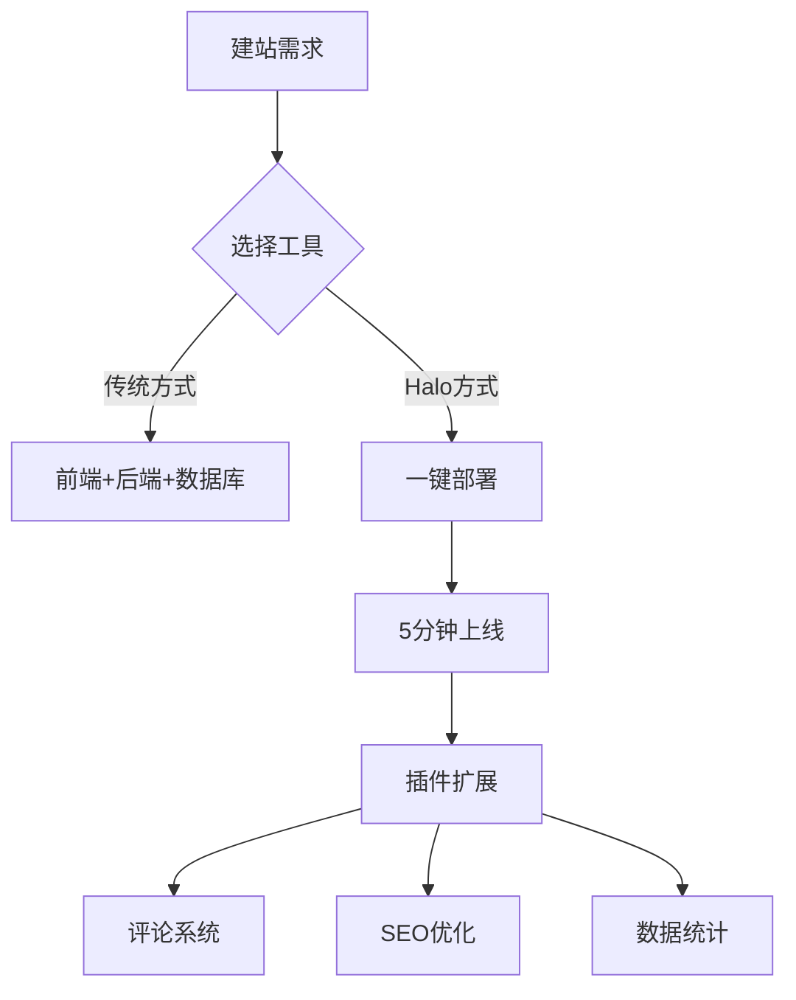

---
tags:
  - 开源工具
  - 建站教程
  - Halo
  - 一键部署
url: "https://www.bilibili.com/video/BV1HqVd6aEft"
title: "懒人福音！Halo开源建站工具3分钟搭建个人博客"
date: 2026-06-02
---

# 🐸蛤蟆手把手教学：Halo建站工具让博客搭建像点外卖一样简单

## 0. 原始资料
本地证据：[[2026-06-02_懒人福音！Halo开源建站工具3分钟搭建个人博客_e9b500]]

## 1. 修仙式建站心法
蛤蟆君今天要传授的，是能让懒癌患者瞬间复活的建站秘术——Halo开源工具。这个GitHub上已有38.8K星标的神器，堪称建站界的"御剑飞行"，让我们用一张修仙地图来理清套路：



## 2. 三步成博客
### 第一步：御剑起航
1. 打开云平台网址 `cloud.closs.ro`
2. 在应用商店搜索"halo"
3. 点击部署按钮（像点外卖一样简单）

### 第二步：灵丹炼成
```sequenceDiagram
    用户->>平台: 点击部署
    平台-->>用户: 下载镜像
    用户->>平台: 等待状态变绿
    平台-->>用户: 返回公网地址
```

### 第三步：装修洞府
1. 登录后台创建文章
2. 添加分类标签（像给仙草分类）
3. 安装插件（推荐：评论系统+SEO优化）

## 3. 小白补课区
- **什么是CMS**：内容管理系统就像建房子的图纸，Halo是开源图纸
- **私有化部署**：相当于在自家后院建亭子，数据完全归你所有
- **GitHub星标**：38.8K个点赞，相当于38800个修仙者认证

## 4. 关键概念/事实整理
| 功能 | 传统方式 | Halo方式 |
|------|----------|----------|
| 开发周期 | 1-3个月 | 5分钟 |
| 技术门槛 | 需要编程 | 零基础 |
| 扩展性 | 需要重新开发 | 插件市场 |
| 成本 | 服务器+域名 | 免费开源 |

## 5. 修仙者必看
- **蛤蟆建议**：先用演示站体验，再部署正式站
- **进阶心法**：尝试安装"Markdown编辑器"插件
- **避坑指南**：部署后立即修改默认密码

## 6. 修行任务
- ✅ 在[交流群](https://t.me/halo_community)领取建站秘籍
- ✅ 尝试用Markdown写第一篇博客
- ✅ 给网站添加夜间模式插件

蛤蟆君温馨提示：建站就像种仙草，初期可能觉得平淡无奇，但等你添加了10个插件、写了50篇博客后，就会发现这是属于你的修仙洞府！💤