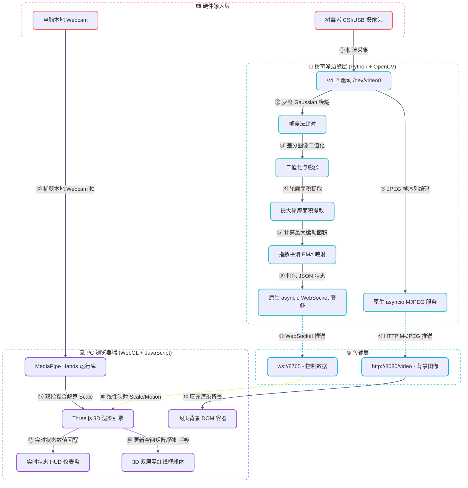

# 🧪 树莓派视觉手势识别与Web 3D交互控制系统

> [!abstract] 核心实践摘要
> 本篇笔记系统总结了嵌入式实践大作业—— **基于树莓派的实时视觉手势识别与网页三维交互系统** 的完整设计与实现。系统构筑了 **“边缘端低耗特征量化 → WebSocket流式推送 → WebGL 3D渲染交互”** 的闭环控制流，是探索软硬共感与边缘端轻量级计算的硬核实录。


---

## 🧭 一、 实验目标与系统架构

### 1. 实验目标
本实验的目标是打破传统的鼠标与键盘输入限制，实现一个跨设备、低延迟的体感交互系统：
* **边缘端采集与解算**：树莓派利用摄像头获取人手运动信息，通过 OpenCV 进行低开销的运动特征量化。
* **低延迟实时传输**：基于原生 WebSocket 协议，实现局域网内数十毫秒级的控制参数流式推送。
* **三维渲染与交互**：PC 浏览器通过 WebGL (Three.js) 渲染高精度双层霓虹线框球体，并根据流进的控制量实时执行缩放（Scale）与变色等矩阵变换。

### 2. 系统整体架构图




---

## 🧭 二、 网页端与树莓派端手势识别逻辑对比

本系统的一大核心特色在于其双端手势识别逻辑的设计分流，分别对应了 **“高算力精细识别”** 与 **“轻量级边缘估算”** 两种截然不同的嵌入式开发哲学：

### 1. 手势识别方案对比表

| 维度         | 网页端 (PC Browser + MediaPipe)                                     | 树莓派端 (Raspberry Pi + OpenCV)                                           |
| :--------- | :--------------------------------------------------------------- | :--------------------------------------------------------------------- |
| **识别内核**   | 深度学习目标检测 + 骨骼回归模型                                                | 数字图像处理（帧差法 + 轮廓提取）                                                     |
| **算力开销**   | 极高（需 PC GPU/WebAssembly 加速）                                      | 极低（低功耗单片机/边缘端可流畅运行）                                                    |
| **识别粒度**   | 21个 3D 关键点（指骨拓扑结构）                                               | 整体运动像素斑块（最大活动包围盒）                                                      |
| **手势控制原理** | **精准骨骼解算**：测量特定指尖关节间距                                            | **物理投影变化**：比对运动区域的大小与面积                                                |
| **控制维度**   | 1. **缩放 (Scale)**：大拇指与食指捏合度<br>2. **碰撞 (Collision)**：食指尖触碰 3D 边界 | **宏观状态映射**：<br>1. **手掌离屏幕远近 (Distance)**<br>2. **手掌张开与合拢 (Fist/Open)** |


### 2. 树莓派端控制机制深度剖析（远近与张合）

> [!info] 树莓派端“面积即控制”的投射机制
> 由于树莓派端没有运行沉重的手部骨骼模型，它对手势强度的判定完全依赖于**最大运动轮廓面积 A**。这种基于面积的设计巧妙地将**手掌离摄像头的远近**和**手掌的张开与合拢**融为一体：
> 
> 1. **手掌离屏幕的远近 (Distance)**：
>    * **原理**：透视投影（小孔成像）。当手掌靠近摄像头时，手在图像中占据的像素数量急剧增多，导致 OpenCV 差分出来的运动斑块面积 A 变大，从而让 3D 球体**变大**。
>    * **规律**：近 → 投影大 → 面积 A 大 → Scale 变大；远 → 投影小 → 面积 A 小 → Scale 变小。
> 2. **手掌的张开与合拢 (Open / Fist)**：
>    * **原理**：物体实际投影截面积变化。当手掌在相机前**完全张开**（五指伸展）时，其投影面积最大；当手掌**握拳合拢**时，其投影面积明显缩水。
>    * **规律**：张开 → 投影面大 → 面积 A 大 → Scale 变大；合拢（握拳） → 投影面小 → 面积 A 小 → Scale 变小。
> 
> 通过这种“面积映射”，用户既可以通过 **“前后推拉”** 手掌，也可以通过 **“张开/抓握”** 拳头来控制 3D 球体的收缩与膨胀，达到了非常直观自然的体感操控体验。


---

## 🔧 三、 硬件准备与环境部署

### 1. 唤醒摄像头 V4L2 驱动
由于树莓派默认的摄像头栈不同，需要通过加载内核模块将 CSI/USB 摄像头挂载为标准的虚拟设备节点 `/dev/video0`，供 OpenCV 访问：
```bash
sudo modprobe bcm2835-v4l2
```
验证挂载：
```bash
ls -la /dev/video0
```

### 2. 运行树莓派服务端主程序
运行 `raspberry_gesture_server.py` 服务。系统针对 headless 模式和有桌面的 VNC 模式设计了自适应启动：

* **标准后台运行模式**（推荐，低开销）：
  ```bash
  python3 raspberry_gesture_server.py --width 480 --height 360 --fps 10
  ```
* **联调调试模式**（有图形界面时）：
  ```bash
  python3 raspberry_gesture_server.py --width 480 --height 360 --fps 10 --preview
  ```

---

## 🧠 四、 边缘端核心算法与协议设计

服务端使用纯 Python 异步标准库 `asyncio` 与 OpenCV 实现，无需额外安装复杂的 Web 框架。

### 1. OpenCV 运动特征提取 (帧差法)
算法在检测循环中计算相邻两帧图像的绝对差值，以此捕获运动的手部：
* **降噪**：灰度化并进行高斯模糊 `cv2.GaussianBlur(gray, (21, 21), 0)`。
* **差分**：`cv2.absdiff(previous_gray, gray)`。
* **形态学处理**：阈值过滤（阈值设为 25）和二次迭代膨胀 `cv2.dilate(thresh, None, iterations=2)`。
* **特征量化**：提取所有轮廓并筛选出面积（Area）最大的一组，若面积 A ≥ min-area，则认定手势动作有效。

### 2. 指数平滑滤波 (防抖)
为了防止空气微颤与传感器噪声导致 3D 球体剧烈抖动，引入指数移动平均 (EMA) 算法：
```
S_current = S_current + (S_target - S_current) * α
```
其中 α 为平滑因子（默认 0.2），在保证跟手速度的前提下提供了非常优秀的平滑防震性能。

> [!tip] 算法物理隐喻
> 指数平滑本质上是给 3D 缩放引入了“物理阻尼”与“惯性”：
> ```
> 新尺寸 = α * 当前手势值 + (1 - α) * 上一次旧尺寸
> ```
> 在 α = 0.2 时，系统每次仅吸纳 20% 的手势变化，其余 80% 保留了旧态 of 稳定惯性。这极其优雅地滤除了空气扰动与相机的噪点微颤，使 3D 球体的变化如丝般顺滑。


### 3. 原生 WebSocket 与 MJPEG 服务器
* **原生握手**：提取 HTTP 报头中的 `Sec-WebSocket-Key`，配合 RFC 6455 规范的签名 GUID，进行 SHA-1 及 Base64 计算，回传 `101 Switching Protocols` 升级连接。
* **视频流**：利用 `multipart/x-mixed-replace; boundary=frame` 响应头，高帧率向前端抛送压缩率为 70 的实时 JPG 图像。

---

## 🌐 五、 前端 WebGL 物理渲染与交互控制

### 1. 3D 视觉：双层霓虹球体
Three.js 画布中设计了极具科技感的双层材质球体：
* **内层 (Solid Mesh)**：霓虹洋红色（`#ff00ff`）的实体材质，开启半透明（Opacity = 0.5）。不透明度通过正弦波随时间起伏（$0.4 \sim 0.5$），实现**呼吸灯般的脉冲微光效果**。
* **外层 (Wireframe Mesh)**：纯白色经纬网格线框。
* **动画**：双层球体均持续自转（X轴 $0.003$，Y轴 $0.008$），丰富空间透视。

### 2. 模式联动分流

前端支持三种模式自由切换：
* **Browser 模式**：调用 PC 本地摄像头与 **MediaPipe Hands**。
  * **右手指捏 (Pinch)**：计算拇指尖（4号）与食指尖（8号）的 3D 距离，将其线性映射为缩放因子 $0.2 \sim 2.0$。
  * **左手触碰检测**：检测左手食指尖是否戳入了 3D 球体的边界范围（通过三维欧几里得距离判定），一旦进入，则触发随机高饱和霓虹色的切换。
* **Raspberry 模式**：前端 `WebSocket` 流式读取树莓派发来的 JSON 数据，将 `scale` 映射给 Three.js 球体缩放，并在网页背景上同步拉取树莓派摄像头的 MJPEG 视频流。
* **Simulate 模式**：前端通过三角函数自动模拟呼吸状变化的 `scale` 曲线，便于脱机测试。

---

## 💡 六、 硬核概念大白话白皮书

为了在汇报和答辩中用最直白的方式解释系统，这里将最复杂的几个概念转化为通俗的日常比喻：

### 1. 帧差法 ── “找茬游戏”
* **大白话**：就像 **“大家来找茬”** 。程序把“上一秒的画面”和“现在的画面”重合，哪里动了，重合处像素的颜色就不一样。程序只把“不一样的地方”抠出来，这就是手势。
* **生活比喻**：你闭着眼，别人偷挪了你的水杯。你一睁眼，一眼就能看出水杯之前在哪、现在在哪，因为你的大脑把记忆和眼前的场景做了“减法”。

### 2. WebSocket 协议 ── “接头打电话”
* **大白话**：以前的网页请求像 **“写信”** ，你寄一封问一次，对方回一次，不问对方不能说。而 WebSocket 像 **“对暗号打电话”** 。网页说：“天王盖地虎！” 树莓派回：“宝塔镇河妖！” 确认身份后电话接通，树莓派就能无限主动地把手势数据通过电话线送过来。
* **生活比喻**：两个人拉了一条专线电话，不用每次说话都写信、封信、投递，大大降低了反应延迟。

### 3. MJPEG 视频流 ── “翻页小画册”
* **大白话**：高深视频编码（比如 MP4）太消耗树莓派 CPU。所以我们用笨办法：树莓派疯狂拍照，拍完一张就用极快速度扔给浏览器，嘴里还喊着：“别关门，后面还有！”浏览器在一个位置疯狂替换这些照片，看起来就成了流畅视频。
* **生活比喻**：小时候我们在课本边缘画的小人连环画，用手指快速拨动书页，小人就动了起来。

### 4. 指数平滑滤波 ── “减震器与车惯性”
* **大白话**：手在空中悬停会有肉眼看不见的颤抖，数据会疯狂乱跳。平滑滤波就是让球体有“惯性”：**球体大小 = 80% 旧大小 + 20% 新手势**。即使手抖得厉害，球也是匀速、顺滑地慢慢放大或缩小。
* **生活比喻**：你稳稳踩油门，车也不会瞬间从 0 码跳到 100 码，而是平缓地提速。这种稳重感就是滤波带来的。

### 5. MediaPipe 手部拓扑 ── “提线木偶”
* **大白话**：程序没把你的手当成一团肉，而是在你的手掌、关节、指尖上**钉了 21 颗隐形螺丝（关节点）**。计算大拇指尖（4号螺丝）和食指尖（8号螺丝）的距离，就能知道你是在捏手指还是放开。
* **生活比喻**：皮影戏演员通过拉动木偶关节上的几根线，就能掌控整个木偶的生动动作。

### 6. 3D 坐标映射 ── “影子抓苹果”
* **大白话**：摄像头画面是 2D 的（只有扁平的上下左右），Three.js 世界是 3D 的（有远近深度）。手指去碰球时，程序需要做“升维”，根据 3D 相机角度在虚拟空间中还原手指的三维坐标，然后计算手指跟 3D 球心的距离。
* **生活比喻**：你用手在墙上映出一个兔子影子，去“咬”墙壁上画的草。虽然你的手没有碰到墙，但从影子的二维角度看，它们确实重合了。映射就是为了确保你的手指在真实的 3D 深度上也真的碰到了球。

---

## ⚠️ 七、 实验痛点与重构纪实

在大作业的调试与演进中，针对以下核心痛点进行了针对性修复：

> [!warning] 痛点一：SSH headless GUI 报错（X Server Error）
> * **痛点本质**：在树莓派终端使用 SSH 远程启动代码时，因为没有挂载物理显示器，一旦执行 OpenCV 的 `cv2.imshow` 就会因找不到图形会话（X11）直接报段错误闪退。
> * **解决法门**：在 GUI 调用处封包 `try-except`。捕获到 X11 相关报错后，自动降级为 `--no-preview` 脱机流模式，切断物理视窗创建，仅将运算数据抛送给 WebSocket 与 WebGL，从而达成稳健的 headless 部署。

> [!warning] 痛点二：设备独占导致的摄像头物理冲突锁死
> * **痛点本质**：由于 Linux 设备驱动节点的独占互斥属性，若是在不同子线程或子进程里各自调用 OpenCV 读取 and MJPEG 视频流，会瞬发 `/dev/video0` 的 Device Busy 锁死错误。
> * **解决法门**：重构为单线程帧流路由管线。每一次 `cap.read()` 读取的新帧，在内存中统一完成灰度差分、绘制渲染，然后再分别打包进 WebSocket 数据流与 JPEG 视频编码流，彻底根除驱动竞争。

> [!warning] 痛点三：Web 端 MediaPipe 算力过载与内存泄漏
> * **痛点本质**：网页长时间运行于 Browser 模式下跑本地手势模型时，高负荷 of WebGL 渲染加上 MediaPipe Hands 实例会导致内存占用呈指数上涨，最终被浏览器 OOM 强制终止。
> * **解决法门**：建立 `browserStartToken` 动态生命周期令牌机制。每当用户切出 Browser 模式时，立刻执行 Web 摄像头的 `track.stop()` 并注销释放 MediaPipe 上下文，达成即用即关的瞬时垃圾回收机制。
