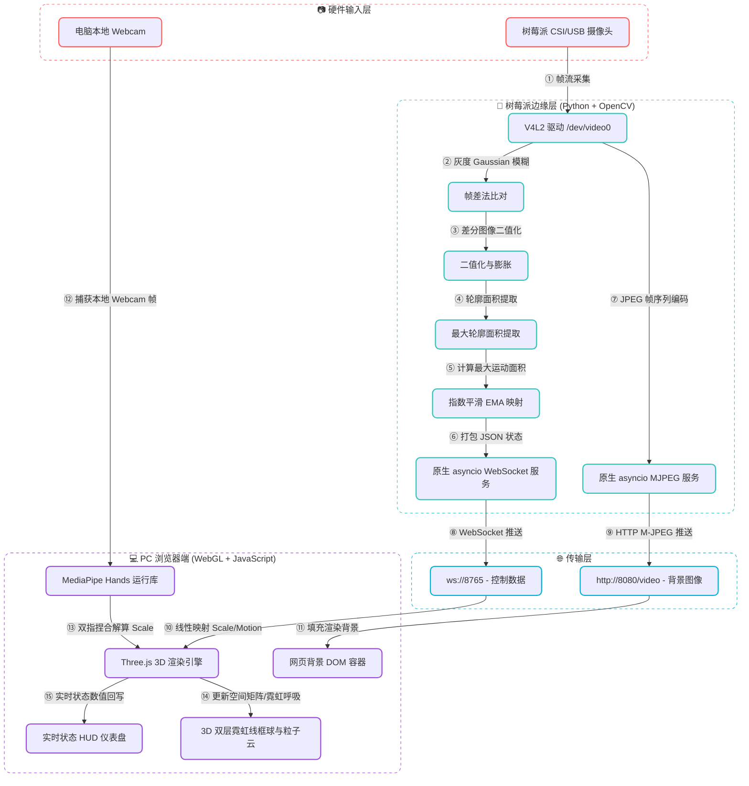

# 🧪 树莓派视觉手势识别与Web 3D交互系统：系统总体架构与双端解算概述

> [!abstract] 核心系统设计摘要
> 本篇文档为大作业的**总体架构设计报告**。系统构建了 **“边缘端低耗特征量化/骨骼推断 → WebSocket实时推送 → WebGL 3D渲染交互”** 的分布式控制闭环。通过结合树莓派的轻量级边缘物理特征提取与网页端 MediaPipe Hands 21个 3D 骨骼关键点的精细化姿态状态机，实现了流畅的三维体感人机交互。

---

## 🧭 一、 实验目标与系统整体架构

### 1. 实验目标
本实验的核心目标是打破传统的鼠标与键盘输入限制，实现一个跨设备、低延迟的体感交互系统：
* **边缘端采集与解算**：树莓派利用摄像头获取人手运动信息，通过 OpenCV 进行低开销的运动特征量化或轻量级手势推断。
* **低延迟实时传输**：基于原生 WebSocket 协议，实现局域网内数十毫秒级的控制参数流式推送。
* **三维渲染与交互**：PC 浏览器通过 WebGL (Three.js) 渲染高精度双层霓虹线框球体与 8,000 点级粒子云，根据控制参数实时执行缩放（Scale）与变色等矩阵变换。

### 2. 系统整体架构拓扑



---

## 🧭 二、 双端手势识别机制对比

本系统设计了双端手势识别的分流，分别对应了 **“高算力精细识别”** 与 **“轻量级边缘估算”** 两种嵌入式开发哲学：

### 1. 手势识别方案对比表

| 维度         | 网页端 (PC Browser + MediaPipe)                                     | 树莓派端 (Raspberry Pi + OpenCV)                                           |
| :--------- | :--------------------------------------------------------------- | :--------------------------------------------------------------------- |
| **识别内核**   | 深度学习目标检测 + 骨骼回归模型                                                | 数字图像处理（帧差法 + 轮廓提取）                                                     |
| **算力开销**   | 极高（需 PC GPU/WebAssembly 加速）                                      | 极低（低功耗单片机/边缘端可流畅运行）                                                    |
| **识别粒度**   | 21个 3D 关键点（指骨拓扑结构）                                               | 整体运动像素斑块（最大活动包围盒）                                                      |
| **手势控制原理** | **精准骨骼解算**：测量特定指尖关节间距                                            | **物理投影变化**：比对运动区域的大小与面积                                                |
| **控制维度**   | 1. **缩放 (Scale)**：双指捏合度<br>2. **碰撞 (Collision)**：食指尖触碰三维边界 | **宏观状态映射**：<br>1. **手掌离屏幕远近**<br>2. **手掌张开与合拢** |

### 2. 树莓派端控制机制深度剖析（远近与张合的统一）

> [!note] 树莓派端“面积即控制”的投射机制
> 由于树莓派端没有运行沉重的手部骨骼模型，它对手势强度的判定完全依赖于**最大运动轮廓面积 $A$**。这种基于面积的设计巧妙地将**手掌离摄像头的远近**和**手掌的张开与合拢**融为一体：
> 
> 1. **手掌离屏幕的远近 (Distance)**：当手掌靠近摄像头时，手在图像中占有的像素增多，导致差分出的运动斑块面积 $A$ 变大，从而让 3D 几何体**变大**；反之变小。
> 2. **手掌的张开与合拢 (Open / Fist)**：当手掌完全张开时，其投影面积最大；当手掌握拳合拢时，投影面积明显缩水。
> 
> 通过这种“面积映射”，用户既可以通过 **“前后推拉”** 手掌，也可以通过 **“张开/抓握”** 拳头来控制 3D 形态的收缩与膨胀，达到了非常直观自然的体感操控体验。

---

## 🧠 三、 网页端（MediaPipe）精细化手势映射与状态机

在 PC 端（Browser 模式）中，系统依托 MediaPipe Hands 输出的 21 个 3D 骨骼关节点 $\mathbf{p}_i = (x_i, y_i, z_i)$ 进行精细化手势解算。为了解决透现投影下指尖倾斜带来的识别误差，本系统设计了“几何间距比例 + 局部直线性”双轨判定机制，并构建了 6 种几何手势与 3D 模型的映射状态机。

> [!tip] 骨骼特征的几何量化与归一化建模
> 为消除手部离镜头远近或个体手掌大小的绝对物理尺寸干扰，我们引入了归一化基准：
> 
> 1. **手掌基准长度 ($L_{\text{palm}}$)**：定义为手腕（Landmark 0）至中指根部 MCP 关节（Landmark 9）的欧氏距离，以此作为归一化尺度因子：
>    $$
>    L_{\text{palm}} = \|\mathbf{p}_0 - \mathbf{p}_9\|_2
>    $$
> 2. **指尖伸展度比率 ($R_i$)**：指尖至手腕距离与手掌基准长度的比值：
>    $$
>    R_i = \frac{\|\mathbf{p}_0 - \mathbf{p}_{\text{tip}_i}\|_2}{L_{\text{palm}}}, \quad i \in \{\text{食指}, \text{中指}, \text{无名指}, \text{小指}\}
>    $$
> 3. **手指直线性 ($S_i$)**：为了应对空间折叠（指尖正对镜头时距离缩减），计算 MCP、PIP、DIP、Tip 四个关节的直线距离与分段折线之比：
>    $$
>    S_i = \frac{\|\mathbf{p}_{\text{MCP}} - \mathbf{p}_{\text{Tip}}\|_2}{\|\mathbf{p}_{\text{MCP}} - \mathbf{p}_{\text{PIP}}\|_2 + \|\mathbf{p}_{\text{PIP}} - \mathbf{p}_{\text{DIP}}\|_2 + \|\mathbf{p}_{\text{DIP}} - \mathbf{p}_{\text{Tip}}\|_2}
>    $$
> 
> **判定准则**：当且仅当 $R_i > 1.3$ 或 $S_i > 0.80$ 时，判定该手指处于**伸展（Extended）**状态，即该手指处于“竖起”状态。

### 2. 6 大手势状态映射表

| 手势动作 | 骨骼几何条件特征 | 映射 3D 形状 | 物理交互与触发机制 |
| :--- | :--- | :--- | :--- |
| **单指指向 (Point)** | 仅食指伸展 ($N_{\text{raised}} = 1$) | `sphere` (球体) | 基础粒子形态，回归最简三维几何体。 |
| **胜利手势 (V-Sign)** | 食指与中指伸展 ($N_{\text{raised}} = 2$) | `galaxy` (星系) | 模拟星寰盘旋，触发双臂对数螺旋粒子自转。 |
| **OK 手势 (OK)** | 大拇指与食指捏合度 $< 0.35$ 且食指未伸展，其余三指中至少两指伸展 | `saturn` (土星) | 拇指与食指的捏合环路，完美拟合土星的行星环。 |
| **四指平展 (Four-Finger)** | 食指、中指、无名指、小指伸展 ($N_{\text{raised}} = 4$)，大拇指与食指根部间距比 $\le 0.58$（大拇指内敛收拢） | `spring` (弹簧) | 模拟螺旋柱形。**交互特色**：缩放操作直接表现为弹簧的**压扁 (Compression)**与**拉长 (Tension)**。 |
| **五指张开 (Open Palm)** | 四指全部伸展 ($N_{\text{raised}} = 4$)，且大拇指外展张开（间距比 $> 0.58$） | `leaf` (树叶) | 模拟叶片脉络，呈现平展散射状态。 |
| **倒挂比心 (Downward Heart)** | 四根手指（食/中/无/小）方向全部朝下 ($\mathbf{p}_{\text{tip}, y} > \mathbf{p}_{\text{MCP}, y}$)，且至少 3 根手指弯曲弯折 ($S_i \le 0.80$) | `heart` (爱心) | 呈倒挂爪状时自动演化为洋红色爱心。该手势是**唯一**可以绕过“捏合锁定”状态的特权手势。 |

> [!note] 手势状态调度切换图 (Gesture State Machine Dispatcher)
> 下图展示了网页端解算模块的手势路由流程，任意稳定手势将直接触发对应的 WebGL 粒子几何变换：
> ```mermaid
> stateDiagram-v2
>     state "手势识别状态机" as StateMachine {
>         [*] --> Idle
>         Idle --> sphere : 仅食指伸展 (N_raised=1)
>         Idle --> galaxy : 食指与中指伸展 (N_raised=2)
>         Idle --> saturn : 大拇指与食指捏合 (Pinch<0.35)
>         Idle --> spring : 四指伸展 + 大拇指内聚 (N_raised=4)
>         Idle --> leaf : 五指大张 (N_raised=4 + 大拇指外展)
>         Idle --> heart : 四指朝下 + 弯曲 (S_i<=0.80)
> 
>         sphere --> Idle : 手手收回 / 握拳
>         galaxy --> Idle
>         saturn --> Idle
>         spring --> Idle
>         leaf --> Idle
>         heart --> Idle
>     }
> ```

### 3. 奶龙状态隔离锁机制 (Nailong Mode Isolation Lock)

> [!warning] 为什么奶龙状态需要物理隔离锁？
> * **业务痛点**：奶龙 3D 实体模型与粒子云的数据量较大，加载和采样耗时明显。如果允许手势直接误触切入，会导致频繁的 I/O 阻塞和页面微卡顿。
> * **隔离设计**：
>   系统在 `processShapeSwitchingGestures` 的入口处增设阻断机制：
>   ```javascript
>   if (targetShape === 'nailong' || targetShape === 'nailong_solid') {
>       gestureHistory = [];
>       return; // 立即退出手势状态机投票，实现逻辑隔离
>   }
>   ```
>   用户必须通过网页 UI 上的实体按钮手动唤醒奶龙；一旦切入，手势控制的**形状切换逻辑完全被切断（锁定）**，多维手势数据退化为纯粹的 3D 旋转矩阵参数和双指缩放因子的物理控制，保障交互专注度。

---

## 🔧 四、 硬件准备与环境部署

### 1. 唤醒摄像头 V4L2 驱动
由于树莓派默认的摄像头栈不同，需要通过加载内核模块将 CSI/USB 摄像头挂载为标准的虚拟设备节点 `/dev/video0`：
```bash
sudo modprobe bcm2835-v4l2
```
验证挂载：
```bash
ls -la /dev/video0
```

### 2. 运行树莓派服务端主程序
运行 `raspberry_gesture_server.py` 服务。在有桌面的 VNC 环境或 headless 远程 SSH 环境下均可自适应启动。对于 CSI 摄像头（Sunny CSI），运行模式首选 `hybrid`（即同时激活 OpenCV 帧差与 MediaPipe 骨骼计算）：
* **混合解算联调模式**（推荐，双端同时支持骨架与 OpenCV）：
  ```bash
  python3 raspberry_gesture_server.py \
    --camera 0 \
    --mode hybrid \
    --width 320 \
    --height 240 \
    --fps 10
  ```
* **本地调试画面预览模式**（在树莓派图形桌面运行，带 cv2 预览窗口）：
  ```bash
  python3 raspberry_gesture_server.py \
    --camera 0 \
    --mode hybrid \
    --width 320 \
    --height 240 \
    --fps 10 \
    --preview
  ```

### 3. 树莓派服务端启动参数参数表

通过在启动命令后附加参数，可以对识别模式、图像质量、处理帧率等进行调优：

| 启动参数选项 | 参数类型 | 默认值 | 作用描述 |
| :--- | :---: | :---: | :--- |
| `--host` | string | `0.0.0.0` | WebSocket 监听的局域网 IP 地址。 |
| `--port` | int | `8765` | WebSocket 监听的服务端口号。 |
| `--video-host` | string | `0.0.0.0` | MJPEG 视频流监听的局域网 IP 地址。 |
| `--video-port` | int | `8080` | MJPEG 视频流监听的服务端口号。 |
| `--camera` | int | `0` | OpenCV 摄像头驱动索引（通常 `/dev/video0` 对应 0）。 |
| `--width` | int | `480` | 摄像头捕获的分辨率宽度（推荐设置 `320` 提升速度）。 |
| `--height` | int | `360` | 摄像头捕获的分辨率高度（推荐设置 `240` 提升速度）。 |
| `--fps` | float | `10.0` | 树莓派端处理循环的最大帧率限制。 |
| `--mode` | choices | `opencv` | `opencv`：纯帧差面积控制，开销极低；<br>`hybrid`：混合模式，执行 OpenCV 计算加低频 MediaPipe Hands 骨骼识别。 |
| `--infer-skip` | int | `5` | 在 `hybrid` 模式下，每隔 $N$ 帧图像才执行一次神经网络推断。 |
| `--model-complexity` | int | `0` | MediaPipe Hands 模型复杂度（`0` 最轻量级，`1` 较重，推荐 `0`）。 |
| `--max-num-hands` | int | `1` | 允许识别的最大手部数量，嵌入式端通常限制为 `1`。 |
| `--min-area` | float | `1200.0` | OpenCV 判定有手部动作的最低轮廓面积像素值。 |
| `--max-area` | float | `22000.0` | OpenCV 面积映射的最大轮廓像素值（对应球体 Scale 最大值）。 |
| `--min-scale` | float | `0.6` | 控制 3D 物体缩放的最小值。 |
| `--max-scale` | float | `2.0` | 控制 3D 物体缩放的最大值。 |
| `--smooth` | float | `0.2` | EMA 指数平滑滤波因子（范围 0 到 1），越小防抖越强，越跟手。 |
| `--jpeg-quality` | int | `70` | MJPEG HTTP 传输视频流的 JPEG 压缩率（0-100）。 |
| `--no-video` | flag | - | 开启该参数将彻底禁用树莓派端的 MJPEG HTTP 视频流以节省网络带宽。 |
| `--preview` | flag | - | 在树莓派桌面环境中弹窗显示 OpenCV 的摄像头回显预览窗口。 |
| `--no-preview` | flag | - | 禁用 OpenCV 本地显示窗口，Headless 远程联调时必选，防止 X11 报错。 |

---

## 🧠 五、 边缘端核心算法与协议设计

服务端使用纯 Python 异步标准库 `asyncio` 与 OpenCV 实现，无需额外安装复杂的 Web 框架。

### 1. OpenCV 运动特征提取 (帧差法)
算法在检测循环中计算相邻两帧图像的绝对差值，以此捕获运动的手部：
* **降噪**：灰度化并进行高斯模糊 `cv2.GaussianBlur(gray, (21, 21), 0)`。
* **差分**：`cv2.absdiff(previous_gray, gray)`。
* **形态学处理**：阈值过滤（阈值设为 25）和二次迭代膨胀 `cv2.dilate(thresh, None, iterations=2)`。
* **特征量化**：提取所有轮廓并筛选出面积（Area）最大的一组，若面积 $A \ge \text{min-area}$，则认定手势动作有效。

### 2. 指数平滑滤波 (防抖)
为了防止空气微颤与传感器噪声导致 3D 几何体剧烈抖动，引入指数移动平均 (EMA) 算法：
$$
S_{\text{current}} = S_{\text{current}} + (S_{\text{target}} - S_{\text{current}}) \times \alpha
$$
其中 $\alpha$ 为平滑因子（默认 0.2），在保证跟手速度的前提下提供了优秀的平滑防震性能。指数平滑本质上是给 3D 缩放引入了“物理阻尼”与“惯性”，吸纳空气扰动，使 3D 变化如丝般顺滑。

### 3. 原生 WebSocket 与 MJPEG 服务器
* **原生握手**：提取 HTTP 报头中的 `Sec-WebSocket-Key`，配合 RFC 6455 规范的签名 GUID，进行 SHA-1 及 Base64 计算，回传 `101 Switching Protocols` 升级连接。
* **视频流**：利用 `multipart/x-mixed-replace; boundary=frame` 响应头，高帧率向前端抛送压缩率为 70 的实时 JPG 图像。

---

## 🌐 六、 前端 WebGL 模式分流联动

前端支持三种模式自由切换：
* **Browser 模式**：调用 PC 本地摄像头与 **MediaPipe Hands**。
  * **右手指捏 (Pinch)**：计算拇指尖（4号）与食指尖（8号）的 3D 距离，将其线性映射为缩放因子 $0.2 \sim 2.0$。
  * **左手触碰检测**：检测左手食指尖是否戳入了 3D 球体的边界范围（通过三维欧几里得距离判定），一旦进入，则触发随机高饱和颜色切换。
* **Raspberry 模式**：前端 `WebSocket` 流式读取树莓派发来的 JSON 数据，将 `scale` 映射给 Three.js 形态缩放，并在网页背景上同步拉取树莓派摄像头的 MJPEG 视频流。

> [!note] 混合模式下网页端（Area/Pinch/Hybrid）控制分流机制
> 在树莓派以 `--mode hybrid` 启动后，它会在单次循环中**并行计算** OpenCV 帧差面积与 MediaPipe 骨骼点，并通过 WebSocket 发送完整数据集。此时，你在网页端可以无缝切换三种控制源：
> * **Area 模式**：由于树莓派依然在并行计算并发送骨骼数据，因此网页背景的实时画面上依然会渲染出黄色骨骼图层，但 3D 几何体的缩放和变换完全由手部运动面积的变化率（OpenCV）决定。
> * **Pinch 模式**：完全由 MediaPipe 解算的指尖捏合度（Pinch Distance）驱动几何体缩放。
> * **Hybrid 模式**：优先采用捏合驱动，手部离开后智能退化为面积驱动，无需重启树莓派服务。

* **Simulate 模式**：前端通过三角函数自动模拟呼吸状变化的 `scale` 曲线，便于脱机测试。
