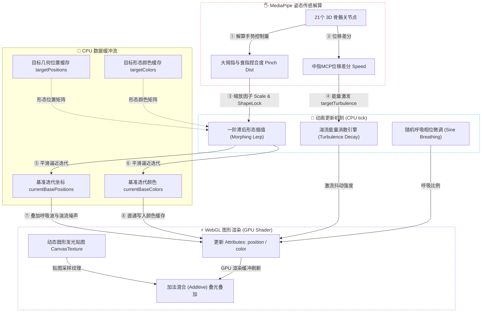

# 🌌 三维星寰：基于 WebGL 与数学建模的圆流漩涡星砂粒子系统

> [!abstract] 核心物理与图形学摘要
> 本篇文档为粒子系统专题设计报告。本系统实现了由 8,000 点级高维粒子云构建的星砂几何演化系统。通过参数方程建模、插值插补动力学、手势传感器物理噪声激发的深入解算，探究了在浏览器前端利用 GPU 加速渲染与 CPU 实时形态计算的高性能融合方案。

---

## 📐 一、 粒子系统数学几何建模 (Rigorous Academic)

本系统采用 8,000 个独立粒子点（$N = 8000$）。每个粒子在三维空间中拥有位置向量 $\mathbf{p}_i = (x_i, y_i, z_i)^T$ 与颜色向量 $\mathbf{c}_i = (r_i, g_i, b_i)^T$。所有形态的几何分布均通过严谨的数学公式生成，并在系统初始化时预计算（Pre-compute）至内存缓冲区。

### 1. 均匀分布球体 (Sphere Shape)
为实现球体表面的均匀分布与径向密度渐变，使用球坐标参数化：
* **几何公式**：
  $$
  \begin{cases}
  x_i = R_i \sqrt{1 - u_i^2} \cos\theta_i \\
  y_i = R_i u_i \\
  z_i = R_i \sqrt{1 - u_i^2} \sin\theta_i
  \end{cases}
  $$
* **参数范围**：
  * $u_i \in [-1, 1]$，为均匀随机数。
  * $\theta_i \in [0, 2\pi]$，为均匀随机角度。
  * $R_i = R_{\text{base}} \cdot (0.38 + 0.62 \cdot s_i^{0.28})$，其中 $s_i \in [0, 1]$ 为偏置概率因子，用以在维持实心密度的同时实现外壳渐稀的呼吸感。

### 2. 双臂对数螺旋星系 (Galaxy Shape)
模拟银河系粒子星云，系统由 $15\%$ 的实心核球（Bulge）与 $85\%$ 的双对称对数螺旋臂（Spiral Arms）混合组成。
* **对数螺旋路径**：
  $$
  r = a e^{b \theta}
  $$
* **双翼几何公式**：
  $$
  \begin{cases}
  x_i = r_i \cos\left(\theta_i + k_i \pi\right) + N_x \\
  y_i = N_y \cdot (1.0 - t_i) \\
  z_i = r_i \sin\left(\theta_i + k_i \pi\right) + N_z
  \end{cases}
  $$
* **参数设定**：
  * 对数螺旋角 $\theta_i = 8.0 \cdot t_i$，其中 $t_i \in [0, 1]$。螺旋半径 $r_i = 0.4 + 1.8 \cdot t_i$。
  * 旋臂选择算子 $k_i \in \{0, 1\}$，代表两条对称旋臂。
  * $N_x, N_y, N_z$ 是基于 Box-Muller 变换生成的正态分布高斯散布噪声（Gaussian dispersion），用以模拟旋臂向外发散的混沌状态：
    $$
    N \sim \mathcal{N}(0, \sigma^2(t))
    $$

### 3. 带偏转角的土星环 (Saturn Shape)
由 $55\%$ 的紧密核体球心与 $45\%$ 的平面圆环（Ring）组成，圆环模拟小行星带，并绕 X 轴倾斜。
* **倾斜旋转变换**：
  设未偏转前环上点为 $\mathbf{p} = (x, y, z)^T$，绕 X 轴旋转 $\phi = 20^\circ \approx 0.35\text{ rad}$ 的矩阵乘法：
  $$
  \mathbf{p}' = \mathbf{R}_x(\phi) \mathbf{p} \implies \begin{pmatrix} x' \\ y' \\ z' \end{pmatrix} = \begin{pmatrix} 1 & 0 & 0 \\ 0 & \cos\phi & -\sin\phi \\ 0 & \sin\phi & \cos\phi \end{pmatrix} \begin{pmatrix} x \\ y \\ z \end{pmatrix}
  $$
* **解析展开**：
  $$
  \begin{cases}
  x'_i = x_i \\
  y'_i = y_i \cos\phi - z_i \sin\phi \\
  z'_i = y_i \sin\phi + z_i \cos\phi
  \end{cases}
  $$
* **环内径与外径分布**：半径 $r_i \sim U(1.4, 2.5)$。

### 4. 连续圆柱螺旋面 (Spring Shape)
模拟三维弹簧的体积钢丝管结构，不仅沿圆柱螺旋线（Helix）延伸，还在管道横截面上具有厚度。
* **参数化公式**：
  设 $t_i \in [0, 1]$，螺距圈数 $T = 6.5$，螺旋半径 $R = 0.52$，钢丝管径 $r_{\text{tube}} = 0.075$：
  $$
  \theta_i = t_i \cdot T \cdot 2\pi, \quad \phi_i \sim U(0, 2\pi)
  $$
  $$
  \begin{cases}
  x_i = R \cos\theta_i + r_i \cos\phi_i \cos\theta_i \\
  y_i = (t_i - 0.5) \cdot 2.2 + r_i \sin\phi_i \\
  z_i = R \sin\theta_i + r_i \cos\phi_i \sin\theta_i
  \end{cases}
  $$
  * 其中 $r_i = \text{random} \cdot r_{\text{tube}}$ 实现了钢丝管内多维粒子的三维填充。

### 5. 脉络弯折叶片 (Leaf Shape)
系统通过 $15\%$ 的中央主脉（Midrib）、$20\%$ 的分支侧脉（Side Veins）以及 $65\%$ 的叶面体（Leaf Blade）构成：
* **叶面边界方程**：
  叶片宽度的径向包络呈正弦渐变：
  $$
  W(t) = 1.15 \sin(\pi t) \cdot (0.42 + 0.58 t), \quad t \in [0, 1]
  $$
* **折叠与纵向弯曲面**：
  $$
  \begin{cases}
  x_i = u_i \cdot W(t_i) \\
  y_i = (t_i - 0.5) \cdot 3.4 \\
  z_i = -0.32 \sin(\pi t_i) + 0.28 |x_i| + \mathcal{N}(0, \sigma^2)
  \end{cases}
  $$
  * 式中 $-0.32 \sin(\pi t_i)$ 刻画了叶片首尾向下的纵向弯折线；$0.28 |x_i|$ 则构造了叶片向中脉对折的 V 字型主脉凹槽。

### 6. 参数化三维爱心 (Heart Shape)
使用经典的三维爱心拓扑曲面方程：
* **几何公式**：
  $$
  \begin{cases}
  x_i = 1.4 \sin^3\theta_i \cos\phi_i \\
  y_i = \left(1.3 \cos\theta_i - 0.5 \cos 2\theta_i - 0.2 \cos 3\theta_i - 0.1 \cos 4\theta_i\right) \cos\phi_i \\
  z_i = 1.1 \sin\phi_i \left(0.4 + 0.6 \left|\sin\theta_i\right|\right)
  \end{cases}
  $$
* **参数范围**：$\theta_i \in [-\pi, \pi]$，$\phi_i \in [-\frac{\pi}{2}, \frac{\pi}{2}]$。

---

## 🌀 二、 动力学控制与物理渲染 (Double-Track Metaphors)

在渲染回路中，粒子除了要按上述数学公式在静止态下分布，还需实时计算动力学行为以实现自然的体感映射：

### 1. 状态过渡的渐近插值 (Morphing)

> [!tip] 状态过渡的一阶惯性插值 (Morphing)
> * **【学术轨】**：系统将粒子变换视为**流形上的状态渐近流**。在每帧 Tick 中，粒子 base 坐标 $\mathbf{p}_{\text{base}}$ 和颜色 $\mathbf{c}_{\text{base}}$ 依照一阶惯性滞后滤波向目标点渐近逼近：
>   $$
>   \mathbf{p}_{\text{base}}(t) \leftarrow \mathbf{p}_{\text{base}}(t-1) + \left(\mathbf{p}_{\text{target}} - \mathbf{p}_{\text{base}}(t-1)\right) \times \gamma
>   $$
>   $$
>   \mathbf{c}_{\text{base}}(t) \leftarrow \mathbf{c}_{\text{base}}(t-1) + \left(\mathbf{c}_{\text{target}} - \mathbf{c}_{\text{base}}(t-1)\right) \times \gamma
>   $$
>   * 其中 $\gamma = 0.06$ 为形态切换步长常数，提供了阻尼过渡效果。
> * **【直觉轨】**：**流沙形态过渡（Sand Morphing）**。当切换手势时，粒子就像一盘被吹散又重新聚拢的带电发光流沙，以轻缓、粘滞的滑动曲线滑向新的位置。这种连续渐变在视觉上极其平滑，毫无跳变感。

### 2. 个体呼吸波 (Breathing Effect)

> [!note] 粒子群的微光呼吸 (Sine Breathing)
> * **【学术轨】**：为引入动态微扰（Micro-perturbation），初始化时分配给每个粒子一个恒定的随机相位差 $\psi_i \sim U(0, 2\pi)$。在动画回路中，沿径向做极低频的正弦微小波动：
>   $$
>   W_i(t) = 1.0 + 0.035 \sin(2.2 t + \psi_i)
>   $$
> * **【直觉轨】**：**微光呼吸（Bioluminescence Pulse）**。避免了传统静态模型的死板。粒子并非固定在 3D 坐标上，而是像水母或夏夜萤火虫群一样，每一个点都有着自己独特的生命节律，在极小的空间内发生着微妙的膨胀与收缩。

### 3. 手势运动学流体湍流 (Turbulence & Jitter)

> [!warning] 手势运动学激发的流体湍流 (Turbulence Jitter)
> * **【学术轨】**：提取 MediaPipe 输出的第 9 号关节（中指 MCP 关节，即手掌心）的上一帧与当前帧坐标 $\mathbf{x}_{\text{prev}}, \mathbf{x}_{\text{curr}}$。计算平面一阶导数（速度）以量化运动强度：
>   $$
>   v_{\text{hand}} = \frac{\|\mathbf{x}_{\text{curr}} - \mathbf{x}_{\text{prev}}\|_2}{\Delta t}
>   $$
>   运动强度直接激发能量池 $T_{\text{target}} = \min(1.0, 16.0 \cdot v_{\text{hand}})$。每帧以指数衰减公式退化，以维持流体力学中的能量消散特征：
>   $T(t) \leftarrow T(t-1) + \left(T_{\text{target}} - T(t-1)\right) \times 0.1, \quad T_{\text{target}} \leftarrow T_{\text{target}} \times 0.92$
>   流体扰动最终通过高频三维周期波动施加给粒子，其中扰动方向正交：
>   $$
>   \begin{cases}
>   N_x = \sin(4.0 y_{\text{base}} + 7.5 t + \psi_i) \cos(4.0 z_{\text{base}} + 7.5 t) \\
>   N_y = \sin(4.0 z_{\text{base}} + 7.5 t + \psi_i) \cos(4.0 x_{\text{base}} + 7.5 t) \\
>   N_z = \sin(4.0 x_{\text{base}} + 7.5 t + \psi_i) \cos(4.0 y_{\text{base}} + 7.5 t)
>   \end{cases}
>   $$
>   最终渲染位置 $\mathbf{P}_i(t)$：
>   $$
>   \mathbf{P}_i(t) = \mathbf{p}_{\text{base}}(t) \cdot W_i(t) \cdot D_{\text{pinch}} + \mathbf{N}_i \cdot \left(0.26 \cdot T(t)\right)
>   $$
> * **【直觉轨】**：**水下激流波动（Water Turbulence）**。当你把手掌快速在空中扫过时，就好像把手伸入了一池装满发光星砂的水盆中用力搅动。原本整齐的几何体在运动能量的激发下，边缘会瞬间爆发出强烈的杂乱颤抖（湍流），随着你收拢手掌静止，多余的激流能量慢慢消退，星砂又温顺地吸附回几何体的原本轮廓。

---

## 🗺️ 三、 粒子交互系统架构与流转图



---

## ⚠️ 四、 性能踩坑与底层深度避坑纪实

> [!important] 避坑一：Points 渲染的深度写入死锁（Black Rectangle Clipping）
> * **问题本质**：WebGL 默认开启了深度写入（Depth Write）。渲染半透明的粒子贴图时，后面的粒子如果比前面的粒子后渲染，会因为深度检测失败而被直接丢弃，在粒子叠加处产生大片**黑色方块切边（贴图背景遮挡）**。
> * **解决法门**：在 PointsMaterial 配置中切断深度写入：
>   ```javascript
>   depthWrite: false,
>   transparent: true,
>   blending: THREE.AdditiveBlending
>   ```
>   关闭深度写入后，粒子不会阻止后方粒子的绘制；配合 `AdditiveBlending`（颜色相加混合），粒子在空间重叠越多的地方光强越大，呈现出高亮聚光星寰效果。

> [!warning] 避坑二：CPU 与 GPU 传输带宽阻塞（Buffer Upload Overload）
> * **问题本质**：8,000个粒子的三维顶点数组在每一帧 Tick 中都在被 CPU 进行 Morphing 和 Noise 迭代。如果每帧都使用全新的 TypedArray 重新挂载 Attribute，会强行引发 WebGL 频繁的显存重分配，CPU-to-GPU 的 PCIe 传输瞬间占满，导致帧率断崖式跌落至 15 帧。
> * **解决法门**：**固定缓冲区更新（In-place Buffers Update）**。只在初始化时分配一次 Float32Array 缓冲区，挂载为 permanent 属性。在 tick 动画中，直接通过索引修改该 Array 的内部数值，修改完成后仅发送修改脏标记通知 GPU 刷新：
>   ```javascript
>   particleMesh.geometry.attributes.position.needsUpdate = true;
>   ```
>   由此避免了垃圾回收（GC）机制对废弃数组的频繁回收，使前端稳稳锁死在 60 帧满帧运行。

---

## 📖 五、 中英专业学术术语对照

| 中文学术术语 | 英文学术术语 | 图形学/物理学核心释义 |
| :--- | :--- | :--- |
| **加法混合** | Additive Blending | 像素重叠时源色与目标色直接相加的融合机制，常用于发光粒子渲染。 |
| **深度写入禁用** | Depth Write Disabled | 绘制当前物体时不修改深度缓冲区，用于处理无重叠遮挡关系的透明材质。 |
| **高斯正态分布** | Gaussian Distribution | 以均值为中心的对称概率分布，本系统用于控制星系旋臂粒子的横向散布度。 |
| **一阶滞后插值** | Linear Interpolation (Lerp) | 沿流形路径进行常数比例逼近的线性静态插值方法，表现为带阻尼的位移。 |
| **湍流扰动** | Turbulence Jitter | 引入高频正交空间噪声来干扰粒子坐标，用以模拟流体介质中的物理抖动。 |
