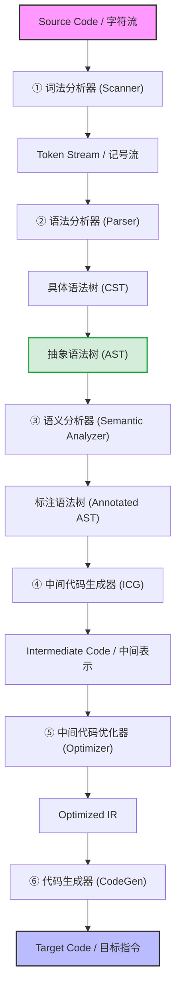

---
aliases:
- 编译器结构与翻译阶段
- Translation Process
- Compiler Phases
- 编译器结构与翻译流程：从原材料到成品的生产流水线
created: 2026-06-12
english: Compiler Structure & Translation Process
tags:
- 编译原理
- 引论
- 编译器结构
- AST
title: 1.1_编译器结构与翻译流程
type: concept
---
# 编译器结构与翻译流程：从原材料到成品的生产流水线

> English: **Compiler Structure & Translation Process**

本节梳理编译器在翻译源程序时经历的各个核心阶段、以及阶段之间流动的数据结构。我们将以实例直观展示词法分析、语法分析（含语法树与抽象语法树的比对）与语义分析的核心任务。

---

## 1. 🌟 大白话通俗解释 (核心直觉)

*   **生活化比喻 —— 翻译外国学术著作** ：
    要把一本英文的学术著作翻译成中文：
    1.  **认字与分词 (Scanner / 词法分析)** ：先把一连串的英文字母拆分成一个个单词（比如 `Apple`, `is`, `fruit`），剔除空格和乱码。
    2.  **句法结构分析 (Parser / 语法分析)** ：分析句子结构，判断主谓宾是否完整，画出句子的语法结构树。
    3.  **语义理解与校对 (Semantic Analyzer / 语义分析)** ：检查句子是否合理。例如“绿色的思想疯狂地睡觉”在句法上正确，但在语义上荒谬。同时查对人名（符号表）是否前后一致。
    4.  **润色与重排 (Optimizer / 优化)** ：精简句子，把重复累赘的话删去。
    5.  **落笔成书 (Code Generator / 代码生成)** ：正式写出对应的中文段落。
*   **一句话总结** ：
    编译器是一个 **多阶段流水线** ，它将高层高级语言代码自底向上逐步解构、分析，并最终合成为底层的机器指令。

---

## 2. 📝 学术规范与编译阶段 (考试硬核)

编译器的基本运行流程可以用以下经典的多阶段流水线表示：



### 编译阶段任务清单

1.  **词法分析器 (Scanner / Lexical Analyzer)** ：
    *   *输入*：字符流（Character Stream）。
    *   *输出*：记号流（Token Stream）。
    *   *核心任务*：识别出具有独立词法意义的语法单元（Token，如标识符、关键字、字面量、操作符）。将标识符（如变量名）存入 **符号表 (Symbol Table)** 。
2.  **语法分析器 (Parser / Syntax Analyzer)** ：
    *   *输入*：记号流。
    *   *输出*：语法树。
    *   *核心任务*：确定程序的语法结构，生成能够反映推导关系的层次树。
3.  **语义分析器 (Semantic Analyzer)** ：
    *   *输入*：语法树。
    *   *输出*：带属性标注的语法树。
    *   *核心任务*：进行 **静态语义检查** ，如类型检查、声明检查（变量是否先声明后使用）等。

---

## 🎨 关键对比：具体语法树 (CST) vs 抽象语法树 (AST)

在语法分析阶段，编译器从 Token 流构建出语法树。这是 Chapter 1 与后续语法分析中最重要的概念对比之一：

*   **具体语法树 (Concrete Syntax Tree / CST，又称分析树 Parse Tree)** ：
    完全保留了文法产生式推导过程的 **所有细节符号** （包括辅助推导的括号 `(` `)`、分号 `;`、方括号 `[` `]` 等终结符）。CST 极其冗余，体积庞大。
*   **抽象语法树 (Abstract Syntax Tree / AST，又称语法树 Syntax Tree)** ：
    是 CST 的 **高度凝聚与浓缩** 。它剥离了所有无助于后续属性求值与翻译的辅助性符号（如括号、分号等操作符的媒介符），只保留核心的 **算子 (Operators)** 和 **操作数 (Operands)** 。

> [!NOTE]
> 全局核心概念详解请跳转阅读： **[[AST|抽象语法树]]** 。

### 经典实例分析：`a[index] = 4 + 2`

以下直观呈现这一行赋值语句在 Parser 输出阶段所生成的两棵树的结构差异：

#### 1. 具体语法树 (CST)
CST 忠实保留了方括号 `[` `]` 和等号 `=` 在文法推导中的具体位置：

```
                 expression
                     |
              Assign-expression
             /       |       \
      expression     =    expression
          |                   |
  Subscript-expression   Additive-expression
  /    |      |     \       /     |     \
expression [ expr ] expression  +  expression
|            |            |           |
Identifier a Identifier index Number 4 Number 2
```

#### 2. 抽象语法树 (AST)
AST 将结构高度浓缩，算符直接作为父节点，删去了辅助性的方括号，直接用下标操作符 `[]` 指代：

```
                =
             /     \
           []       +
          /  \     / \
         a  index 4   2
```
*   **AST 优化效果** ：可以看到，方括号 `[`、`]` 以及多余的 `expression` 单链传递节点被完全剔除，只留下了核心的数据结构和运算操作。

---

## 3. 🎯 应试痛点与常见考题

*   **编译阶段职责划分（选择题/简答题）** ：
    *   *题目*：类型检查、变量未声明便使用属于编译的哪个阶段？
    *   *答案*： **语义分析阶段** （Parser 阶段只管结构是否符合文法句法，不管类型是否匹配）。
*   **画出 AST 与 CST** ：
    *   *题目*：给定一个简单赋值表达式（如 `x = a + 3`），画出其 CST 和 AST。
    *   *技巧*：CST 必须按照文法层级推导，保留等号等细节；AST 只需要将操作符（如 `=`，`+`）作为分支节点，操作数（如 `x`, `a`, `3`）作为叶子节点。

---

## 🔗 关联概念
*   **`[[编译原理总览]]`** — 课程脉络总索引
*   **[[AST|抽象语法树（AST）]]** — 语法与语义分析的核心载体
*   **`[[1.2_T形图与自举]]`** — 编译器的翻译与移植机制
