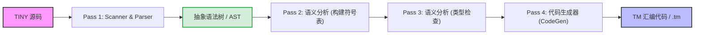

---
aliases:
- TINY语言
- TM虚拟机
- Tiny Machine
- TINY语言与TM虚拟机：供新手练手的袖珍编译器沙盒
created: 2026-06-12
english: TINY Language & TM Machine
tags:
- 编译原理
- 引论
- TINY
- 虚拟机
title: 1.3_TINY语言与TM虚拟机
type: concept
---
# TINY语言与TM虚拟机：供新手练手的袖珍编译器沙盒

> English: **TINY Language & TM Machine**

本节梳理 Louden 教材专属的 **TINY 语言** 的语法规则、 **TINY 编译器** 的内部阶段划分，以及配套的 **TM 虚拟机 (Tiny Machine)** 指令集系统。这是将编译原理理论落地的经典实操案例。

---

## 1. 🌟 大白话通俗解释 (核心直觉)

*   **TINY 语言 —— “小学生极简英语”** ：
    普通的编程语言（如 C++、Java）就像复杂的成人语言，有千百种语法和修饰词。而 **TINY** 语言是一门为了教学而特意裁剪出来的“极简语言”。它没有复杂的指针、没有类和对象、甚至连变量类型也只有整数一种，控制语句也只有 `if` 和 `repeat`。因为它足够简单，所以几百行代码就能写完它的编译器。
*   **TM 虚拟机 —— “带有 8 个寄存器和 2 个内存条的迷你沙盒”** ：
    写出来的 TINY 程序不能直接在我们的 Intel 或 AMD 的 CPU 上运行。为了运行它，教科书作者设计了一个虚拟的计算机，叫做 **TM (Tiny Machine)** 。
    它非常小巧，只有 8 个寄存器（$r0 \sim r7$），但它遵循现代处理器的基本规律：数据 and 指令是分开的（哈佛架构），做加减法必须把数先放进寄存器里（RISC 风格）。通过一个简单的模拟器软件（`tm.exe`），我们就能一步步看清代码是如何在底层被执行的。

---

## 2. 📝 TINY 语言特性与编译器结构 (硬核理论)

### TINY 语言的语法设计特征

1.  **极简的变量与类型** ：
    *   所有变量都是 **整型 (Integer)** ，无需显式声明（直接使用即声明）。
    *   没有数组、结构体、指针等复杂数据类型。
2.  **基本控制流语句** ：
    *   只有两种控制流：`if-else`（条件判断）和 `repeat-until`（循环）。
3.  **输入输出 (I/O)** ：
    *   内置 `read` 语句（从标准输入读取整数到变量中）与 `write` 语句（向标准输出打印变量或表达式的值）。
4.  **表达式与运算符** ：
    *   算术运算支持 `+`, `-`, `*`, `/`，以及圆括号 `()`。
    *   比较运算支持 `<` 和 `=`。
    *   **布尔表达式只作为控制流语句的测试条件** ，不能赋值给普通变量（即没有布尔类型变量，只有布尔测试状态）。
5.  **注释风格** ：
    *   用花括号 `{ ... }` 包裹， **不支持嵌套** 。

---

### TINY 编译器的内部结构与多趟划分 (Passes)

TINY 编译器的核心代码由 C 语言写成，其工作流程分为 **4 趟 (4 Passes)** ，由 `main.c` 驱动：

1.  **Pass 1：词法与语法分析** ：
    *   `scan.c` (Scanner) 读入字符流并生成 Token。
    *   `parse.c` (Parser) 采用递归下降分析法，吃进 Token 并构建出 **抽象语法树 (AST)** 。
2.  **Pass 2：语义分析（构建符号表）** ：
    *   `analyze.c` 中的 `buildSymtab` 遍历 AST，并在 `symtab.c` 中创建/更新符号表，记录变量的名字和首次出现的位置。
3.  **Pass 3：语义分析（类型检查）** ：
    *   `analyze.c` 中的 `typeCheck` 再次遍历 AST，确保表达式的类型匹配（例如，确保比较运算的左右两边都是整型）。
4.  **Pass 4：代码生成** ：
    *   `cgen.c` (Code Generator) 和 `code.c` 遍历 AST，根据语法树节点的语义，生成对应的 TM 虚拟机汇编代码。

---

## 💻 3. TM 虚拟机与汇编指令集 (重点难点)

### TM 虚拟机的架构规格

*   **哈佛架构 (Harvard Architecture)** ：
    *   **指令内存 (Instruction Memory)** ：只读的指令段，地址范围为 $0 \sim \text{I-Max}-1$。
    *   **数据内存 (Data Memory)** ：可读写的变量及堆栈段，地址范围为 $0 \sim \text{D-Max}-1$。
*   **寄存器系统** ：
    *   拥有 8 个通用寄存器：`reg[0]` 至 `reg[7]`，其值均为整型。
    *   **PC 寄存器 (Program Counter)** ：通常在模拟器中用作程序计数器，指明下一条要执行的指令地址。
    *   **寄存器约定** ：在 TINY 代码生成中，一般指定 `reg[7]` 为 **PC** ，`reg[6]` 为指向堆栈顶部的 **SP (Stack Pointer)** ，`reg[5]` 为指向全局变量段的 **GP (Global Pointer)** 。`reg[0]` 和 `reg[1]` 常用作临时计算的累加器。

---

### TM 指令集格式与执行机制

TM 虚拟机的指令有两种基本格式： **只对寄存器操作的 RO 格式** ，和 **寄存器与内存交互的 RM 格式** 。

#### 1. RO (Register-Only) 指令格式
此类指令仅在寄存器之间进行计算或实现特殊的 I/O 与停机。
*   **指令形式** ： `OP  r, s, t`
*   **动作语义** ： 将寄存器 `s` 和 `t` 的值进行运算，结果存入目标寄存器 `r` 中。

| 助记符 | 指令参数 | 动作语义 (C语言描述) | 含义说明 |
| :--- | :--- | :--- | :--- |
| **ADD** | `r, s, t` | `reg[r] = reg[s] + reg[t]` | 加法 |
| **SUB** | `r, s, t` | `reg[r] = reg[s] - reg[t]` | 减法 |
| **MUL** | `r, s, t` | `reg[r] = reg[s] * reg[t]` | 乘法 |
| **DIV** | `r, s, t` | `reg[r] = reg[s] / reg[t]` | 除法 (分母为0时停机) |
| **IN** | `r, s, t` | `reg[r] = read_integer()` | 从标准输入读入一个整数到 `r` (忽略 s, t) |
| **OUT** | `r, s, t` | `print(reg[r])` | 向标准输出打印 `r` 的值 (忽略 s, t) |
| **HALT** | `r, s, t` | `stop_simulation()` | 停止虚拟机运行 (忽略 r, s, t) |

#### 2. RM (Register-Memory) 指令格式
此类指令实现寄存器与数据内存之间的装载与存储，以及控制流的条件/无条件跳转。
*   **指令形式** ： `OP  r, d(s)`
*   **有效地址计算 (Effective Address / EA)** ： $\text{EA} = d + \text{reg}[s]$。其中 $d$ 是一个有符号的整型偏移量 (Offset)，$s$ 是基址寄存器。

> [!IMPORTANT]
> RM 跳转指令的条件判定均是 **相对于 0 (Zero) 进行比较** 。如果满足条件，则将 PC 寄存器设为有效地址 $\text{EA}$；否则，PC 自动加 1 执行下一条。

| 助记符 | 指令参数 | 动作语义 (C语言描述) | 含义说明 |
| :--- | :--- | :--- | :--- |
| **LD** | `r, d(s)` | `reg[r] = dMem[d + reg[s]]` | **Load** ：从内存加载数据到寄存器 |
| **ST** | `r, d(s)` | `dMem[d + reg[s]] = reg[r]` | **Store** ：将寄存器数据存储进内存 |
| **LDA** | `r, d(s)` | `reg[r] = d + reg[s]` | **Load Address** ：将计算出的有效地址加载到寄存器 |
| **LDC** | `r, d(s)` | `reg[r] = d` | **Load Constant** ：直接加载常数 $d$ 到寄存器 (忽略 s) |
| **JLT** | `r, d(s)` | `if (reg[r] < 0) reg[PC] = d + reg[s]` | **Jump if Less Than** ：寄存器值小于 0 则跳转 |
| **JLE** | `r, d(s)` | `if (reg[r] <= 0) reg[PC] = d + reg[s]` | **Jump if Less than or Equal** ：小于等于 0 跳转 |
| **JGT** | `r, d(s)` | `if (reg[r] > 0) reg[PC] = d + reg[s]` | **Jump if Greater Than** |
| **JGE** | `r, d(s)` | `if (reg[r] >= 0) reg[PC] = d + reg[s]` | **Jump if Greater than or Equal** |
| **JEQ** | `r, d(s)` | `if (reg[r] == 0) reg[PC] = d + reg[s]` | **Jump if Equal** |
| **JNE** | `r, d(s)` | `if (reg[r] != 0) reg[PC] = d + reg[s]` | **Jump if Not Equal** |

---

### TM 仿真器交互命令一览

编译出的 `.tm` 文件可以在仿真器中以交互式命令运行，常用调试指令如下：

*   `regs`：打印当前所有 8 个通用寄存器以及 PC 寄存器的值。
*   `go`：连续执行指令，直到遇到 `HALT` 指令或发生运行时错误。
*   `step <n>`：单步或执行指定的 $n$ 步指令。
*   `dMem <b> <n>`：打印从数据内存地址 $b$ 开始的 $n$ 个内存单元内容。
*   `iMem <b> <n>`：打印从指令内存地址 $b$ 开始的 $n$ 条指令。
*   `quit`：退出仿真器。

---

## 4. 🎯 应试痛点与常见考题

*   **TINY 语言特性的正误判断** ：
    *   *常见考点*：TINY 语言中是否允许将布尔值 `true`/`false` 赋给变量？
    *   *防坑技巧*： **不允许** 。条件判断结果（如 `x < 5`）是临时测试状态，TINY 没有布尔类型的变量，也没有赋值给布尔变量的文法。
*   **计算跳转指令的目标地址** ：
    *   *经典题目*：给定一条跳转指令 `JEQ 0, -5(7)`，已知当前 PC 指向该指令（假设地址为 15），该指令执行时若 `reg[0] == 0`，PC 将跳转到哪里？
    *   *计算方法*：有效跳转地址 $\text{EA} = d + \text{reg}[s]$。这里 $d = -5$，$s = 7$（即 PC 寄存器，当前值为 15）。因此跳转地址为 $-5 + 15 = 10$。

---

## 🔗 关联概念
*   **`[[1.1_编译器结构与翻译流程]]`** — 编译器各个 Passes 的宏观划分
*   **`[[1.2_T形图与自举]]`** — 跨平台交叉编译移植的理论表达
