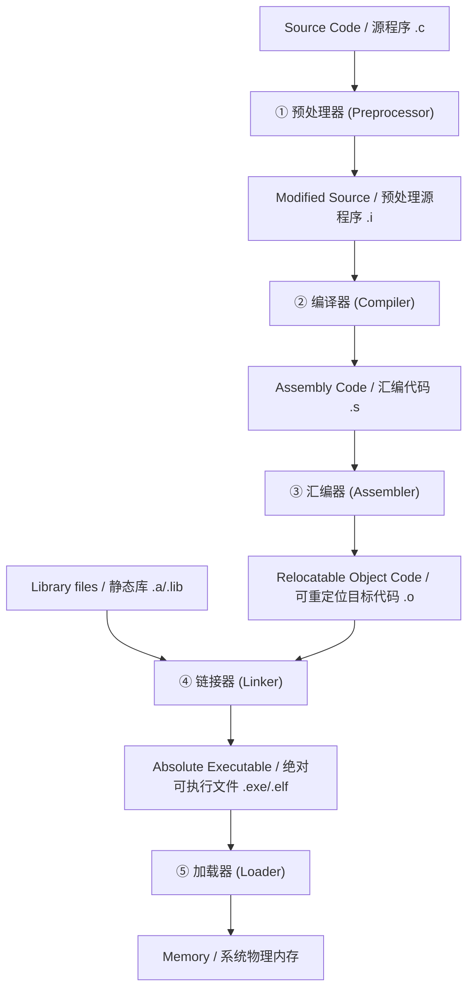

---
aliases:
- 编译器伴随工具链
- 编译程序伴随工具
- 预处理器、编译器、汇编器、链接器、加载器
- Toolchain
- 预处理、汇编、链接与加载
- 编译器伴随工具链：软件从源码到内存的完整生命旅程
created: 2026-06-13
english: Compiler Companion Toolchain
tags:
- 编译原理
- 引论
- 工具链
- 链接
- 汇编
title: 1.5_编译器伴随工具链（预处理、汇编、链接与加载的联合流水线）
type: concept
---
# 编译器伴随工具链：软件从源码到内存的完整生命旅程

> English: **Compiler Companion Toolchain**

在实际工程中，将高层源语言代码转化为计算机内存中真正可执行的程序，并非仅由编译器（Compiler）孤立完成，而是由一系列**伴随工具（Companion Tools）**共同构成的**联合流水线**。

---

## 1. 🌟 大白话通俗解释 (核心直觉)

*   **生活化比喻 —— 汽车生产与运输交付线**：
    要将汽车的设计图纸变成用户在公路上开的车，需要经历以下步骤：
    1.  **宏图预处理 (Preprocessor / 预处理器)**：先把图纸中引用到的外部发动机标准件、外部车门螺丝说明书合并到主图纸上，并剔除所有草稿线（注释）。
    2.  **核心冲压组装 (Compiler / 编译器)**：将设计图纸转化为精密的**汽车骨架和底盘**。
    3.  **标准化零件喷漆 (Assembler / 汇编器)**：把骨架上的各类定制设计翻译为标准化工厂零件编号（机器码 `.o` / 目标文件）。
    4.  **各车间联合组装 (Linker / 链接器)**：把底盘车间、引擎车间、轮胎车间生产的各自独立的部件链接组合在一起，拼接成一辆**完整的可以开动的车**。
    5.  **物流配送与上路 (Loader / 加载器)**：将组装好的车通过拖车运送到公路上，加满油（分配内存空间，置初始指针），让车子真正跑起来。
*   **一句话总结**：
    **预处理器**做源码合并，**编译器**把源码变汇编，**汇编器**把汇编变机器码，**链接器**把零散的机器码打包成可执行文件，**加载器**把可执行文件装载进内存执行。

---

## 2. 📝 学术规范定义 (考试硬核)

程序构造的完整系统生命周期可以由以下管道表示：

### 2.1 预处理器 (Preprocessor)
*   **核心功能**：处理所有以 `#` 开头的预处理指令。
*   **任务清单**：
    1.  **文件包含**：将指定的头文件（如 `#include <stdio.h>`）内容直接拷贝替代该行。
    2.  **宏展开**：将所有的宏定义（如 `#define PI 3.14`）在代码中进行文本级替换。
    3.  **条件编译**：根据条件（如 `#ifdef DEBUG`）保留或剔除特定代码段。
    4.  **注释剥离**：剔除所有单行及多行注释。

### 2.2 编译器 (Compiler)
*   **核心功能**：将预处理后的源程序（高层语言）翻译为特定的**汇编语言程序（Assembly Code）**。

### 2.3 汇编器 (Assembler)
*   **核心功能**：将汇编语言翻译为机器可以直接识别的**可重定位指令机器码（Relocatable Machine Code）**。
*   **输出物**：`.o` 或 `.obj` 文件（二进制格式，但其中各个函数和变量的内存地址尚未确定，是“相对可移动的”）。

### 2.4 链接器 (Linker)
*   **核心功能**：将多个独立编译的 `.o` 文件以及系统库文件（如 `.lib`, `.a`）合并、整理，打包成一个**绝对可执行文件**。
*   **两大核心任务**：
    1.  **符号解析 (Symbol Resolution)**：将代码中对外部符号（如调用 `printf` 函数）的引用与该符号的定义关联起来。
    2.  **重定位 (Relocation)**：将各个可重定位目标文件的独立地址空间合并，为所有指令和全局变量分配最终的、唯一的**逻辑内存虚拟地址**。

### 2.5 加载器 (Loader)
*   **核心功能**：操作系统内核的装载子系统。将存放在硬盘上的绝对可执行二进制文件加载到主存（RAM）的指定位置。
*   **任务清单**：
    1.  创建进程，分配虚拟地址空间。
    2.  将可执行文件的代码段和数据段映射/拷贝到物理内存。
    3.  初始化程序计数器（PC 指针）指向程序的入口点（Entry Point，如 `_start`）。

---

## 3. 🎯 应试痛点与避坑指南 (拿分关键)

*   **编译步骤前后顺序及输入输出判定（选择题）**：
    *   *考点*：汇编器的输入是什么？链接器的输出是什么？
    *   *易错*：汇编器的输入是**汇编代码（.s）**，不是源程序；链接器的输出是**绝对可执行代码**。
*   **可重定位目标文件 vs 可执行文件**：
    *   *区别*：前者地址空间从 0 开始，各段相对独立，**无法直接被 CPU 执行**（因为外部函数符号未解析）；后者拥有操作系统分配的绝对虚拟空间，可直接装载。

---

## 4. 🔗 关联上下文 (双链图谱)

*   **上级章节**：[[1.1_编译器结构与翻译流程]]
*   **同级概念**：[[1.4_编译与解释的根本区别（整本翻译与逐句口译的差异）|编译与解释的根本区别]]
*   **后续延伸**：[[DFA]] — 词法分析阶段的底层引擎
