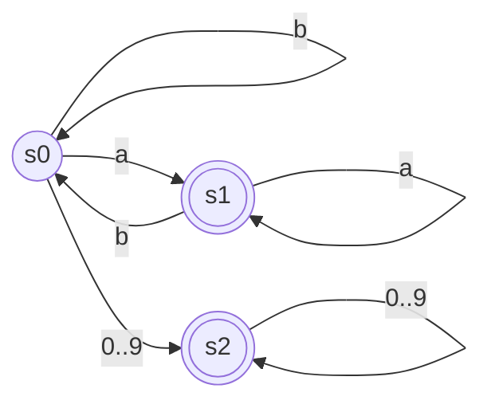
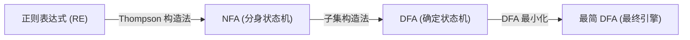

---
aliases:
- DFA（确定有限自动机）
- DFA
- 确定性有限状态自动机
- 确定有限自动机
- Deterministic Finite Automaton
- DFA：一条路走到底的确定识别机器
created: 2026-06-12
english: Deterministic Finite Automaton
source_chapter:
- 2
tags:
- 编译原理
- 词法分析
- 自动机
title: DFA (确定有限自动机)
type: concept
used_in_chapter:
- 2
---
# DFA：一条路走到底的确定识别机器

> English: **Deterministic Finite Automaton (DFA)**

在 **词法分析 (Scanning)** 阶段，**DFA** 是词法分析器用于将源程序字符流高速切割并识别为 Token 的核心数学模型与运行引擎。

> [!NOTE] 双轨直觉：强迫症安检员与唯一地图
> - **DFA 就像一个“做事极度死板、具有强迫症的安检员”**。
> - **唯一性确定**：他没有任何分身术，在任何时刻他只能站在一个确定的房间里。对于手里的任意一个字符，规则图纸上都画着**唯一**一扇通往下一个房间的门。他绝不纠结，顺着唯一的牌子往前走。
> - **无空跳传送**：每个房间门前都必须查票（消耗输入字符），这里没有任何可以免费跨越的秘密通道（没有 $\varepsilon$ 转移）。

---

## 形式化数学定义

> [!NOTE]- 📐 理论数学定义（五元组形式化表示，可折叠不看）
> 一个确定性有限自动机 $M$ 是一个五元组：
> 
> $$
> M = (S, \Sigma, \delta, s_0, F)
> $$
> 
> 我们将抽象的符号与“强迫症安检员的工作现场”进行深度映射：
> 
> 1. **$S$ 是有限的状态集合** —— 安检站里一间间挂着门牌号的**“关卡房间”**。
> 2. **$\Sigma$ 是有限的输入字母表** —— 安检口允许通过的**“凭证字符集”**（如 ASCII 字符集，相当于门票）。
> 3. **$\delta$ 是状态转移函数**，它是一个单值映射：$\delta: S \times \Sigma \to S$。
>    - **直觉理解**：这是每个房间墙上挂着的**“唯一指示牌”**。对于当前房间 $s$ 和手里的字符 $c$，指示牌写明了唯一的下一个去处 $s' = \delta(s, c)$。如果没有写，就是走投无路（报错）。
> 4. **$s_0 \in S$ 是唯一的初始状态** —— 安检大楼唯一的**“入口大门”**。
> 5. **$F \subseteq S$ 是终态集合** —— 被安检员视为合格并盖上“通过章”的**“合格确认室”**（在状态图上通常用双圈表示）。

---

## 词法分析器 (Scanner) 工作机制

词法分析器在运行时，通过控制输入字符流的指针在 DFA 上进行状态跳转。

### 1. 二维跳转表 (Transition Table)
在代码中，状态转移函数 $\delta$ 通常被编译为一个极为高效的二维数组，利用直接寻址实现 $O(1)$ 的跳转速度：

```c
state = transition_table[current_state][input_char];
```

| 状态 \ 字符 | `a` | `b` | `0`..`9` | 其他 |
| :---: | :---: | :---: | :---: | :---: |
| **0 (初态)** | 1 | 0 | 2 | 错误 |
| **1 (终态)** | 1 | 0 | 错误 | 错误 |
| **2 (终态)** | 错误 | 错误 | 2 | 错误 |

#### 对应状态转移图 (State Transition Diagram)
上述跳转表对应的 DFA 状态图渲染如下（双圈代表终态/接受状态）：


---

### 2. 最长匹配与回溯机制 (Maximal Munch & Backtracking)

实际的编译器词法规则（如标识符与保留字）要求“最长匹配原则”。例如，输入 `iferror` 应被识别为标识符 `iferror`，而不是关键字 `if` 后面跟着标识符 `error`。

> **💡 安检员的贪婪规则：贪心走到底，退回最近合格点**
> 
> 安检员在给长字符串（比如 `iferror`）安检时，他不会一看到匹配了关键字 `if`（一个合格确认室）就停下，而是会极其贪心地顺着指示牌继续往前走，直到遇到不认识的字符或者指示牌中断（报错状态）才撞墙停下。
> 
> 撞墙后，他会查看手里的行动记录本，退回到**一路上最近走过的那个合格确认室**的位置（即最长匹配的终点），给那段内容盖章并打包输出 Token，而把后面多走的字符退回到待安检队列中（这就是回溯）。

#### Scanner 主循环经典伪代码

```c
Token nextToken() {
    State state = s0;
    int lexeme_start = current_ptr;
    int last_accept_ptr = -1;
    TokenType last_accept_type = TOKEN_ERROR;

    while (current_ptr < input_length) {
        char c = input[current_ptr];
        state = transition_table[state][c];
        
        if (state == STATE_ERROR) {
            break; // 撞墙：无法再继续匹配，退出循环
        }
        
        current_ptr++;
        
        // 记录最近一次经过的“合格确认室”（接受状态）及位置
        if (state in F) {
            last_accept_ptr = current_ptr;
            last_accept_type = getTokenType(state);
        }
    }

    // 匹配终止，进行判定与回溯
    if (last_accept_ptr != -1) {
        current_ptr = last_accept_ptr; // 回溯到最长匹配的接受点
        return Token(last_accept_type, input[lexeme_start ... last_accept_ptr-1]);
    } else {
        // 词法错误处理
        reportLexicalError();
        current_ptr = lexeme_start + 1; // 略过错误字符，继续尝试
        return Token(TOKEN_ERROR);
    }
}
```

---

## 🔄 自动机等价与词法分析流水线

在词法分析器的实际构建中，正则表达式、NFA 和 DFA 构成了一条完整的**自动化开发与运行流水线**：



- **NFA 转 DFA (子集构造法)**：NFA 容易由正则表达式机械生成，但由于存在分身和空转移，计算机运行效率低。因此，我们通过 **[[子集构造法]]**，把 NFA 的所有分身状态进行“网袋打包”，将其合并为确定性的 DFA 状态，从而消除了所有的分身和空转移。
- **DFA 转 NFA (子集关系)**：从数学定义上，任何一个 DFA 都是一个**受到限制的 NFA**（即不存在 $\varepsilon$ 边，且每个字符对应的转移状态数 $\le 1$）。因此，DFA 天然就是 NFA，不需要做任何逆向转换。
- **结构对比**：关于这两种自动机在 6 种基本语法结构（字符、连接、选择、闭包等）下的具体图形对比与化简原理，请参阅 [[NFA与DFA典型结构对照（从分头试探到单线直达）]]。

---

## 避坑与总结

1. **确定性无歧义**：DFA 每一条边上的转移都是**绝对唯一且无歧义**的，因此没有 $\varepsilon$ 边。这使得它的硬件或软件实现极快。
2. **状态转换**：在编译器设计中，我们通常使用 **[[子集构造法]]** 将直观但难以直接执行的 [[NFA]] 转换为等价的 DFA。
3. **空间优化**：生成的初级 DFA 跳转表通常较为庞大且存在冗余状态，我们会使用 **[[DFA最小化]]** 对其进行“同类合并”，极大地节省内存占用。
