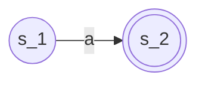
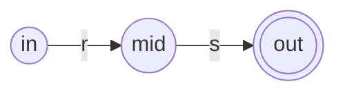
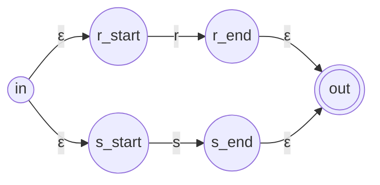
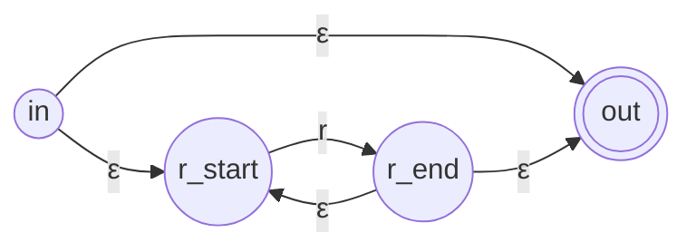
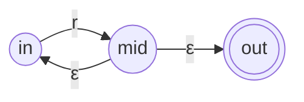
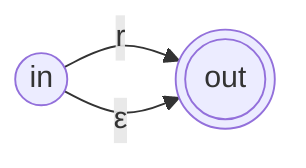

---
aliases:
- NFA（非确定有限自动机）
- NFA
- 非确定性有限状态自动机
- 非确定有限自动机
- Nondeterministic Finite Automaton
- NFA：分头试探的多样可能机器
created: 2026-06-12
english: Non-deterministic Finite Automaton
source_chapter:
- 2
tags:
- 编译原理
- 词法分析
- 自动机
title: NFA (非确定有限自动机)
type: concept
used_in_chapter:
- 2
---
# NFA：分头试探的多样可能机器

> English: **Non-deterministic Finite Automaton (NFA)**

在 **词法分析 (Scanning)** 阶段，**NFA** 是由正则表达式（RE）直接通过机械化构造法生成的中间状态机模型。它是连接“人类容易理解的词法描述”与“计算机能够快速执行的确定状态机 (DFA)”的桥梁。

> [!NOTE] 双轨直觉：多胞胎分身与免费传送门
> - **NFA 就像一个“多胞胎分身游乐园”**。
> - **分身术确定**：当你在某个房间面临岔路口（例如对于同一个输入字符，有多个不同指向的门）时，你不需要纠结走哪条，因为你可以瞬间克隆出若干个分身，分头去走每一条岔路。
> - **免费传送（$\varepsilon$ 转移）**：乐园里有一些魔法传送门（$\varepsilon$ 边），你不需要查任何票（不消耗任何字符输入），就可以直接瞬间移动过去。
> - **任意分身通关原则**：只要你所有的克隆分身中，**有任意一个分身** 最终在读完所有输入字符时成功到达了“出口”（终态），整台自动机就被视为匹配成功。

---

## 形式化数学定义

> [!NOTE]- 📐 理论数学定义（五元组形式化表示，可折叠不看）
> 一个非确定性有限自动机 $M$ 是一个五元组：
> 
> $$
> M = (S, \Sigma, \delta, s_0, F)
> $$
> 
> 我们将抽象的符号与“分身游乐园的工作现场”进行深度映射：
> 
> 1. **$S$ 是有限的状态集合** —— 游乐园里一个个**“游乐房间”**。
> 2. **$\Sigma$ 是有限的输入字母表** —— 园内允许刷卡消费的**“凭证字符集”**。
> 3. **$\delta$ 是状态转移函数**，它返回的是一个**状态集合**（幂集）：
>    - **形式化表达**：$\delta: S \times (\Sigma \cup \{\varepsilon\}) \to \mathcal{P}(S)$。
>    - **直觉理解**：这是墙上的指示牌。它写着“拿着车票 $a$ 可以去房间 $\{2, 3\}$”，或者“这里有滑梯，不拿票（$\varepsilon$）也可以去房间 $\{4\}$”。它允许**瞬移**和**分裂出分身**同时前往多个房间。
> 4. **$s_0 \in S$ 是唯一的初始状态** —— 游乐园唯一的**“检票口入口”**。
> 5. **$F \subseteq S$ 是终态集合** —— 游乐园通关大门的**“出口”**（在状态图上通常用双圈表示）。

---

## Thompson 构造法：从正则表达式到 NFA

**Thompson 构造法** 是一种将任意正则表达式递归转换为等价 NFA 的经典机械化算法。它定义了以下几种原子与组合结构：

### 1. 基本子结构（匹配字符 a）
*   **直觉解释**：普通的刷卡通道。只有拿票并刷掉字符 `a`，才能从房间 $s_1$ 走到 $s_2$。

### 2. 连接结构 (rs)
*   **直觉解释**：串行通道。先通过 $r$ 区域，在其出口通过免费通道（或直接相连）进入 $s$ 区域。

### 3. 选择结构 (r|s)
*   **直觉解释**：分身岔口。入口处通过 $\varepsilon$ 免费传送门克隆出两个你，分别去尝试走 $r$ 区域和 $s$ 区域，最后在出口重新汇合。

### 4. 克林闭包 (r*)
*   **直觉解释**：循环与绕行。
    *   **匹配 0 次**：直接从入口通过免费滑梯（$\varepsilon$）滑到终点出口。
    *   **匹配多次**：从 $r$ 区域出口通过免费滑梯绕回其起点，重复匹配。

### 5. 正闭包 (r+)
*   **直觉解释**：必须走一次的循环。你必须先老老实实穿过 $r$ 区域一次，之后才可以利用免费滑梯传回起点重复匹配多次。

### 6. 可选结构 (r?)
*   **直觉解释**：走或不走。要么穿过 $r$ 区域，要么直接走免费传送门绕开它。

---

## 🔄 自动机等价与词法分析流水线

在词法分析器的实际构建中，正则表达式、NFA 和 DFA 构成了一条完整的**自动化开发与运行流水线**：

- **NFA 转 DFA (子集构造法)**：NFA 容易由正则表达式机械生成，但由于存在分身和空转移，计算机运行效率低。因此，我们通过 **[[子集构造法]]**，把 NFA 的所有分身状态进行“网袋打包”，将其合并为确定性的 DFA 状态，从而消除了所有的分身和空转移。
- **DFA 转 NFA (子集关系)**：从数学定义上，任何一个 DFA 都是一个**受到限制的 NFA**（即不存在 $\varepsilon$ 边，且每个字符对应的转移状态数 $\le 1$）。因此，DFA 天然就是 NFA，不需要做任何逆向转换。
- **结构对比**：关于这两种自动机在 6 种基本语法结构（字符、连接、选择、闭包等）下的具体图形对比与化简原理，请参阅 [[NFA与DFA典型结构对照（从分头试探到单线直达）]]。

---

## NFA 的运行痛点与解决方案

虽然从正则表达式构造 NFA 非常机械、简单，但在计算机中直接模拟 NFA 的运行效率极低：
1. **状态爆炸与回溯**：计算机需要频繁记录当前所处的**所有可能状态的集合**，或不断回溯，这导致运行时极其消耗 CPU 和内存。
2. **解决方式**：编译器在实际运行时，绝对不直接运行 NFA。我们会使用 **[[子集构造法]]** 这一算法将 NFA “合体收网”，将所有分身可能打包合并，变成确定性的 [[DFA]] 后再执行。
