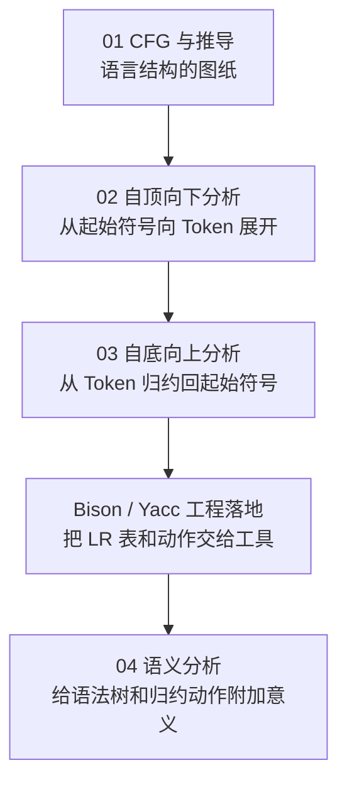
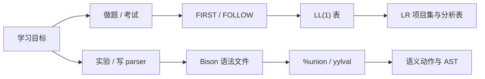

---
aliases:
- 语法分析学习路线图
- Syntax Analysis Learning Path
created: 2026-06-15
english: Syntax Analysis Learning Path
tags:
- 编译原理
- 语法分析
- 学习路线
title: 语法分析学习路线图
type: overview
used_in_chapter:
- 3
- 4
- 5
---
# 语法分析学习路线图：先会看图纸，再学两种施工队

> English: **Syntax Analysis Learning Path**

语法分析这一章最容易散成一堆名词：CFG、推导、LL(1)、FIRST、FOLLOW、LR 项目、ACTION/GOTO 表。正确读法不是按文件名随机点开，而是先建立“语言结构图纸”，再分别学习两类分析器：**自顶向下预测**与**自底向上归约**。

---

## 1. 大白话通俗解释（核心直觉）

> [!NOTE]
> **盖房子与拆包装箱的比喻**：
> *   **CFG 与推导**：先拿到建筑图纸，知道“房子可以由哪些房间组成”，也就是语言结构如何被产生式描述。
> *   **自顶向下分析（LL）**：从屋顶蓝图开始往下施工，先猜大结构，再一层层展开成具体 Token。
> *   **自底向上分析（LR）**：从地上一堆零件开始往回拼，先识别小部件，再逐步归约成完整建筑。
> *   **Bison/Yacc 工程落地**：把 LR 的状态机和语义动作交给工具生成，自己专注写文法和动作。

*   **一句话总结**：语法分析的学习顺序是 **先懂文法能描述什么，再懂 LL 怎么预测，最后懂 LR/Bison 怎么归约与落地**。

---

## 2. 推荐学习主线

| 阶段 | 先读 | 再读 | 目标 |
|---|---|---|---|
| CFG 基础 | [[CFG与上下文无关文法]] | [[最左推导]] / [[最右推导]] / [[二义性文法]] | 会判断句子怎样由文法生成 |
| 自顶向下 | [[预测分析]] | [[FIRST集合]] / [[FOLLOW集合]] / [[LL(1)文法]] | 会构造 LL(1) 分析表并追踪栈 |
| 自底向上 | [[自底向上语法分析]] | [[移进]] / [[归约]] / [[LR(0)项目]] | 会理解 shift/reduce 的机械过程 |
| LR 升级 | [[SLR(1)分析算法]] | [[LR(1)分析算法]] / [[LALR(1)分析算法]] | 会解释 LR 家族差异和冲突来源 |
| 工程落地 | [[Bison工程落地（从设计图纸到能跑的生产线）]] | [[Flex与Bison的邮筒与传送带（yylval与值栈）]] | 会把文法写成可运行 parser |

---

## 3. 两条分支的选择建议

> [!TIP]
> 如果目标是考试题，先走 **CFG → FIRST/FOLLOW → LL(1) 表 → LR 项目集 → ACTION/GOTO 表**。如果目标是实验代码，先走 **CFG → 自底向上语法分析 → Bison 工程落地 → 语义动作**。

---

## 4. 关联目录

- [[00_自顶向下分析学习路线图]]
- [[00_自底向上分析学习路线图]]
- [[00_语义分析学习路线图]]
