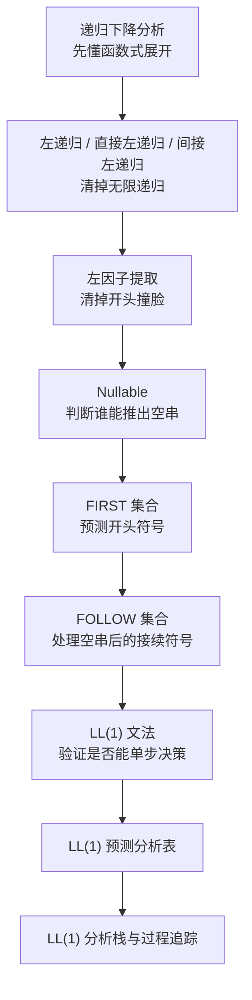

---
aliases:
- 自顶向下分析学习路线图
- LL(1)学习路线图
created: 2026-06-15
english: Top-Down Parsing Learning Path
tags:
- 编译原理
- 语法分析
- 自顶向下
- LL1
title: 自顶向下分析学习路线图
type: overview
used_in_chapter:
- 4
---
# 自顶向下分析学习路线图：先清路障，再拿预测表通关

> English: **Top-Down Parsing Learning Path**

自顶向下分析的核心问题只有一个：站在某个非终结符前，看一眼输入符号，能不能**唯一决定**用哪条产生式展开。围绕这个问题，左递归、左因子、Nullable、FIRST、FOLLOW、LL(1) 表都是服务设施。

---

## 1. 大白话通俗解释（核心直觉）

> [!NOTE]
> **走迷宫前先修路的比喻**：
> *   **左递归**像一条一进门就绕回原点的死循环路，递归下降会直接卡住。
> *   **左因子冲突**像多个岔路口开头长得一模一样，司机看第一眼根本不知道该选哪条。
> *   **FIRST/FOLLOW**是路口指示牌，告诉分析器“这条路可能以什么符号开头”和“空路走完后后面能接什么”。
> *   **LL(1) 分析表**就是最终导航地图：当前非终结符 + 当前输入符号 = 唯一产生式。

*   **一句话总结**：自顶向下分析先把文法修成不绕路、不撞脸的形状，再用 FIRST/FOLLOW 做一张不含冲突的预测表。

---

## 2. 推荐阅读顺序

| 顺序 | 笔记 | 学习目标 |
|---|---|---|
| 1 | [[递归下降分析]] / [[预测分析]] | 知道自顶向下分析器如何展开非终结符 |
| 2 | [[左递归]] / [[直接左递归]] / [[间接左递归]] | 会识别和消除递归下降的死循环来源 |
| 3 | [[左因子提取]] | 会把公共前缀抽出来，降低预测冲突 |
| 4 | [[Nullable]] | 会判断非终结符是否能推出空串 |
| 5 | [[FIRST集合]] | 会算产生式右部的首符集合 |
| 6 | [[FOLLOW集合]] | 会算非终结符后面可能出现的符号 |
| 7 | [[LL(1)文法]] | 会用 FIRST/FOLLOW 交集判断是否 LL(1) |
| 8 | [[LL(1)预测分析表（自顶向下分析的方向指示牌）]] | 会填预测分析表 |
| 9 | [[LL(1)分析栈（倒装衣服的窄筒行李箱）]] / [[LL(1)预测分析过程追踪（分析器运行的慢动作回放）]] | 会按输入串追踪分析过程 |

---

## 3. 做题路线

> [!TIP]
> 自顶向下综合题不要一上来填表。标准顺序是：先消左递归，再提左因子，再算 Nullable/FIRST/FOLLOW，最后填 LL(1) 表并检查冲突。

---

## 4. 关联套路

- [[01_LL1分析过程追踪套路]]
- [[02_LL1综合题套路]]
- [[03_判断文法不是LL1]]
- [[04_提取左因子套路]]
- [[05_消除左递归套路]]
