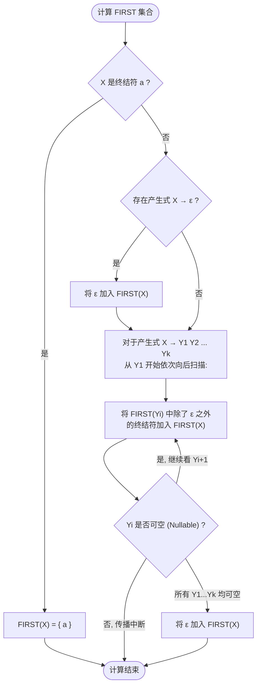

---
aliases:
- First 集合
- FIRST Set
- First Set
- FIRST集合（FIRST Set）
- FIRST集合：产生式右部能吐出的第一个终结符集
created: 2026-06-10
english: FIRST Set
source_chapter:
- 4
tags:
- 编译原理
- 语法分析
- 自顶向下
title: FIRST集合
type: concept
used_in_chapter:
- 4
---
# FIRST集合：产生式右部能吐出的第一个终结符集

> [!NOTE] 双轨直觉：第一只出现在视野里的“实体哨兵”
> 从符号串 $\alpha$ 开始向后展开推导，**所有可能处于句型最左侧的“终结符”的集合**。
> 如果该符号串完全可以展开为空，那么空标记 $\varepsilon$ 也属于这个集合。
> 它是预测分析器查表进行“路线选择”的核心决策依据。

---

## 1. 直觉认知（Intuitive View）

> [!NOTE] 大白话直觉：长廊推门看最左侧的实体哨兵
> 想象你在一条长廊（符号串 $\alpha$）的起点，长廊里有一排门（非终结符）。你推开门向深处看：
> * **如果第一扇门 $Y_1$ 推开后，里面放着的是一堆实物（终结符）**：那你在门口一眼看过去，能看到的“第一批东西”（FIRST）就是 $Y_1$ 产生的所有首字符。后面房间里的东西全被这第一扇门挡住了，你看不见。
> * **如果第一扇门 $Y_1$ 是个空房间（Nullable，即顾客没加椰果，推导出了 $\varepsilon$）**：这意味着你可以直接越过 $Y_1$ 的门框，推开第二扇门 $Y_2$ 往里看。此时，你能看到的“第一批符号”不仅包含 $Y_1$ 里的非空实物，还包含了 $Y_2$ 里的首字符。
> * **如果所有的门都是空房间**：那么这条长廊可以被完全看穿（被清空），意味着整串符号是可空的，$\varepsilon$ 也就是它的 FIRST 集合成员。

---

## 2. 数学定义与计算规则

### 形式化定义
对于文法符号串 $\alpha \in (V_T \cup V_N)^*$，其 FIRST 集合定义为：
$$
FIRST(\alpha) = \{ a \in V_T \mid \alpha \Rightarrow^* a\beta \} \cup \{ \varepsilon \mid \alpha \Rightarrow^* \varepsilon \}
$$

### 级联可空推导（Nullable Propagation）── 大白话直觉与手电筒透光模型

对于任意符号串 $X_1 X_2 \dots X_n$（例如某个产生式的右部），我们在考场上计算它的 FIRST 集合时，可以把它想象成一出**“手电筒照光”**的游戏，凭借直觉快速得出答案：

> **💡 手电筒透光模型**
> 
> 想象你在黑夜里，面前站着一排人（$X_1, X_2, X_3$），你手里拿着一把**手电筒**往前照。你想知道手电筒的光能照亮哪些人的衣服颜色（首字符）：
> 
> 1. **实体人（不可空）**：穿着厚重的羽绒服（不透光）。如果排头 $X_1$ 穿着羽绒服，你的手电筒只能照亮 $X_1$ 衣服的颜色（即 $\text{FIRST}(X_1)$）。后面的人被它挡得死死的，你什么也看不见，照光过程直接终止。
> 2. **幽灵人（可空，包含 $\varepsilon$）**：穿着一件**透明薄纱**。如果排头 $X_1$ 是幽灵，手电筒的光就能**穿透**他，继续照亮他身后的 $X_2$。此时你一眼望去，不仅能看到 $X_1$ 的非空衣服颜色，还能看到 $X_2$ 露出的衣服颜色。
> 3. **全员透明（全员可空）**：如果一整排人（$X_1$ 到 $X_n$）全都穿着透明薄纱，那么你的手电筒光不仅能照亮所有人的衣服，还能**直接照过所有人，落到最远处的白墙上**（白墙即是空标记 $\varepsilon$）。
> 
> **总结**：计算 FIRST 就是从左往右用手电筒照光。遇到不可空的就挡住并停下；遇到可空的（包含 $\varepsilon$）就将它的非空元素并入，然后继续穿透看下一个。

> [!NOTE]- 📐 理论推导公式（学术论文与教材标准版，可折叠不看）
> 对于数学科班或需要写严谨论文的场景，其形式化定义如下：
> 
> $$
> \text{FIRST}(X_1 X_2 \dots X_n) = \bigcup_{i=1}^{n} \{ a \in \text{FIRST}(X_i) \setminus \{\varepsilon\} \mid \forall j < i, \text{Nullable}(X_j) \} \cup \{ \varepsilon \mid \forall j \le n, \text{Nullable}(X_j) \}
> $$

### 经典算法步骤（三法则）

---

## 3. 规范答题计算示例（以表格进行迭代计算）

在考试中，对于包含大量 $\varepsilon$ 产生式和级联关系的复杂文法，推荐使用**不动点迭代法（Fixed-Point Iteration）**进行计算。该算法具有确定性，能够保证在考场上不漏掉任何元素。

### 迭代计算流程
1. **初始化**：
   - 对于终结符 $a \in V_T$，有 $\text{FIRST}(a) = \{ a \}$。
   - 对于非终结符 $A \in V_N$，若存在 $A \to \varepsilon$，则初始化 $\text{FIRST}(A) = \{ \varepsilon \}$；否则初始化 $\text{FIRST}(A) = \emptyset$。
2. **循环迭代**：
   - 遍历所有产生式 $A \to X_1 X_2 \dots X_k$。
   - 应用级联可空推导公式，将计算出的 $\text{FIRST}(X_1 X_2 \dots X_k)$ 累加并入 $\text{FIRST}(A)$ 中。
3. **结束条件**：
   - 比较当前轮次与上一轮次的各个非终结符的 FIRST 集合。若没有任何一个集合发生扩大，则算法收敛（达到不动点），迭代结束。

### 经典考题文法
$$
\begin{aligned}
S &\to A B C \\
A &\to a A \mid \varepsilon \\
B &\to b B \mid M \\
M &\to c \mid \varepsilon \\
C &\to d C \mid \varepsilon
\end{aligned}
$$

### FIRST 不动点迭代执行跟踪表

下表展示了 Jacobi 风格的同步迭代更新过程（即当前轮次计算仅依赖于上一轮次的集合状态）：

| 非终结符 | Round 0 (初始化) | Round 1 | Round 2 | Round 3 (收敛不动点) | 最终推导依据与级联说明 |
| :---: | :--- | :--- | :--- | :--- | :--- |
| **S** | $\emptyset$ | $\emptyset$ | $\{ a, b, d, \varepsilon \}$ | $\{ a, b, c, d, \varepsilon \}$ | $S \to A B C$。$A, B, C$ 级联可空，首符向右穿透传播。 |
| **A** | $\{ \varepsilon \}$ | $\{ a, \varepsilon \}$ | $\{ a, \varepsilon \}$ | $\{ a, \varepsilon \}$ | 由 $A \to a A \mid \varepsilon$ 决定。 |
| **B** | $\emptyset$ | $\{ b, \varepsilon \}$ | $\{ b, c, \varepsilon \}$ | $\{ b, c, \varepsilon \}$ | $B \to b B \mid M$。由于 $M$ 可空，首符继承 $M$ 的首符。 |
| **M** | $\{ \varepsilon \}$ | $\{ c, \varepsilon \}$ | $\{ c, \varepsilon \}$ | $\{ c, \varepsilon \}$ | 由 $M \to c \mid \varepsilon$ 决定。 |
| **C** | $\{ \varepsilon \}$ | $\{ d, \varepsilon \}$ | $\{ d, \varepsilon \}$ | $\{ d, \varepsilon \}$ | 由 $C \to d C \mid \varepsilon$ 决定。 |

> [!TIP] 迭代细节解析
> 1. **Round 0**: 仅识别直接含有 $\varepsilon$ 产生式的非终结符（$A, M, C$），其 FIRST 集合初始化为 $\{ \varepsilon \}$。
> 2. **Round 1**: 
>    - 计算 $B$：由于 $B \to M$，且上一轮 $\text{FIRST}(M) = \{ \varepsilon \}$，故将 $\varepsilon$ 传给 $B$；加上 $B \to b B$ 的 $b$，得到 $\{ b, \varepsilon \}$。
>    - 计算 $S$：由于上一轮 $B$ 的 FIRST 集合为空，所以当扫描到 $A \to \varepsilon$ 穿透至 $B$ 时传播被阻断。故 $\text{FIRST}(S)$ 仍为 $\emptyset$。
> 3. **Round 2**: 
>    - 计算 $B$：$B \to M$，从上一轮 $\text{FIRST}(M) = \{ c, \varepsilon \}$ 得到 $c$，故 $B$ 集合扩充为 $\{ b, c, \varepsilon \}$。
>    - 计算 $S$：使用上一轮的值 $A=\{ a, \varepsilon \}, B=\{ b, \varepsilon \}, C=\{ d, \varepsilon \}$。因为 $A, B, C$ 全员可空，首符一路向右穿透，此时 $S$ 集合一次性并入了 $A$ 的 $a$、$B$ 的 $b$、$C$ 的 $d$ 以及全员可空的 $\varepsilon$，得到 $\{ a, b, d, \varepsilon \}$。
> 4. **Round 3**: 
>    - 计算 $S$：基于上一轮 $B = \{ b, c, \varepsilon \}$，此时 $c$ 也穿透到了 $S$，集合扩充为 $\{ a, b, c, d, \varepsilon \}$。
> 5. **Round 4**: 集合无变化，迭代宣告结束，成功锁定不动点。

---

## 4. 应试易错点（Common Mistakes）

> [!CAUTION] 避坑指南
> 1. **FIRST 是集合**：绝不能写成 $FIRST(E) = ($。必须用花括号包裹：$FIRST(E) = \{ ( \}$。
> 2. **可空传播链断裂**：在 $X \to Y_1 Y_2 Y_3$ 中，如果 $Y_1$ 和 $Y_2$ 可空，千万别忘了把 $Y_3$ 的非空首符也合并进 $\text{FIRST}(X)$。
> 3. **区分符号与符号串**：对单个符号 $X$ 的 FIRST 集合计算完后，大题中查表往往需要计算整个产生式右部串 $\alpha$ 的 $\text{FIRST}(\alpha)$，必须按照上面的“门廊穿透规则”严格计算。

---

## 5. 关联笔记与双链

* [[FOLLOW集合]] ── 姊妹概念，当可空时，FIRST 与 FOLLOW 在填表时汇合。
* [[Nullable]] ── 决定了 FIRST 集合在计算非终结符串时能否“穿透门廊”向后延伸。
* [[LL(1)预测分析表（自顶向下分析的方向指示牌）|LL(1)分析表]] ── $\text{FIRST}(\alpha)$ 决定了产生式 $A \to \alpha$ 应该填入分析表中的哪几列。
