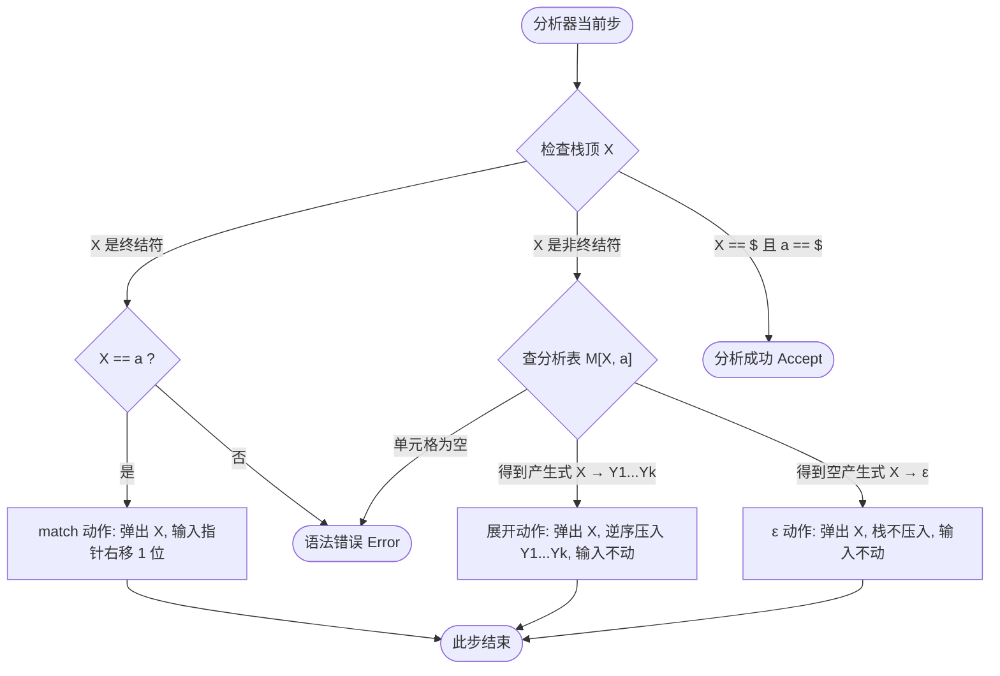

---
aliases:
- LL(1)预测分析过程追踪（分析器运行的慢动作回放）
- Parser Trace
- LL(1)预测分析过程
- parser trace
- parsing trace
- LL(1)预测分析过程（LL(1) Parser Trace）
- LL(1) Parser Trace
- LL(1)预测分析过程追踪：分析器运行的慢动作回放
created: 2026-06-10
english: Parser Trace
source_chapter:
- 4
tags:
- 编译原理
- 语法分析
- 自顶向下
title: LL(1)预测分析过程追踪（分析器运行的慢动作回放）
type: concept
used_in_chapter:
- 4
---
# LL(1)预测分析过程追踪：分析器运行的慢动作回放

> [!NOTE] 双轨直觉：给编译器做每一步的“运行快照记录”
> Parser Trace 是预测分析器在解析输入符号串时，**分析栈（Stack）和输入流（Input）的每一步状态快照**。
> 整个过程极其机械，分析器排除一切主观猜测，完全根据 [[LL(1)预测分析表（自顶向下分析的方向指示牌）|LL(1)分析表]] 里的指示执行“配对匹配”、“倒着压栈展开”或者“选配料消亡”动作。

---

## 1. 直觉认知与核心谜题：为什么要“逆序压栈”？

> [!NOTE] 大白话直觉：旅行箱倒装衣服
> 想象你在收拾旅行箱，明天出门你打算按“外套 $\to$ 衬衫 $\to$ 内衣”的顺序一件件穿上（从左往右最左推导）。
> 因为旅行箱是“后进先出（LIFO）”的物理结构，你只能**倒着装箱**：先把内衣塞到箱底，再放衬衫，最后把外套铺在最上面。
> 这样，当明天打开箱子时，第一件拿出来的就是最外层的外套。
> 在推导时也一样，为了让最左侧的符号 $Y_1$ 处于栈顶以便在下一步最先被处理，它必须是最后一个被压入栈中的符号。所以，我们只能**逆序压栈**：从右往左依次塞入栈里（展开 $A \to Y_1 Y_2 \dots Y_k$ 时，先压入 $Y_k$，最后压入 $Y_1$）。

---

## 2. 状态追踪的三大法则（运行机制）

设当前**栈顶符号为 $X$**，**当前输入 Lookahead 符号为 $a$**：

---

## 3. 应试黄金判定与易错点

> [!CAUTION] 老师阅卷扣分红线
> 1. **严禁合并步骤（最致命的扣分点）**：
>    LL(1) 分析器是一个单步状态机，**一行表格只允许执行一步原子操作**（要么做一次产生式展开，要么做一次 match 字符匹配）。绝对不能在一行里同时做两次展开（如把非终结符瞬间展到底），必须老老实实分行书写！
> 2. **match 时输入指针不移动**：
>    很多同学在做 `match a` 时，忘记在 Input 列把头部的 `a` 划掉（或指针后移），导致后续匹配错乱。
> 3. **ε-产生式时乱动输入指针**：
>    当执行 $A \to \varepsilon$ 时，这只是栈顶的 $A$ 隐形消失了，**并没有消耗任何实际的输入 Token**。因此，Input 列的内容**绝对不能有任何变化**，指针保持原位！

---

## 4. 典型例题与套路超链接

* 完整的做题三列表格结构与简写规范，请参阅：[[01_LL1分析过程追踪套路]]。
* 包含括号、加法、乘法等算术表达式的 40 步完整 Parser Trace 实例，请参阅：[[Ex4.5_LL1分析过程追踪]]。
* 如果题目在追踪时要求“同步计算表达式的值”，需要同步引入属性栈（Value Stack）估值机制，请参阅：[[Ex4.5_LL1分析过程追踪#跨章节超链接：Value Stack (值栈/属性栈) 评估机制深剖|Value Stack 动作评估]]。

---

## 5. 关联概念与双链

* [[LL(1)预测分析表（自顶向下分析的方向指示牌）|LL(1)分析表]] ── 追踪过程中，面对非终结符时下一步动作的唯一指令来源。
* [[LL(1)分析栈（倒装衣服的窄筒行李箱）]] ── 状态栈的物理结构与底层的进出栈操作概念。
* [[LL(1)文法]] ── 只有 LL(1) 文法驱动的分析表，才能在 Parser Trace 过程中实现无回溯的单向平滑解析。
