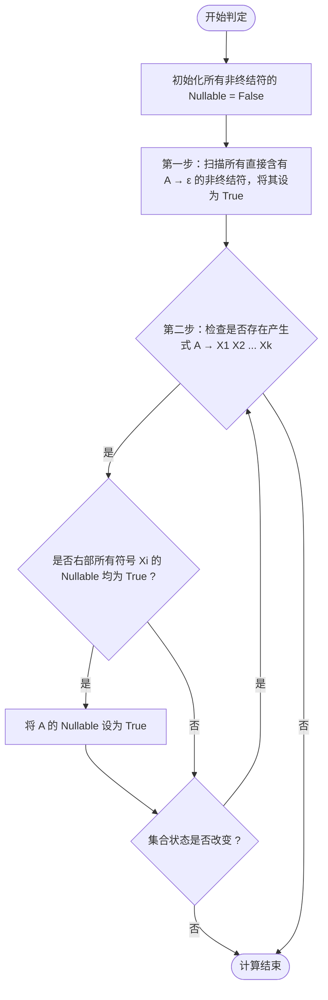

---
aliases:
- 可空性
- nullable
- nullable nonterminal
- Nullable
- Nullable：判定非终结符是否能“凭空消失”
created: 2026-06-10
english: Nullable
source_chapter:
- 3
tags:
- 编译原理
- 语法分析
- 自顶向下
title: Nullable
type: concept
used_in_chapter:
- 4
---
# Nullable：判定非终结符是否能“凭空消失”

> [!NOTE] 双轨直觉：可空符号就是奶茶里的可选配料（如椰果、珍珠）
> 在推导时，如果一个非终结符能够完全“消失”（即推导出空串 $\varepsilon$），说明它是个**选配项**，你可以选择不加它（不留痕迹）。
> 这个可空属性在自顶向下分析中会引发巨大的**连锁反应**，就像买奶茶时椰果加不加，会直接影响你第一口吸到的是什么（FIRST集合），以及谁会挨着你身后的配料（FOLLOW集合）。

---

## 1. 直觉认知（Intuitive View）

> [!NOTE] 大白话直觉：买奶茶选配料与买车选配件
> * **非 Nullable 符号**：**奶茶里的“杯子”或“茶底”**。无论你怎么定制，杯子和茶底都是必须存在的标配，不能凭空消失。
> * **Nullable 符号**：**奶茶里的“椰果”或“红豆”（可选配料）**。在买奶茶时，你可以选择“加椰果”（展开产生式），也可以选择“不要椰果”（展开为空串 $\varepsilon$，此时椰果在整杯奶茶中完全不存在）。
> 
> ### “选配料”的连锁反应：
> 1. **对 FIRST 的影响（第一口吸到什么）**：
>    如果你的奶茶配方是 $A \to B C$（第一道料放 $B$，第二道料放 $C$），而第一道料 $B$ 是个**选配料**（比如椰果，可不加）。
>    如果你在点单时选择**不加 $B$**，那么你插上吸管喝第一口（FIRST）时，吸到的就直接是第二道料 $C$ 了！所以 $\text{FIRST}(A)$ 包含了 $\text{FIRST}(C)$。
> 2. **对 FOLLOW 的影响（谁挨着你的屁股）**：
>    如果排队做奶茶的配方是 $A \to \alpha B C$。正常情况下，加完配料 $B$ 之后，下一道配料必然是 $C$。
>    但如果 $C$ 是个**选配料**且顾客**选择不加**，那么在做完 $B$ 之后，就没有任何后续配料了。此时，挨着 $B$ 后面的，就直接变成了紧跟在整个奶茶 $A$ 后面的后续配料了（继承 $\text{FOLLOW}(A)$）。

---

## 2. 数学定义与不动点算法（Mathematical Rules）

### 形式化定义
若非终结符 $A$ 满足以下条件，则称 $A$ 是可空的（Nullable）：
$$
A \Rightarrow^* \varepsilon
$$

### 计算算法（Fixed-Point Algorithm）
要找出文法中所有的 Nullable 符号，可以通过迭代计算直到状态不再改变：

---

## 3. 应试易错点（Common Mistakes）

> [!CAUTION] 易错警示
> 1. **漏掉间接可空**：很多同学只看有没有直接的 $A \to \varepsilon$，而漏掉了 $A \to B C$ 这种通过多步推导使得 $B \Rightarrow \varepsilon$ 且 $C \Rightarrow \varepsilon$ 导致的间接可空。
> 2. **消除左递归后的 Nullable 遗漏**：在消除左递归引入新符号 $A'$（如 $A' \to \alpha A' \mid \varepsilon$）时，**新符号 $A'$ 必定是 Nullable 的**。千万不要在后续填表时忽略这一关键点。

---

## 4. 典型例题应用

* 在 [[Ex4.9_LL1分析表_左递归与Nullable]] 中，$D \to E F$，$E \to y \mid \varepsilon$，$F \to x \mid \varepsilon$。
  * 由于 $E$ 和 $F$ 均可空，因此 $D$ 被判定为 **Nullable**。
  * 这导致了 $\text{FIRST}(D)$ 必须合并 $\text{FIRST}(E)$ 和 $\text{FIRST}(F)$，且 $\varepsilon \in \text{FIRST}(D)$。
  * 同时也导致 $\text{FOLLOW}(E)$ 必须合并 $\text{FOLLOW}(D)$，因为紧跟 $E$ 后面的 $F$ 随时可能隐形。

---

## 5. 关联概念与双链

* [[FIRST集合]] ── 可空性是 $\text{FIRST}$ 集合中 $\varepsilon$ 的来源。
* [[FOLLOW集合]] ── 可空符号是 $\text{FOLLOW}$ 集合向后继承传播的媒介。
* [[LL(1)预测分析表（自顶向下分析的方向指示牌）|LL(1)分析表]] ── 在填表时，只有针对 Nullable 符号，才需要查 `FOLLOW` 集合填入 $\varepsilon$-产生式。
