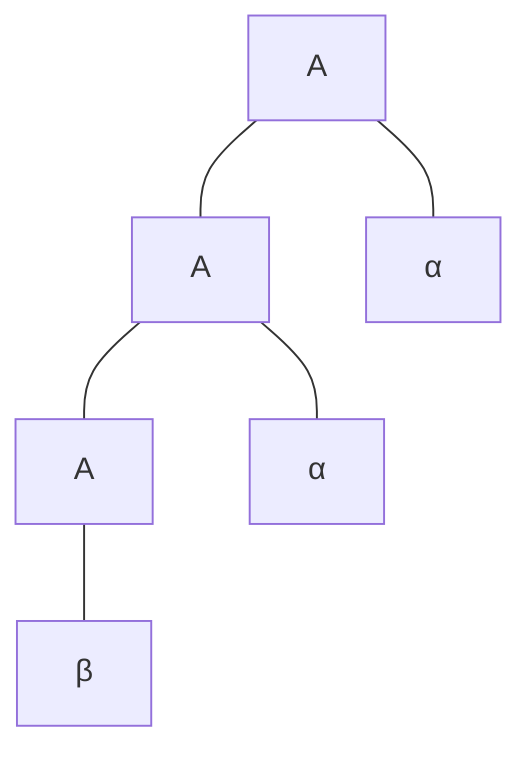
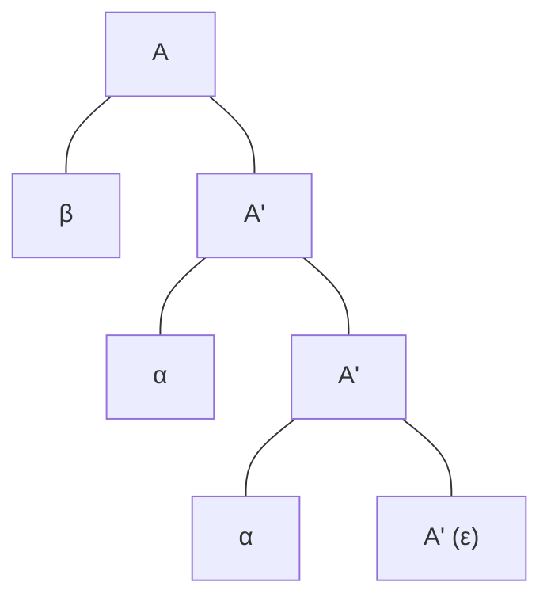

---
aliases:
- Left Recursion
- 左递归（Left Recursion）
- 左递归：引发无限死循环的自引用陷阱
created: 2026-06-10
english: Left Recursion
source_chapter:
- 3
tags:
- 编译原理
- 语法分析
- 自顶向下
title: 左递归
type: concept
used_in_chapter:
- 4
---
# 左递归：引发无限死循环的自引用陷阱

> [!NOTE] 双轨直觉：无限套娃的“鬼打墙”
> 在自顶向下分析中，如果一个演员在还没开始表演（还没消耗任何输入）之前，就机械地宣布：“我要再分身演一次我自己！”——这就是左递归。
> 它的致命危害是导致分析器陷入**无限死循环**，使解析栈像吹泡泡一样无限膨胀，直到内存溢出崩溃。

---

## 1. 直觉认知：为什么左递归会导致无限循环？

预测分析器在展开非终结符 $A$ 时，需要匹配当前的输入。
若有产生式：
$$A \to A \alpha$$
当分析器遇到 $A$，它会查表发现需要将 $A$ 替换为 $A \alpha$；接着，为了处理最左边的符号，它又要把这个新的 $A$ 展开为 $A \alpha \dots$
在这个过程中，**没有任何终结符被匹配（被消耗）**。这意味着输入指针一步都没有动，而分析栈里却堆叠了无数个 $\alpha$。

### 语法树的倾斜转变（直觉可视化）：
消除左递归，本质上是将**左倾斜（左结合）的语法树**，强行改写为**右倾斜（右结合）的等价语法树**。

#### ① 左结合语法树 (Left-Leaning Tree)
*   **特点**：自底向上左侧无限延伸（左结合）

#### ② 右结合语法树 (Right-Leaning Tree)
*   **特点**：向右下角倾斜（右结合）

---

## 2. 消除算法与数学公式

### ① 直接左递归 (Direct Left Recursion)
#### 识别形式：
$$A \to A \alpha \mid \beta$$
*（其中 $\beta$ 不以 $A$ 开头，且 $\alpha \neq \varepsilon$）*

#### 改写公式（引入新辅助非终结符 $A'$）：
$$
\begin{aligned}
A &\to \beta A' \\
A' &\to \alpha A' \mid \varepsilon
\end{aligned}
$$
#### 推广形式（多 $\alpha$ 多 $\beta$）：
若 $A \to A\alpha_1 \mid A\alpha_2 \mid \beta_1 \mid \beta_2$，改写为：
$$
\begin{aligned}
A &\to \beta_1 A' \mid \beta_2 A' \\
A' &\to \alpha_1 A' \mid \alpha_2 A' \mid \varepsilon
\end{aligned}
$$

---

### ② 间接左递归 (Indirect Left Recursion)
#### 识别形式：
$A$ 没有直接以 $A$ 开头的产生式，但经过多步推导后能绕回自身。
*例如：$S \to A a \mid b$ 且 $A \to S d \mid c$，则有 $S \Rightarrow A a \Rightarrow S d a$。*

#### 消除方法（代入消元法）：
通过**产生式代入**将间接左递归转化为直接左递归，然后再套用直接消除公式。
*具体算法决策流请参阅：* [[05_消除左递归套路#消除左递归的算法决策流|消除左递归算法流]]。

---

## 3. 应试易错点（Common Mistakes）

> [!CAUTION] 考前必看：高频扣分点
> 1. **漏掉 $A'$ 的 $\varepsilon$ 分支**：
>    在引入 $A'$ 后，很多人顺手写成 $A' \to \alpha A'$，而漏掉了空产生式 $\mid \varepsilon$。**没有空产生式，递归就失去了出口，整个文法将无法匹配任何以 $\beta$ 结尾的有限字符串！**
> 2. **产生式用逗号连接（语法错误）**：
>    写答案时，**每一条产生式必须独占一行**！绝对不能写成：`S → bS', S' → aS' | ε`（逗号在文法中是合法的 Token，这样写会导致严重的文法歧义）。
> 3. **直接套公式漏掉 $\beta$ 的识别**：
>    对于 $A \to A a \mid b \mid A c$。
>    * 提取出的左递归项为：$\alpha_1 = a, \alpha_2 = c$。
>    * 非左递归项为：$\beta = b$。
>    * 容易漏掉 $\alpha_2$，导致结果写错。

---

## 4. 典型例题应用

* 在 [[Practice_消除左递归]] 中，详细演练了如果面对包含自循环（$T \to T$）和间接循环（$T \to U$ 与 $U \to T$）的文法进行系统级代入和消除。
* 在 [[Ex4.8_LL1综合题]] 的 **Step 1** 中，展示了在大题第一步必须先扫除直接左递归，否则后续 FIRST/FOLLOW 全盘皆输。

---

## 5. 关联概念与双链

* [[直接左递归]] & [[间接左递归]] ── 左递归的细分类型。
* [[左因子提取]] ── 另一种常见的文法变换，与消除左递归合称“文法改造双璧”。
* [[LL(1)文法]] ── 含有左递归的文法必然存在无限推导循环，因此绝对不可能是 LL(1) 的。
* [[05_消除左递归套路]] ── 消除左递归的标准化工程做题套路。
