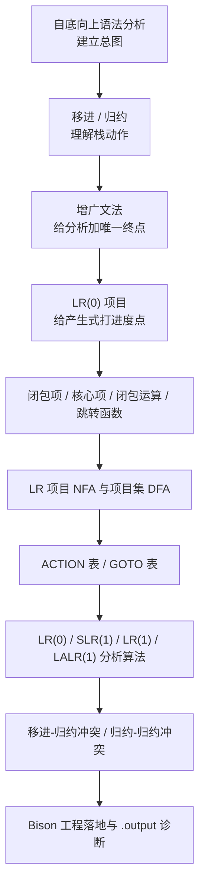
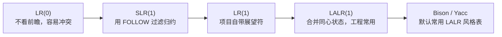
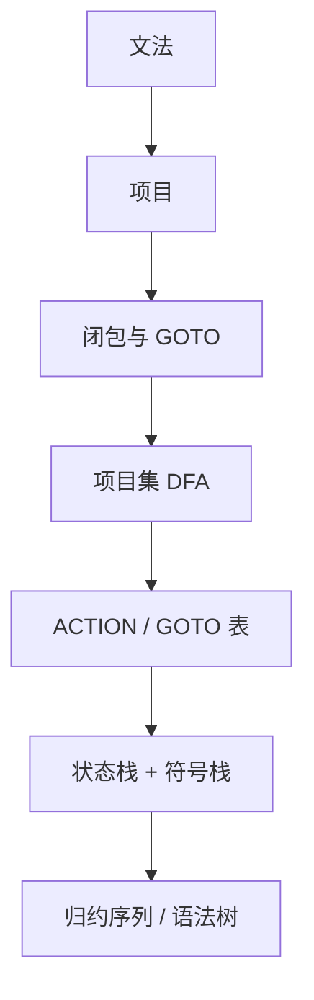

---
aliases:
- 自底向上分析学习路线图
- LR学习路线图
created: 2026-06-15
english: Bottom-Up Parsing Learning Path
tags:
- 编译原理
- 语法分析
- 自底向上
- LR
title: 自底向上分析学习路线图
type: overview
used_in_chapter:
- 5
---
# 自底向上分析学习路线图：先懂移进归约，再造 LR 机器

> English: **Bottom-Up Parsing Learning Path**

自底向上分析的主线不是先背 LR(0)、SLR、LR(1)、LALR(1) 的名字，而是先理解一个机械动作：**把输入 Token 不断移进栈里，遇到句柄就按产生式归约**。项目、闭包、GOTO、ACTION 表，都是为了让机器知道“什么时候移进，什么时候归约”。

---

## 1. 大白话通俗解释（核心直觉）

> [!NOTE]
> **流水线质检员的比喻**：
> *   **移进**：新零件从传送带进入仓库，先压栈保存。
> *   **归约**：质检员发现栈顶几件零件正好能拼成一个部件，就按图纸合并。
> *   **LR 项目**：图纸上打了一个“读到这里”的进度点，告诉机器某条产生式已经看到了哪里。
> *   **ACTION/GOTO 表**：把所有“当前状态 + 输入符号”对应的动作写成表，分析器只负责查表执行。

*   **一句话总结**：自底向上分析先学栈上怎么移进和归约，再学 LR 项目如何把这种判断自动化成表。

---

## 2. 推荐阅读顺序

| 顺序 | 笔记 | 学习目标 |
|---|---|---|
| 1 | [[自底向上语法分析]] | 先建立 LR 分析的全局流水线 |
| 2 | [[移进]] / [[归约]] | 会解释 shift/reduce 动作 |
| 3 | [[增广文法]] | 知道为什么要引入新的起始符号 |
| 4 | [[LR(0)项目]] / [[LR(1)项目]] | 会读带点项目和展望符 |
| 5 | [[闭包项]] / [[核心项]] / [[闭包运算]] / [[跳转函数]] | 会计算状态扩展和转移 |
| 6 | [[LR项目NFA]] / [[LR项目集DFA]] / [[项目集规范族]] | 会把项目连成状态机 |
| 7 | [[ACTION表]] / [[GOTO表]] | 会从状态机提取分析表 |
| 8 | [[LR(0)分析算法]] / [[SLR(1)分析算法]] / [[LR(1)分析算法]] / [[LALR(1)分析算法]] | 会区分 LR 家族能力边界 |
| 9 | [[移进-归约冲突]] / [[归约-归约冲突]] | 会诊断冲突来源 |
| 10 | [[Bison工程落地（从设计图纸到能跑的生产线）]] / [[读懂Bison的黑匣子日志（.output冲突诊断）]] | 会把理论映射到工具输出 |

---

## 3. LR 家族升级路线

> [!TIP]
> LR 家族不要横着背名字，要按“减少冲突、增加前瞻精度、压缩状态数量”的升级逻辑读。

---

## 4. 最小闭环

