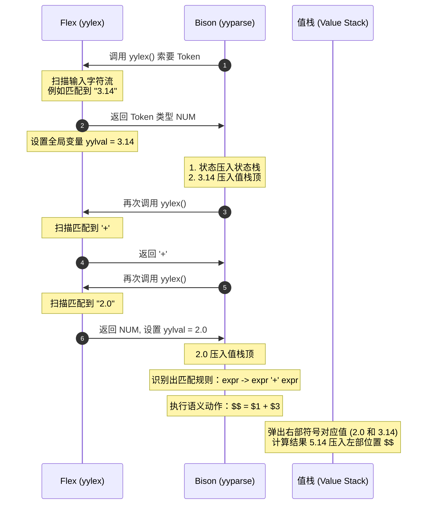

---
aliases:
- Bison工程落地（从设计图纸到能跑的生产线）
- Bison工程落地（Yacc与LALR(1)的消歧义与求值）
- Yacc与LALR(1)
- Yacc
- Bison
- LALR(1)实践
- Bison工程落地：从设计图纸到能跑的生产线
created: 2026-05-24
english: Yacc and LALR(1)
source_chapter:
- 5
- 6
tags:
- 编译原理
- 语法分析
- 自底向上
- Yacc
- Bison
- 实践
title: Bison工程落地（从设计图纸到能跑的生产线）
type: concept
updated: 2026-06-13
used_in_chapter:
- 5
- 6
---
# Bison工程落地：从设计图纸到能跑的生产线

> **前言：Yacc 的双重身份之谜**
> 很多初学者会疑惑：“Yacc/Bison 到底是 Chapter 5（语法分析）还是 Chapter 6（语义分析）的内容？”
> 答案是：**它是横跨两章的桥梁**。
> Yacc 的**骨架**是 Chapter 5 的 **LALR(1) 语法分析表**；而 Yacc 的**血肉和灵魂**则是 Chapter 6 的 **语法制导翻译（SDT）与语义动作**。它负责把学术上的“自动机图纸”组装成能跑、能算、能报错的“工程起重机”。

---

## 🗺️ 协作全景图：Flex 与 Bison 的“演员与舞台剧本”

在实际编译器工程（如 C/C++）中，词法分析器生成器 **Flex** 和语法分析器生成器 **Bison (Yacc 的现代版)** 紧密配合。它们之间的调用流与数据栈协作如下：



- **yyparse()**：Bison 生成的主控函数。它像一个“舞台导演”，不断向 Flex 索要下一个 Token。
- **yylex()**：Flex 生成的词法扫描函数。它像一个“道具员”，每次被调用就返回一个 Token 的类别编号（如 `PLUS`, `NUM`），并将 Token 的具体属性值（如数值 `10`）塞入全局变量 **yylval** 中。
- **yylval**：两者的通信邮筒。用来传递终结符的“行李（属性）”。

---

## 🏛️ Yacc 文件的三段式“剧本结构”

一个标准的 `.y` 文件必须划分为三个部分，使用双百分号 `%%` 作为分界符：

```yacc
%{
/* -------------------------------------------------------------
 * 第一部分：Declarations (声明段)
 * 放 C 语言头文件、宏定义、以及 Yacc 专用的 Token 和优先级声明
 * ------------------------------------------------------------- */
#include <stdio.h>
#include <stdlib.h>
void yyerror(const char *s);
int yylex(void);
%}

/* Yacc 属性类型定义 (联合体) */
%union {
    int ival;
    double dval;
    struct ASTNode *node;
}

/* Token 与类型声明 */
%token <ival> NUM
%token PLUS MINUS TIMES DIVIDE
%type <node> expr term factor

/* 优先级与结合性声明 (越往下优先级越高) */
%left PLUS MINUS
%left TIMES DIVIDE
%right UMINUS

%%
/* -------------------------------------------------------------
 * 第二部分：Rules (文法规则与语义动作段)
 * 定义文法产生式，并在 { } 中编写归约时触发的 C 代码
 * ------------------------------------------------------------- */
expr : expr PLUS term    { $$ = newBinaryNode("+", $1, $3); }
     | term             { $$ = $1; }
     ;

term : term TIMES factor { $$ = newBinaryNode("*", $1, $3); }
     | factor            { $$ = $1; }
     ;

factor : NUM             { $$ = newLeafNode($1); }
       ;

%%
/* -------------------------------------------------------------
 * 第三部分：Routines (辅助 C 函数段)
 * 放置用户自定义的辅助函数，如 yyerror、main 入口等
 * ------------------------------------------------------------- */
void yyerror(const char *s) {
    fprintf(stderr, "Syntax Error: %s\n", s);
}

int main(void) {
    return yyparse(); /* 启动 LALR(1) 分析表驱动引擎 */
}
```

---

## ⚔️ 工程消歧义机制：分析栈上的“保安守则”

在理论上，二义性文法（如 `E -> E + E | E * E`）在构造 LR/LALR(1) 分析表时必然会产生 **移进-归约 (Shift-Reduce) 冲突**。
Yacc 不强制要求你重写文法，而是通过在第一部分声明优先级，为分析表上的冲突制定了**“保安守则”**：

### 1. 优先级与结合性守则
- **移进 Token 优先级 > 栈顶产生式优先级** $\Rightarrow$ **Shift (移进)**：继续读，不急着收网。例如读到 `a + b · * c`，乘号优先级高，选择移进 `*`。
- **移进 Token 优先级 < 栈顶产生式优先级** $\Rightarrow$ **Reduce (归约)**：立刻收网，合并出左部。例如读到 `a * b · + c`，加号优先级低，先归约 `a * b`。
- **优先级相同** $\Rightarrow$ 查**结合性**：
  - `%left`（左结合） $\Rightarrow$ **Reduce**：前面的先抱团（如 `a - b - c` 变为 `(a - b) - c`）。
  - `%right`（右结合） $\Rightarrow$ **Shift**：让后面的先抱团（如 `a = b = c` 变为 `a = (b = c)`）。
  - `%nonassoc`（不可结合） $\Rightarrow$ **Error (报错)**：不允许连写（如 `a < b < c` 在很多语言中非法）。

> [!IMPORTANT]
> **产生式的优先级是如何确定的？**
> 默认情况下，一条产生式规则的优先级等于它**右部最后一个终结符**的优先级。
> 如果右部没有终结符，或者需要强行改变其优先级，必须使用 **`%prec`** 指令强行指定（如一元负号的优先级覆盖）。

### 2. %prec 的借调 authority 魔法
在表达式中，减号 `-`（二元运算符）的优先级很低；但一元负号 `-x`（单目运算符）的优先级必须极高。
Yacc 通过 `%prec` 允许单目负号“借调”高优先级声明：

```yacc
%left PLUS MINUS
%left TIMES DIVIDE
%right UMINUS         /* 声明一个虚拟的、高优先级的 Token UMINUS */

%%
expr : expr MINUS expr   /* 默认优先级等于最后一个终结符 MINUS (低) */
     | MINUS expr %prec UMINUS  /* 强行声明此规则的优先级与 UMINUS 相同 (极高) */
```

---

## 📦 属性传递与求值：分析栈旁的“行李传送带”

在理论上，**S-属性文法**在自底向上分析中可以实现**一边归约、一边求值**。Yacc 在物理实现上极其巧妙：
Bison 内部维护了两个平行的栈：
1. **状态栈 (State Stack)**：存放 LALR(1) 的 DFA 状态编号。
2. **值栈 (Value Stack)**：存放对应的属性值（即 `yylval` 传递来的行李）。

```
状态栈 (State Stack)      值栈 (Value Stack)
  |   State 3   |  <--->   |   $3 (term)   |
  |   State 8   |  <--->   |   $2 (PLUS)   |
  |   State 1   |  <--->   |   $1 (expr)   |
  +-------------+          +---------------+
```

### 属性引用符号对照表
| 符号 | 学术概念 | 工程含义 |
| :---: | :--- | :--- |
| **`$$`** | 产生式左部非终结符的综合属性 ($A.val$) | 归约后压入值栈的新属性值 |
| **`$1`** | 右部第 1 个符号的属性 ($X_1.val$) | 值栈中对应位置的数值/节点指针 |
| **`$3`** | 右部第 3 个符号的属性 ($X_3.val$) | 值栈中对应位置的数值/节点指针 |

### ⚠️ 考场高频大坑：中途语义动作 (Mid-Rule Actions) 的分裂危机
在写 `.y` 规则时，我们通常把动作写在**最右端**（归约时执行）。但有时为了某些副作用，会把动作写在**产生式中间**：

```yacc
/* 中途语义动作示例 */
expr : term { printf("Found Term\n"); } PLUS factor { $$ = $1 + $4; }
```

> [!CAUTION] **Bison 内部大分裂机制**
> 物理上的 LALR(1) 只能在**产生式完全匹配（即圆点在最右端）**时执行归约动作。
> 为了在中间插入动作，Bison 会在幕后进行**文法改写**，强行插入一个 **空产生式（$\epsilon$-production）**：
> $$
> \text{expr} \to \text{term} \; M \; \text{PLUS} \; \text{factor}
> $$
> $$
> M \to \varepsilon \quad \{ \text{printf("Found Term\\n");} \}
> $$
> 
> **副作用**：这无中生有地引入了新的非终结符 $M$ 和 $\epsilon$ 归约，导致 DFA 的状态**分裂**，极易引入原本不存在的 **移进-归约冲突**。
> **考场准则**：除非绝对必要，**严禁使用中途语义动作**。如需执行中间副作用，应尝试拆分文法。

---

## 🛠️ 理论落地：Bison 与 Lab 2 科学计算器的 AST 映射

在 [[Lab2-YACC科学计算器语法分析|Lab 2 科学计算器]] 中，Bison 语义动作正是 Chapter 6 语法制导定义（SDD）中**抽象语法树构造**的工业落地。

```
       理论属性文法规则 (Ch6 SDD)                Bison 语义动作实现 (Lab 2)
  E1.node = ast_binary("+", E2.node, T.node)  <==>  expr : expr '+' expr { $$ = ast_binary("+", $1, $3); }
```

### 1. %union 在值栈上的类型绑定
由于语法树包含多种节点（如数字、变量名、节点指针），Bison 通过 `%union` 声明值栈中的多重属性类型：
```yacc
%union {
    double      dval;       /* NUMBER, PI 等常量的数值 */
    char       *sval;       /* ID 变量名称的文本指针 */
    Node       *nval;       /* AST 树节点的结构体指针 */
}

/* 绑定终结符的值类型 */
%token <dval> NUMBER
%token <sval> ID
/* 绑定非终结符的返回树节点指针 */
%type <nval> expr stmt
```

### 2. 核心 AST 节点构造映射表
当发生语法归约时，Bison 的动作代码会被触发，调用底层 C 语言的 AST 构造函数并返回节点指针：

| 产生式规则 (Bison Rule) | 语义动作 (Semantic Action) | 构造出的 AST 结构 (Visual Node) |
| :--- | :--- | :--- |
| `expr : NUMBER` | `{ $$ = ast_number($1); }` | 常量数字节点：`[NODE_NUMBER \| value=3.14]` |
| `expr : ID` | `{ $$ = ast_identifier($1); }` | 变量节点：`[NODE_IDENTIFIER \| name="x"]` |
| `expr : expr '+' expr` | `{ $$ = ast_binary("+", $1, $3); }` | 二元运算节点：`[NODE_BINARY \| op="+"]`，子树为 `$1` 和 `$3` |
| `expr : '-' expr %prec UMINUS` | `{ $$ = ast_unary("-", $2); }` | 一元运算节点：`[NODE_UNARY \| op="-"]`，子树为 `$2` |
| `stmt : ID '=' expr` | `{ $$ = ast_assign($1, $3); }` | 赋值节点：`[NODE_ASSIGN \| name="x"]`，子树为 `$3` |

---

## 🚒 错误恢复机制：分析栈上的“安全防火逃生通道”

当输入文件出现语法错误（如少写分号）时，纯学术 LALR(1) 会直接宣告瘫痪（`Syntax Error` 并退出）。但在工程上，我们希望编译器能够跳过错误继续编译，一次性报出所有错误。
Yacc 引入了特有的 **`error` token** 与 **`yyerrok`** 机制。

### 1. 错误恢复三部曲
当 `yyparse()` 检测到语法错误时，会触发以下急救流程：
1. **回滚状态栈**：不断弹出状态栈，直到找到一个**能够接受 `error` 伪标记**的 DFA 状态。
2. **丢弃输入流**：抛弃后续读入的 Token，直到读到一个可以紧跟在 `error` 后面的**同步标记 (Synchronizing Token)**（通常是分号 `;` 或换行 `\n`）。
3. **假装成功并重启**：将 `error` 伪标记当作已经成功匹配的符号压栈，并在读到同步标记后，调用 **`yyerrok`** 宏清除内部错误标记，让分析器恢复到正常状态。

### 2. 经典错误恢复规则设计
```yacc
stmt : expr SEMI           /* 正常语句 */
     | error SEMI          /* 容错规则：当语句出错时，吃掉 error，直到看到分号 SEMI，并在此重置 */
     {
         yyerrok;
         printf("Recovered from statement error.\n");
     }
```

---

## ⚖️ Yacc(Bison) 与 LALR(1) 理论能力对比

| 指标 | 纯学术 LALR(1) 理论 | Yacc / Bison 工程引擎 |
| :--- | :--- | :--- |
| **文法限制** | 必须是无冲突 of LALR(1) | 允许二义性文法，通过 `%left/%right` 消除冲突 |
| **错误处理** | 遇到非法字符/无法动作立刻 Panic 退出 | 提供 `error` token 机制进行栈回滚与同步符对齐 |
| **动作触发** | 仅在完全归约时触发 ($A \to \alpha \cdot$) | 允许中途动作 `{ ... }`（底层通过分裂状态实现） |
| **属性计算** | 仅支持自底向上的综合属性计算 | 底层通过平行的 Value Stack 存放 `%union` 复杂指针 |
| **默认冲突消解** | 无默认行为，报错拒绝填表 | **Shift/Reduce 优先 Shift** (如 if-else 悬挂匹配); **Reduce/Reduce 优先选择在剧本里写在上面的那条产生式** |
