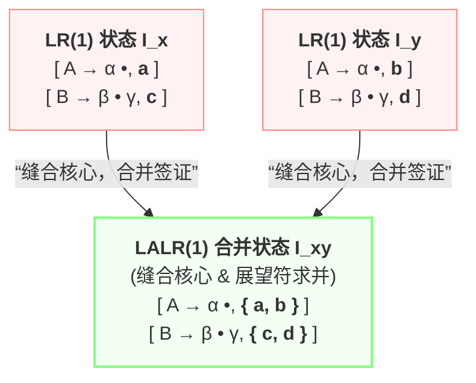

---
aliases:
- LALR(1)项目（LALR(1) Item）
- LALR(1) 项目
- LALR(1) Item
- LALR(1)项目
- LALR(1)项目：合并同心状态的精简生产线快照
created: 2026-06-12
english: LALR(1) Item
source_chapter:
- 5
tags:
- 编译原理
- 语法分析
- 自底向上
title: LALR(1)项目
type: concept
used_in_chapter:
- 5
---
# LALR(1)项目：合并同心状态的精简生产线快照

> English: **LALR(1) Item**

**LALR(1) 项目** 说白了，就是把两个长相、匹配进度完全一致，只有签证（展望符）不同的同卵双胞胎项目，**强行合体并把护照签证页缝合在一起**的产物。

---

## 1. 直觉比喻：同卵双胞胎的护照签证页缝合

> [!NOTE]
> 我们可以用“护照缝合”来理解这个空间压缩设计：
> * **LR(1) 状态机**：是个强迫症。哪怕两个状态里的规则和进度完全一样，只要一个人签证是去美国（$a$），另一个是去英国（$b$），他就必须分成两个独立状态，导致地图庞大无比。
> * **LALR(1) 项目**：则是把这两个“同卵双胞胎”（同心项）强行合体。既然你们内心是一样的，那你们的护照就缝在一起，签证页取并集 $\{a, b\}$。这样一来，我们的换乘大厅（状态）数量瞬间缩回到了最精简的 LR(0) 级别，但分析时依然拥有几乎和 LR(1) 一样精准的签证拦截能力。

---

## 2. 同心项合并算法步骤

构建 LALR(1) 项目集 DFA 的过程并非重新计算，而是对已有的 LR(1) 项目集 DFA 进行强行合拢：

1. **确定核心（Core）**：对于任意一个 LR(1) 项目集 $I_i$，忽略所有项目的前看符号（Lookahead），仅保留其 LR(0) 项目的核心部分，得到 $\text{Core}(I_i)$。
2. **同心判定与归类**：遍历所有 LR(1) 状态，将具有完全相同核心的状态归为一类。若 $\text{Core}(I_x) = \text{Core}(I_y)$，则称 $I_x$ 与 $I_y$ 为 **同心状态**。
3. **状态合并与前看集合并**：将所有同心状态合并为一个新的 LALR(1) 状态。合并后，项目的核心保持不变，但对于核心相同的项目，将其前看符号集合取 **并集**。即：
   $$
   [A \to \alpha \cdot \beta, L_1] \cup [A \to \alpha \cdot \beta, L_2] \implies [A \to \alpha \cdot \beta, L_1 \cup L_2]
   $$
4. **重新映射转移边**：合并状态后，原先在同心状态之间的转移边也相应指向合并后的新状态，生成 LALR(1) DFA。

---

## 3. 同心项合并前 vs. 合并后可视化对比

LALR(1) 项目与 LR(1) 项目的根本区别在于：
*   **LR(1) 项目**：只绑定**单个**展望符。相同核心但展望符不同的项目，会分裂在不同的 DFA 状态中（状态数极多）。
*   **LALR(1) 项目**：绑定一个**展望符集合（并集）**。它将相同核心的同心状态强行合并，从而将状态数缩减回 LR(0) 状态机的规模。

### 🔄 同心状态合并物理演化示意图

### 📊 双栏数据对照表

以两个同心 LR(1) 状态的合并为例，展示其在 LALR(1) 中的表现形式：

| 合并前（LR(1) 状态分裂，共 2 个状态） | 合并后（LALR(1) 状态合一，共 1 个状态） |
| :--- | :--- |
| **状态 $I_x$**： $[A \to \alpha \cdot, a]$ $[B \to \beta \cdot \gamma, c]$ | **状态 $I_{xy}$**： $[A \to \alpha \cdot, \{a, b\}]$ $[B \to \beta \cdot \gamma, \{c, d\}]$ |
| **状态 $I_y$**： $[A \to \alpha \cdot, b]$ $[B \to \beta \cdot \gamma, d]$ | |

---

## 4. 🚨 考场必背：合并同心项的冲突定理与证明

强行合并状态并合并展望符是一把双刃剑，对分析表的冲突情况有如下硬核物理定理：

### 定理 1：合并同心项绝对不会引入新的“移进-归约”（S/R）冲突

> **证明**：
> 设合并后的 LALR(1) 状态 $K$ 中存在移进-归约冲突，即同时存在：
> 1. 移进项目：$[A \to \beta \cdot a \gamma, b]$，其中 $a$ 是待移进的终结符。
> 2. 归约项目：$[B \to \delta \cdot, a]$，其前看符号包含 $a$。
> 
> 由于状态 $K$ 是由若干个同心 LR(1) 状态 $I_1, I_2, \dots, I_m$ 合并而来，根据同心定义，这些状态具有完全相同的 LR(0) 核心。因此，在每一个原始状态 $I_i$ 中，都必然同时存在核心项目 $A \to \beta \cdot a \gamma$ 和 $B \to \delta \cdot$。
> 
> 既然 $K$ 中归约项目的前看符号集合包含 $a$，而 $K$ 的前看符号集是所有子状态前看符号的并集：
> 
> $$
> \text{Lookahead}_K(B \to \delta \cdot) = \bigcup_{i=1}^{m} \text{Lookahead}_{I_i}(B \to \delta \cdot)
> $$
> 
> 那么必定存在某一个原始状态 $I_k$（$1 \le k \le m$），其归约项目的前看符号已然包含 $a$（即 $[B \to \delta \cdot, a] \in I_k$）。
> 
> 同时，由于核心相同，$I_k$ 中也必然存在移进项目 $[A \to \beta \cdot a \gamma, b_k]$。
> 这意味着，在合并之前的 **原始状态 $I_k$ 中，就已经存在了针对终结符 $a$ 的移进-归约冲突**。
> 
> **结论**：LALR(1) 中的 S/R 冲突必定是继承自合并前就冲突的 LR(1) 状态，合并操作本身**绝对不会凭空创造出新的 S/R 冲突**。

### 定理 2：合并同心项可能会引入新的“归约-归约”（R/R）冲突

> **证明**：
> 两个归约项目的移进不依赖于任何输入，但决定它们是否归约全看前看符号。
> 假设在两个独立的同心 LR(1) 状态中，其前看符号不重叠，此时安全无冲突。但当它们合并时，由于前看符号取并集，两个不同产生式的前看集可能会产生交集，从而爆发出 R/R 冲突。我们用下面的经典文法予以实证。

---

## 5. 经典实证：引入归约-归约冲突的反例文法

考虑如下上下文无关文法 $G$：
$$
S' \to S
$$
$$
S \to a A d \mid b B d \mid a B c \mid b A c
$$
$$
A \to e
$$
$$
B \to e
$$

### 5.1 在 LR(1) 中的分析（安全无冲突）
当分析器分别读入前缀 $a$ 或 $b$ 后，会生成两个**同心但前看符号不同**的状态：

* **状态 $I_8$ (读入 $a$ 之后)**：
  $$
  S \to a \cdot A d, \quad \{\text{＄}\}
  $$
  $$
  S \to a \cdot B c, \quad \{\text{＄}\}
  $$
  $$
  A \to \cdot e, \quad \{d\} \quad (\text{因 } A \text{ 后面是 } d)
  $$
  $$
  B \to \cdot e, \quad \{c\} \quad (\text{因 } B \text{ 后面是 } c)
  $$
  
  若在 $I_8$ 面临输入 $e$，移进 $e$ 到达状态 $I_{11}$：
  $$
  A \to e \cdot, \quad \{d\}
  $$
  $$
  B \to e \cdot, \quad \{c\}
  $$
  此时，当面临输入 $d$ 时归约为 $A$，面临输入 $c$ 时归约为 $B$。**前看符号集合不交（$\{d\} \cap \{c\} = \emptyset$），在 LR(1) 中安全无冲突**。

* **状态 $I_9$ (读入 $b$ 之后)**：
  $$
  S \to b \cdot B d, \quad \{\text{＄}\}
  $$
  $$
  S \to b \cdot A c, \quad \{\text{＄}\}
  $$
  $$
  A \to \cdot e, \quad \{c\} \quad (\text{因 } A \text{ 后面是 } c)
  $$
  $$
  B \to \cdot e, \quad \{d\} \quad (\text{因 } B \text{ 后面是 } d)
  $$
  
  若在 $I_9$ 面临输入 $e$，移进 $e$ 到达状态 $I_{12}$：
  $$
  A \to e \cdot, \quad \{c\}
  $$
  $$
  B \to e \cdot, \quad \{d\}
  $$
  面临 $c$ 时归约为 $A$，面临 $d$ 时归约为 $B$。**前看符号不交（$\{c\} \cap \{d\} = \emptyset$），在 LR(1) 中同样安全无冲突**。

### 5.2 在 LALR(1) 中的状态合并（爆发冲突）
观察发现，状态 $I_{11}$ 与 $I_{12}$ 具有相同的 LR(0) 核心：$\{A \to e \cdot, B \to e \cdot\}$。
LALR(1) 算法会将这两个状态强行合并为新状态 $I_{11-12}$：
$$
A \to e \cdot, \quad \{c, d\}
$$
$$
B \to e \cdot, \quad \{c, d\}
$$

**冲突爆发**：在新状态 $I_{11-12}$ 下，如果输入符号为 $c$ 或 $d$，前看集出现重叠交集（$\{c, d\} \cap \{c, d\} = \{c, d\} \neq \emptyset$）。分析器无法判断应该按 $A \to e$ 归约还是按 $B \to e$ 归约，从而**爆发出 LALR(1) 归约-归约冲突**。该文法不是 LALR(1) 文法。

---

## 6. 考场画图与冲突自检技巧 (Exam Tips)

在考试中，如果题目要求判断一个文法是否为 LALR(1) 文法，或者要求画出 LALR(1) 状态机，**千万不要从头画出 30-50 个完整的 LR(1) 状态再做合并**，这样计算量太大且极易出错。

### 💡 核心判定三步走（极速自检法）

1. **直接寻找同心项候选者**：
   在文法中，寻找那些“右部完全相同，但由不同非终结符推导而来”的产生式（如文法中的 $A \to e$ 和 $B \to e$）。这类产生式在自动机中往往会成为同心项合并时爆发归约-归约冲突的源头。
2. **局部前看传播追踪**：
   仅针对这些疑似冲突的核心项目，逆向追踪它们在不同路径下的前看符号。
   - 路径一：$S \to \alpha A \beta \implies$ 前看符号为 $\text{FIRST}(\beta)$
   - 路径二：$S \to \gamma B \delta \implies$ 前看符号为 $\text{FIRST}(\delta)$
3. **并集求交判定**：
   将不同路径下的前看集进行合并（求并集），若合并后的前看集交集非空（即 $\text{Lookahead}_A \cap \text{Lookahead}_B \neq \emptyset$），则可直接判定**存在 LALR(1) 归约-归约冲突**，无需画出完整的大图。

---

## 7. 关联例题与算法

*   **全景地图与术语对照**：[[LR家族的华山论剑（LR0、SLR、LR1与LALR的终极对比）]]
*   **同心项冲突 Yacc 实战分析**：[[Bison工程落地（从设计图纸到能跑的生产线）]]
*   **物理查表执行引擎**：[[LALR(1)分析算法]]
