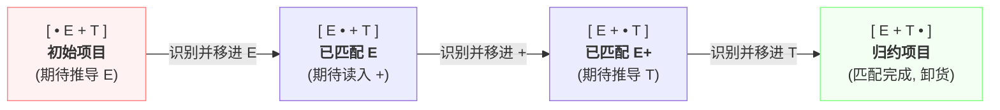
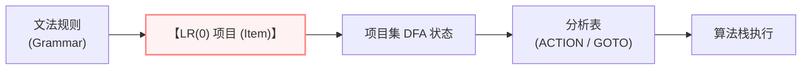

---
aliases:
- LR(0)项目（LR(0) Item）
- LR(0) 项目
- LR(0) Item
- LR(0)项目
- LR(0)项目：带阅读视线的生产线快照
created: 2026-06-10
english: LR(0) Item
source_chapter:
- 5
tags:
- 编译原理
- 语法分析
- 自底向上
title: LR(0)项目
type: concept
used_in_chapter:
- 5
---
# LR(0)项目：带阅读视线的生产线快照

> English: **LR(0) Item**

**LR(0) 项目** 说白了，就是把我们写好的产生式拆成一个个 **“带进度条”的细分拼装说明纸条**。这个进度条就是产生式右部的 **圆点（`·`）**。它用来记录分析器在拼装这句产生式时，已经进行到了哪一步。

---

## 1. 直觉比喻：拼装说明书上的“进度圆点”

> [!NOTE]
> 你可以把每一个 LR(0) 项目看作是一个 **“拿来做装配对照的小纸条”**：
> * **圆点左边**：表示我们**已经拿到手并且装配好**的零件。
> * **圆点右边**：表示我们**接下来眼巴巴正等着的**零件。
> * **圆点走到最右端**（如 $A \to X Y \cdot$）：代表这套零件已经全部找齐，可以立刻打包组装（即进行 **[[归约]]**）。

---

## 2. 形式定义

对于上下文无关文法中的任意产生式  $A \to \alpha \beta$ ，在其右部的任何位置插入一个 **圆点（`·`）** ，即构成一个 LR(0) 项目。

对于产生式  $A \to X_1 X_2 \dots X_n$ ，圆点共有  $n+1$  个可插入位置，因而会产生 ** $n+1$ 个项目**。

---

## 3. 进度可视化 (Dot Progress Bar)

以产生式  $E \to E + T$  为例，其 4 个 LR(0) 项目展示了分析进度的步步推进过程：

---

## 4. 流水线位置 (Pipeline Location)

在自动编译生成语法分析器的流水线中，项目处于最基础的微观位置：

---

## 5. 与算法的关联 (Relationship with Algorithms)

项目是静态数据结构，它们最终通过控制 ACTION/GOTO 表的填写，来指导宏观算法的运行：

*   **关联 [[LR(0)分析算法]]**：
    *   在 LR(0) DFA 中，一旦某个状态包含归约项目  $A \to \alpha \cdot$ ，在填分析表时，算法将**无条件**地在这一行的**所有终结符列**填入归约动作  $r_k$ （“闭眼无脑归约”）。
*   **关联 [[SLR(1)分析算法]]**：
    *   **SLR(1) 同样使用 LR(0) 项目及状态机**。但在填表时，算法会“睁眼看一步”：仅当面临的下一个输入字符  $a \in \text{FOLLOW}(A)$  时，才允许填入归约动作  $r_k$ 。这相当于给归约项加装了一个“安检门”，有效拦截了不合理的归约，消解了大量移进-归约冲突。

---

## 6. 典型例子与分类

以产生式  $A \to X Y$  为例，项目分为四类：

1.  **初始项目**： $A \to \cdot X Y$ （圆点在最左边，还未匹配任何符号）。
2.  **待约项目**： $A \to X \cdot Y$ （圆点后是非终结符  $Y$ ，期待先完成  $Y$  的推导，在 DFA 中会触发 [[闭包运算]] 引入  $Y$  的初始项目）。
3.  **移进项目**： $A \to X \cdot a Y$ （圆点后是终结符  $a$ ，期待直接从输入流读入，指导算法执行 [[移进]] 并将状态压栈）。
4.  **归约项目**： $A \to X Y \cdot$ （圆点在最右边，识别完成，指导算法将  $XY$  弹出并[[归约]]为  $A$ ）。

### 特殊情况：空产生式
对于空产生式（ $\varepsilon$-production ） $A \to \varepsilon$ ：
*   由于右部为空，圆点只有一个位置，因此**仅产生一个项目**： $A \to \cdot$ 。
*   该项目既是初始项目，也是归约项目，一旦被引入状态，无需读入任何符号即可直接指导算法触发归约（如填入  $r_j$ ）。

---

## 7. 高频误解与避坑

> [!WARNING]
> **误区一：状态就是项目吗？**
> **绝对不是**。项目是“单条规则的进度”，而状态是“多个项目做 CLOSURE 运算补齐后的**集合**”。状态是项目集的容器。

> [!CAUTION]
> **误区二：存在独立的“SLR(1)项目”形式吗？**
> **不存在**。SLR(1) 和 LR(0) 共享完全一致的项目定义和 DFA 状态机。SLR(1) 的核心提升在于**查表归约算法的过滤**，而非项目本身的长相。

---

## 8. 关联例题/套路/易错点

*   **全景地图与术语对照**：[[LR家族的华山论剑（LR0、SLR、LR1与LALR的终极对比）]]
*   **状态机构造**：[[01_LR0项目集规范族构造套路]]
*   **空产生式项目冲突案例**：[[Ex5.2_SLR分析与LR0冲突_空产生式文法]]
