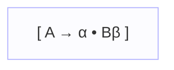
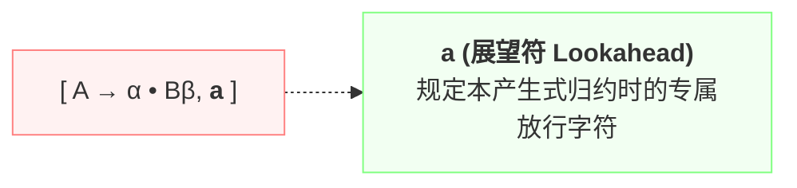
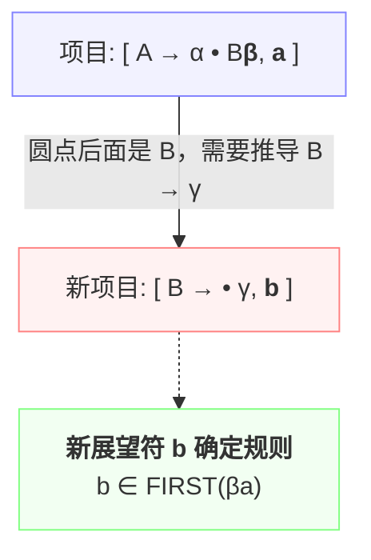

---
aliases:
- LR(1)项目（LR(1) Item）
- LR(1) 项目
- LR(1) Item
- LR(1)项目
- LR(1)项目：带展望符的双元组生产线快照
created: 2026-06-12
english: LR(1) Item
source_chapter:
- 5
tags:
- 编译原理
- 语法分析
- 自底向上
title: LR(1)项目
type: concept
used_in_chapter:
- 5
---
# LR(1)项目：带展望符的双元组生产线快照

> English: **LR(1) Item**

**LR(1) 项目** 说白了，就是给原来的说明书纸条（LR(0)项目）**硬性盖戳贴上了一个“专属落地签证”（展望符）**。这个签证强行规定了：你到了产生式终点想要封箱打包（归约）时，面临的下一个输入字符，**必须是这个指定的签证字符**才准行！

---

## 1. 直觉比喻：自带专属落地签证的护照进度条

> [!NOTE]
> 我们可以用签证和护照来做如下生动对比：
> * **LR(0) 项目**：裸奔的进度纸条。不管到了哪个路口，只要一到终点立刻闭眼刹车（直接归约）。
> * **SLR(1) 过滤**：相当于到了终点时，打电话回总部查一查黑名单（ $\text{FOLLOW}(A)$ ），如果是亲戚就刹车。
> * **LR(1) 项目**：则是 **“一出生就在护照上盖死专属签证的进度条”**。比如 $[A \to \alpha \cdot, a]$，它把归约资格和字符 $a$ 终身绑定。当分析器在这个路径走到终点时，如果眼前的下一个字符不是 $a$，哪怕它是 FOLLOW 集的一员，也绝对不许在这里刹车归约。这也就是“高精 GPS 导航”。

---

## 2. 形式定义

一个 LR(1) 项目是一个双元组：
$$[A \to \alpha \cdot \beta, a]$$

其中：
*   $A \to \alpha \cdot \beta$  是标准的 [[LR(0)项目]] ，刻画了分析的当前进度。
*   $a \in V_T \cup \{\$\}$  是 **展望符**（Lookahead），规定了该产生式在完全归约后，**紧跟在非终结符 $A$ 后继位置上的合法终结符**。

---

## 3. 结构与进度可视化

为了对比两者的差别，我们可以分别来看它们的结构构成：

### 1️⃣ LR(0) 项目结构
仅包含基本的**匹配进度标记**（圆点 `•`）：


### 2️⃣ LR(1) 项目结构
在 LR(0) 核心进度标记的基础上，硬性绑定一个**展望符（Lookahead）**：


---

## 4. 流水线位置与展望符传播规则 (Propagation)

在整个 Parser 编译生成的流水线中，LR(1) 项目由于携带了展望符，对状态机 DFA 的生成具有决定性影响：


### 展望符的闭包传播规则 (CLOSURE)
当圆点右侧是非终结符  $B$  时，推导  $B \to \gamma$  的初始项目，其专属展望符  $b$  不是随便生成的，而是由  $B$  后面紧跟的剩余符号  $\beta$  与老展望符  $a$  共同决定的：



#### 考场简易口诀：
1.  **若 $B$ 后面还有多余符号 $\beta$**（即  $\beta \neq \varepsilon$ ）：
    *   若  $\beta$  不能推导为空，则新展望符  $b = \text{FIRST}(\beta)$  （只看后面的邻居，老展望符被阻挡）。
    *   若  $\beta \xrightarrow{*} \varepsilon$ ，则  $b = (\text{FIRST}(\beta) \setminus \{\varepsilon\}) \cup \{a\}$ 。
2.  **若 $B$ 后面已经是尽头**（即  $\beta = \varepsilon$ ）：
    *   老展望符  $a$  将**直接遗传**给新生成的子项目： $b = a$ 。

---

## 5. 与算法的关联：状态分裂 (State Splitting)

LR(1) 项目的展望符直接指导 [[LR(1)分析算法]] 的查表决策：
*   对于归约项目  $[A \to \alpha \cdot, a]$ ，算法仅在输入字符为  $a$  的这一列填入归约动作  $r_k$ 。

### 带来的代价
由于引进了展望符，即使两个项目的匹配进度（LR(0)核心）完全一致，只要展望符不同，它们就会在 DFA 中被分割为不同的状态。这就是 **状态分裂**。
*   例如，状态集  $\{ [A \to \alpha \cdot, a] \}$  与  $\{ [A \to \alpha \cdot, b] \}$  在 LR(0)/SLR(1) 中是同一个状态，但在 LR(1) 中必须是两个独立的状态。
*   这导致 LR(1) 的 DFA 状态数成倍暴增，占用极大内存。

---

## 6. 典型例子

设文法有 $S' \to S, \$$，初始状态 $I_0$ 的闭包构建：
```text
[S' -> ·S, $]  ── (S 后面无多余符号，直接继承 $) ──> 引入 [S -> ·L=R, $] 和 [S -> ·R, $]
```

---

## 7. 高频误区与避坑

> [!WARNING]
> **误区一：展望符 $a$ 是当前输入字符吗？**
> **绝对不是**。当前读到的字符由圆点后的符号表示。展望符是“备用钥匙”，是在**整个产生式归约完毕后**，期待出现的下一个字符。

> [!CAUTION]
> **误区二：展望符与全局 FOLLOW 集合有什么区别？**
>  $\text{FOLLOW}(A)$  是文法中所有可能跟在  $A$  后面的字符的**全集**。而 LR(1) 的展望符  $a$  是当前这特定条分支推导路径下的**子集**。因此，LR(1) 比 SLR(1) 的拦截更加精准，能够处理极其微妙的移进-归约冲突。

---

## 8. 关联例题/套路

*   **全景地图与术语对照**：[[LR家族的华山论剑（LR0、SLR、LR1与LALR的终极对比）]]
*   **状态合并压缩方案**：[[LALR(1)项目]]
*   **物理查表执行引擎**：[[LR(1)分析算法]]
