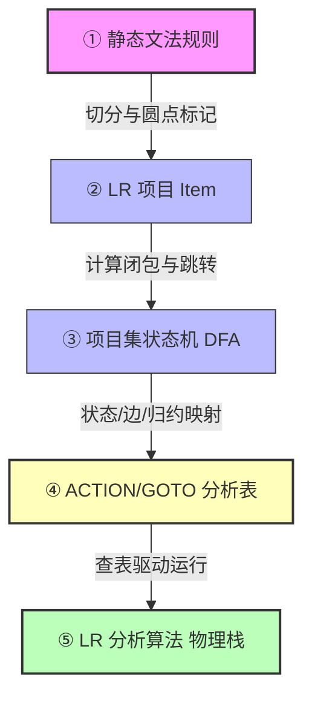

# LR家族的华山论剑（LR0、SLR、LR1与LALR的终极对比）

> English: **LR Parsing Family Overview**
> 
> 在 [[自底向上语法分析]] 的学习中，初学者极易将众多的“项目”、“状态”、“分析表”和“算法”混为一谈。本篇旨在作为 **宏观复习地图**，对 LR 语法分析进行四层架构解耦，并整合了 LR 家族四兄弟（LR(0), SLR(1), LR(1), LALR(1)）的形式化定义、前看符号来源、填表算法及核心能力对比。

---

## 🗺️ 编译生成全景流水线 (Parser Pipeline)

一个自动生成的语法分析器（如 Yacc/Bison 内部引擎）是从静态文法推导，最终编译为动态运行栈引擎的。其生成与运行流水线如下：

---

## 🏛️ 四层对象核心解耦 (Four-Layer Architecture)

要攻克 LR 语法分析，必须划清以下四个概念的边界：

### 第一层：项目 (Item) —— “进度微粒”
*   **角色**：静态产生式右部加了 **圆点（`·`）** 的规则，用来标记**单个产生式的匹配进度**。
*   **形式**：
    *   $E \to E \cdot + T$ （表示已识别出  $E$ ，正期待读入加号）
    *   $[A \to \alpha \cdot \beta, a]$ （带有展望符的项目）
*   **注意**：项目是微观粒子，分析算法不直接拿单个项目干活。

### 第二层：项目集状态 (Item Set State) —— “局部语境”
*   **角色**：多个项目的集合，经由 [[闭包运算]] 补齐期望，构成了 **DFA 状态机的一个节点**。
*   **形式**：一个状态 $I_i$ 内可能同时包含移进项目、待约项目和归约项目，它们共同描述了当前可能面临的多种推导状态。
*   **注意**：状态 $\neq$ 项目。状态是项目构成的集合。

### 第三层：分析表 (ACTION/GOTO Tables) —— “静态图纸”
*   **角色**：由项目集 DFA 静态映射出的二维跳转表。
    *   **ACTION 表**：处理终结符，填入移进（$s$）、归约（$r$）、接受（`acc`）或报错。
    *   **GOTO 表**：处理非终结符归约后的状态回退与跳转。
*   **注意**：分析表是静态的数据结构（二维数组），是状态机的表格化表示。

### 第四层：分析算法 (Parser Engine) —— “物理栈引擎”
*   **角色**：动态的执行程序。它维护着一个 **状态栈** 和一个 **符号栈**，不断读入输入字符，查看当前栈顶状态，**查阅分析表（图纸）** 做出动作判定（移进/归约），推动分析向前进行。
*   **注意**：算法是执行体。不同的 LR 变体（如 SLR vs. LR1）执行同样的驱动循环，差别仅在于查阅的**分析表内容不同**。

---

## ⚔️ LR 家族四兄弟大白话戏说与终极对比

> [!NOTE]
> **LR 家族四兄弟的开车比喻**
> 
> *   **老大 LR(0) ── “憨直的闭眼司机”**：
>     极其死脑筋，只要一开到产生式终点（归约项），不管前面是什么路标符号，一律来个紧急刹车直接打包（无脑归约）。这导致他经常在移进和归约之间原地撞车（极易冲突）。
> *   **老二 SLR(1) ── “带大喇叭广播的睁眼司机”**：
>     比老大聪明一点，到了终点会多看一眼下一个符号。他拿着一个大喇叭（全局 FOLLOW 集合）去问：“前面的路标是我的亲戚吗？”如果是，才敢刹车归约。这消除了很多冲突，但因为大喇叭里喊的范围太广，还是不够精细。
> *   **老三 LR(1) ── “带精准落地签证的高级 GPS 司机”**：
>     细节狂人，精细到了极点。他在每一个零件出生的瞬间，就在护照上强行盖戳：“当且仅当下一个路标恰好是 $a$ 时，才准刹车归约！”（专属展望符）。这使得他最精准、最安全，但因为把所有签证不一样的同路线状态全部撕裂开（状态分裂），导致他画出的地图巨大无比，容易把电脑内存挤爆。
> *   **老四 LALR(1) ── “缝合双胞胎证件的省钱司机”**：
>     为了省内存，他玩了个骚操作。他把地图上那些“除了签证符号不同，路线和圆点位置完全一样”的同卵双胞胎状态全部强行合并（同心合并），护照签证页取并集。这使得他的地图大小缩回到了老二的水平，但精确度依然定点逼近老三。

### 📊 家族四兄弟形式化属性终极对照表

| 语法分析法 | 项目形式 (Item Type) | 状态机来源 (DFA Source) | 前看符号/来源 (Lookahead) | CLOSURE 算法规则 | ACTION 归约填表拦截条件 | DFA 状态数 | 冲突消解能力 | 大白话直观判据 (Core Intuition) |
| :--- | :--- | :--- | :--- | :--- | :--- | :---: | :--- | :--- |
| **[[LR(0)分析算法\|LR(0)]]** | [[LR(0)项目]] | LR(0) 项目集规范族 | 不使用前看符号 | 仅展开点后非终结符的产生式 | **无脑归约**：对所有输入符号均填 `r` | 较少 | **极弱**（极易产生移进-归约冲突） | **闭眼瞎归约**：只要圆点到头了，面临任何符号一律无脑归约 |
| **[[SLR(1)分析算法\|SLR(1)]]** | 重用 [[LR(0)项目]] | 重用 LR(0) 状态机 | 全局后继符号集 $\text{FOLLOW}(A)$ | 同 LR(0) 算法 | **全局 FOLLOW 安检**：输入符号 $a \in \text{FOLLOW}(A)$ 时才允许归约 | 较少 (同LR0) | **较强**（利用后继符号消解大量冲突） | **亲戚才归约**：查全局 FOLLOW 集合，必须是后继亲戚才允许归约 |
| **[[LR(1)分析算法\|LR(1)]]** | [[LR(1)项目]] | LR(1) 项目集规范族 | 项目绑定的专属前看符号 $[a]$ | **前看符号闭包传播**：$[A \to \alpha \cdot B\beta, a]$ 展开为 $[B \to \cdot\gamma, b]$，其中 $b \in \text{FIRST}(\beta a)$ | **精准专属签证安检**：仅在面临绑定的专属前看符号 $a$ 时才允许归约 | **极庞大** (状态分裂) | **最强**（理论极限，无任何多余归约） | **凭票精准归约**：凭借项目出生时专属绑定的落地签（展望符）才归约 |
| **[[LALR(1)分析算法\|LALR(1)]]** | 重用 [[LR(1)项目]] | **合并同心状态** 后的 DFA | 并集前看符号集 $[a, b, ...]$ | 同 LR(1) 算法 | **合并并集签证安检**：仅在面临合并状态后的并集符号时才允许归约 | 较少 (同LR0) | **介于SLR与LR1之间**（合并同心集可能引入归约-归约冲突） | **拼车省钱归约**：双胞胎合并，签证合影并用，可能认错人产生冲突 |

#### 📐 能力包含层级链
$$
\text{LR}(0) \subset \text{SLR}(1) \subset \text{LALR}(1) \subset \text{LR}(1)
$$

---

## 🔍 算法核心差异与同心合并深度剖析

### 1. 为什么 SLR(1) 依然不够精准？
SLR(1) 使用的 $\text{FOLLOW}(A)$ 集合是**全局**的。只要文法在某处允许符号 $a$ 紧跟在 $A$ 后面，它就会被纳入 $\text{FOLLOW}(A)$。
但在特定的 DFA 状态 $I_i$ 中，根据当前的解析路径，非终结符 $A$ 后面能够实际跟的后继符号，往往只是 $\text{FOLLOW}(A)$ 的一个**真子集**。SLR(1) 用粗糙的全局后继取代了精准的上下文，导致它在一些并不可能面临归约符号的列上填入了 `reduce`，引发了不必要的移进-归约冲突。

### 2. LR(1) 是如何通过闭包传播展望符的？
在 LR(1) 的 `CLOSURE` 计算中，展望符是沿着推导路径逐层向前推导并绑定的：
若状态中存在项目：
$$
[A \to \alpha \cdot B \beta, \;\; a]
$$
这意味着接下来我们要识别子结构 $B$，并且在此产生式归约后，后面期待跟着的符号是 $a$。那么我们在展开 $B$ 的产生式时，新项目 $B \to \cdot \gamma$ 后面所能跟的展望符必然是：
$$
b \in \text{FIRST}(\beta a)
$$
因为只有当 $\beta$ 推导为空（$\beta \Rightarrow^* \varepsilon$）时，展望符才会 fallback 传播到 $a$。这种精确的局部预测信息有效避免了状态合并导致的冲突。

### 3. LALR(1) 合并同心集为什么能省空间？它会带来什么副作用？
*   **空间压缩**：LALR(1) 把那些核心（即圆点位置和产生式完全相同）但仅有前看符号不同的 LR(1) 状态合二为一，从而将状态数量大幅缩减到与 LR(0) 相同的水平。
*   **绝不引入“移进-归约冲突”**：
    因为是否移进只取决于圆点后的符号是否是终结符，而同心状态的圆点位置完全一样。如果合并前的状态都没有移进-归约冲突，合并后也绝不会无中生有产生移进-归约冲突。
*   **可能引入“归约-归约冲突”**：
    由于合并时将前看符号取了并集，如果两个不同的归约项目在各自的 LR(1) 状态下其展望符是不相交的（安全的），但由于状态合并，两者的展望符集合取并后产生交集，在查表时就会在交集符号列上同时触发两个产生式的归约，即**无中生有地产生归约-归约冲突**。

---

## 💡 考场高频认知避坑

> [!CAUTION] 考试避坑核心要点
> **避坑 1：SLR(1) 并没有独立的“SLR项目”！**
> SLR(1) 算法的 DFA 状态和项目形式与 LR(0) **完全一样**。它不需要在项目里画展望符。它仅仅是在“生成表”和“归约执行”时，查了一下  $\text{FOLLOW}$  集合。
> 
> **避坑 2：LR(1) 项目里的展望符 $[a]$，不是“当前输入字符”！**
> 展望符  $a$  是**期待在该产生式完全归约后，紧跟在非终结符后面的那个符号**。它在项目诞生（CLOSURE 计算）时就被推导并绑定了，是一个静态标签，用于在归约时起拦截作用。
> 
> **避坑 3：LALR(1) 合并同心状态可能会推迟错误的发现时机**
> 相比 LR(1)，由于 LALR(1) 合并了前看符号，它可能会在应该报错的位置继续做几步无意义的归约动作（因为并集前看符号误判为了合法动作），但它**绝对不会漏报错误**，只要遇到第一个无法动作的输入时依然会立刻报错。

---

## 🗺️ 复习导航

### 静态概念卡片
*   [[LR(0)项目]]：进度圆点、空产生式项目的特殊归约。
*   [[LR(1)项目]]：带有展望符的项目、 $\text{FIRST}(\beta a)$  闭包传播规则与状态分裂。
*   [[LALR(1)项目]]：同心项合并、展望符求并集规则。
*   [[LR项目集DFA]] 与 [[LR项目NFA]]：状态机的推导与关系。

### 动态算法与分析表
*   [[LR(0)分析算法]] | [[SLR(1)分析算法]] | [[LR(1)分析算法]] | [[LALR(1)分析算法]]
*   [[ACTION表]] 与 [[GOTO表]]
*   [[移进-归约冲突]] 与 [[归约-归约冲突]]
