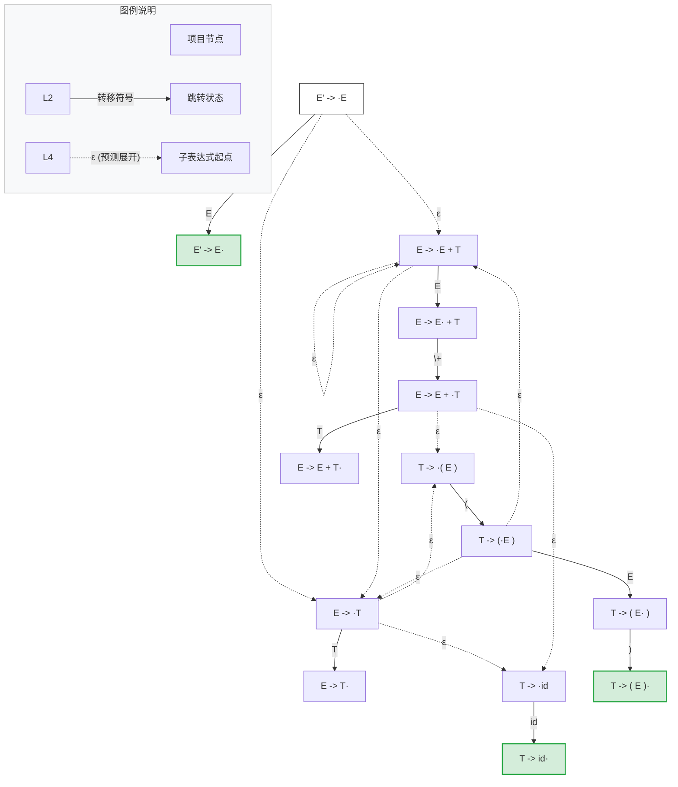

---
aliases:
- LR项目NFA（LR Items NFA）
- LR项目 NFA
- LR Items NFA
- LR项目NFA
- LR Item NFA
- LR项目NFA：包含所有可能动作转换的庞大网络
created: 2026-06-12
english: LR Items NFA
source_chapter:
- 5
tags:
- 编译原理
- 语法分析
- 自底向上
- 自动机
title: LR项目NFA
type: concept
used_in_chapter:
- 5
---
# LR项目NFA：包含所有可能动作转换的庞大网络

> English: **LR Items NFA**

**LR 项目 NFA** 说白了，就是把文法里的每一个说明书纸条（LR(0)项目）当成一个独立的坐标点，然后用跳转轨道和空传送门连起来后，得到的**“分身无数、极其混乱的迷宫地图”**。它是我们为了建造出确定性的 DFA 换乘路线图而必须经过的一个临时理论模型。

---

## 🚗 直觉比喻：迷宫网络中的“单人分身足迹” (Single-Player Path Network)

> [!NOTE]
> 为了理解项目 NFA，我们可以将它想象成一个巨大的分身迷宫：
> 
> *   **坐标节点（单个项目 Item）**：每一个单独的项目（如 $[A \to \alpha \cdot X \beta]$）都是迷宫里的一个微观行进坐标。它精确表示你在哪一条路上，前面已经走了多远，后面还要走多远。
> *   **石子路（移进/跳转边 X-edge）**：从 $[A \to \alpha \cdot X \beta]$ 走到 $[A \to \alpha X \cdot \beta]$ 是一条实实在在的单向石子路。当你在路口读到符号 $X$ 时，你才能迈步过去（消耗输入 Token）。
> *   **瞬移传送门（空转移 $\varepsilon$ 边）**：当你来到非终结符门前（$[A \to \alpha \cdot B \beta]$）时，迷宫在此处提供了一组免费传送门。在不消耗任何时间、不读入任何符号（$\varepsilon$ 跳转）的情况下，你可以在这些传送门里瞬间召唤出一大批“分身”，同时站在所有以 $B$ 为起点的通道入口（$B \to \cdot \gamma$）待命。
> *   **分身爆炸的烦恼**：虽然传送门展示了未来可能的所有小道，但也导致了状态机的分裂。在任何一个时刻，我们可能同时分身处在十几个不同的微观位置上，极其混乱，程序根本无法直接拿着这张图来执行唯一的移进或归约决策。

---

## 如何构建 LR(0) NFA

对于一个给定的上下文无关文法，可以通过以下规则连接所有的项目节点：

1.  **节点**：每一个 [[LR(0)项目]] 都是图中的一个状态节点。
2.  **有向转移边**：
    *   **移进/跳转边**：对于项目  $A \to \alpha \cdot X \beta$ ，有一条标记为符号  $X$ （终结符或非终结符）的有向边，指向项目  $A \to \alpha X \cdot \beta$ 。这表示当分析器遇到符号  $X$  时，分析进度向右推进一个字符。
    *   **空转移边（ $\varepsilon$ 边）**：对于项目  $A \to \alpha \cdot B \beta$ （即圆点右侧是一个非终结符  $B$ ），有一条标记为  $\varepsilon$  的空转移边指向所有以  $B$  为左部的产生式的初始项目  $B \to \cdot \gamma$ 。这表示分析器预测接下来需要展开非终结符  $B$ 。

---

## 为什么不能直接使用 NFA？

在 NFA 中，存在大量不需要消耗任何输入字符就能进行的“空跳转”（ $\varepsilon$-transition ），例如从  $A \to \alpha \cdot B \beta$  瞬间进入  $B \to \cdot \gamma$ 。这种特征导致：
1.  **多值转移**：面对同一个符号输入，状态机可能从不同路径到达多个不同的项目节点。
2.  **不确定性**：程序无法直接根据当前输入和当前单个项目来唯一决定执行移进还是归约。

因此，NFA 本身不适合直接作为查表驱动的分析程序。

### 示例：NFA 中的空跳转路径

下面是文法 $E \to E+T \mid T$ 且 $T \to \text{id} \mid (E)$ 的部分项目 NFA 转移示意图：

图中向下延伸的  $\varepsilon$  有向边就是非确定性的来源——分析器在匹配  $E' \to \cdot E$  时，既可以认为当前处于准备匹配  $E$  的阶段，也可以瞬间空跳转到  $E \to \cdot E+T$  甚至  $T \to \cdot \text{id}$  。

---

## NFA 与 DFA 的对应关系

必须通过 [[子集构造法]]（在语法分析中具体体现为 [[闭包运算]] ），将 NFA 的非确定性状态进行合拢，转换成确定的 [[LR项目集DFA]]：

| 特性 | LR 项目 NFA | LR 项目集 DFA |
| :--- | :--- | :--- |
| **状态节点** | 单个 [[LR(0)项目]] | 项目的 **集合**（即项目集，对应活前缀等价类） |
| **空转移** | 存在大量  $\varepsilon$  有向边 | 无任何  $\varepsilon$  有向边，只有确定性转移 |
| **填表可行性** | 无法填表，存在多分支模糊性 | 状态唯一确定，直接填制 Action/Goto 二维分析表 |

> [!TIP]
> **本质理解**：DFA 的每一个状态，在物理上就等于 NFA 中若干个可以通过  $\varepsilon$  空跳转边相互到达的项目节点的 **闭包（$\varepsilon$-closure）** 集合。
