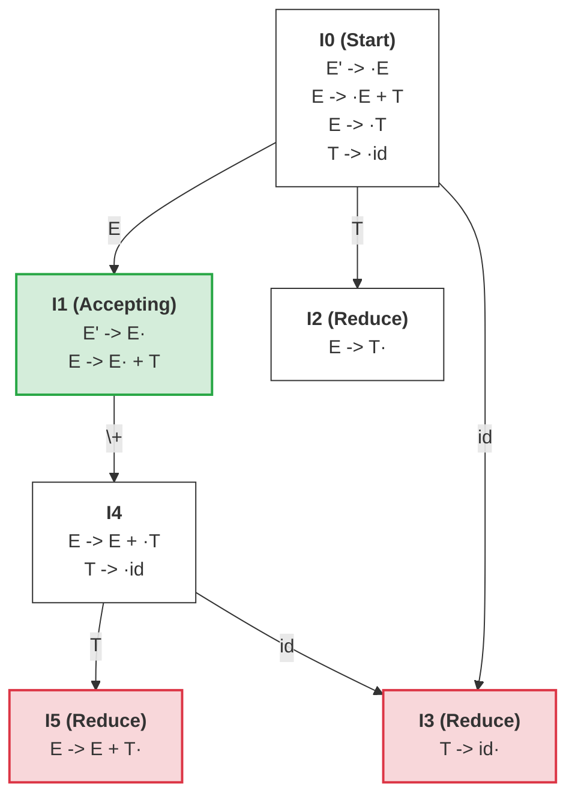

---
aliases:
- LR项目集DFA（LR Item Sets DFA）
- LR项目集 DFA
- LR Item Sets DFA
- LR项目集DFA
- LR Itemset DFA
- LR项目集DFA：合并闭包后的确定性动作转换网
created: 2026-06-12
english: LR Item Sets DFA
source_chapter:
- 5
tags:
- 编译原理
- 语法分析
- 自底向上
- 自动机
title: LR项目集DFA
type: concept
used_in_chapter:
- 5
---
# LR项目集DFA：合并闭包后的确定性动作转换网

> English: **LR Item Sets DFA**

**LR 项目集 DFA** 说白了就是我们**“把所有分身聚拢在安全防护站后，绘制出来的终极确定性导航地图”**。它是消除项目 NFA 内部空跳转传送门之后，将所有可能同时处于的项目用围栏圈在一起（合并为状态/项目集），由状态和唯一的跳转线构成的确定性自动机。

---

## 🚗 直觉比喻：大路合一的“安全防护站地图” (Safe Station Atlas)

> [!NOTE]
> 为了消解 NFA 的分身混乱，DFA 进行了大刀阔斧的“合并重组”：
> 
> *   **防护站节点（项目集 / DFA 状态）**：状态机不再允许分身四处乱跑。它把你在某一时刻能够通过“瞬移传送门（$\varepsilon$ 边）”到达的所有分身（微观项目节点）全部圈定在一个围栏内，合并为一座统一的**“安全防护站”**（即项目集）。
> *   **单向指示路牌（跳转边 GOTO）**：从当前的防护站出发，一旦读到符号 $X$，所有人必须一起沿着指定的道路前进，到达下一座唯一的防护站。由于消除了所有的空转移传送门，路标是完全唯一的。
> *   **终极导航图（状态机）**：这张由各大防护站以及它们之间单向路牌构成的网络，就是分析器在解析代码时闭眼开车的“终极导航地图”。只要顺着路牌走，分析器就绝对不会迷失在分身中。

---

## 核心特征

*   **状态（节点）**：DFA 的每一个节点都是一个 **项目集**（即若干个 [[LR(0)项目]] 或 [[LR(1)项目]] 的集合，也就是活前缀的等价状态类）。
*   **转移（边）**：节点之间的连线由 [[跳转函数]]  $GOTO(I, X)$  决定，其中  $X$  可以是终结符或非终结符。
*   **确定性**：面对任何一个当前状态和输入字符，DFA 都能给出 **唯一确定** 的下一步走向或归约动作，不会产生非确定性的空跳转。

---

## DFA 的构建算法

通过 [[闭包运算]] 和 [[跳转函数]]，可以使用以下算法迭代构建完整的项目集 DFA：

```text
1. 从增广文法的初始项目出发，计算初始状态：
   I_0 = CLOSURE({S' -> ·S})

2. 对于每个已加入规范族但尚未处理的状态 I_i：
     对于文法中的每个符号 X（终结符或非终结符）：
       J = GOTO(I_i, X)
       如果 J 非空且 J 是一个新的项目集：
         将 J 作为新状态加入状态机中
       如果在 I_i 与 J 之间无连线，则添加一条标记为 X 的有向边
       
3. 重复步骤 2，直到没有新的状态和转移边被发现（算法收敛）。
```

---

## 示例：一个完整的 LR(0) DFA

对于增广文法：
1. $E' \to E$
2. $E \to E + T$
3. $E \to T$
4. $T \to \text{id}$

构造出的项目集 DFA 如下：



*(注：在状态 $I_4$ 接收输入字符 `id` 进行跳转时，转移到的目标项目集依然是 $\{T \to \text{id}\cdot\}$。为了精简 DFA，直接让其指回已存在的等价状态 $I_3$，而无需新建重复的物理状态。)*

---

## DFA 与 LR 分析表的映射关系

DFA 是生成 [[ACTION表]] 和 [[GOTO表]] 的直接数据源：

*   DFA 的每个状态  $I_i$  对应分析表的 **第 $i$ 行**。
*   DFA 中标记为 **终结符**  $a$  的跳转边（如  $GOTO(I_i, a) = I_j$ ）对应  $ACTION[i, a] = s_j$ （移进动作）。
*   DFA 中标记为 **非终结符**  $A$  的跳转边（如  $GOTO(I_i, A) = I_j$ ）对应  $GOTO[i, A] = j$ （状态跳转）。
*   DFA 状态中包含 **归约项目**  $A \to \alpha \cdot$  且满足分析算法拦截要求时，在相应列填入  $r_k$ （归约动作）。
*   DFA 状态中包含接受项目  $S' \to S \cdot$  且面临结束符  $\text{＄}$  时，填入  `acc` （接受）。

DFA 是通过 **[[子集构造法]]** 从 [[NFA]]（即把所有 LR 项目相互连线得到的非确定有限状态自动机）转换而来的。这个过程将 NFA 中因  $\varepsilon$  边产生的非确定性全部消解，合并为一个确定性的状态机。
