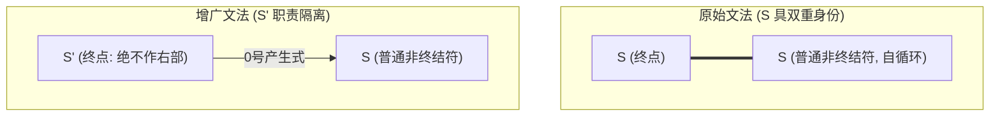

---
aliases:
- 增广文法（Augmented Grammar）
- Augmented Grammar
- 增广文法
- 增广文法：引入唯一终点以判定成功接收的机制
created: 2026-06-10
english: Augmented Grammar
source_chapter:
- 5
tags:
- 编译原理
- 语法分析
- 自底向上
title: 增广文法
type: concept
used_in_chapter:
- 5
---
# 增广文法：引入唯一终点以判定成功接收的机制

> English: **Augmented Grammar**

**增广文法**说白了就是**“在环形跑道外面，额外拉出的一条‘一次性冲线带’”**。为了让分析器在走到最后时拥有唯一确定的“终点线”，我们人为给文法最前面添加一条产生式规则（通常是 $S' \to S$，作为 0 号产生式）。它是构造任何 LR 系列状态机的首要工作。

---

## 🧠 双轨直觉：环形跑道与“一次性冲线带”

> [!NOTE]
> **终点线与跑道圈数的冲突（大白话通俗解释）**
> 
> 设想一场在环形跑道上进行的马拉松比赛，跑道的起点和中间交汇点都是大门 $S$：
> *   **裁判的困惑**：当选手跑过大门 $S$ 时，裁判会陷入极大的纠结——这位选手是跑完了全程（应该停下宣布获胜，即归约 `acc`），还是仅仅跑完了一圈，需要继续往下跑（移进 `shift`）？
> *   **解决办法**：增广文法就是裁判在环形跑道的大门之外，专门拉出的一条**“一次性冲线带 $S'$”**。选手的终极目标不再是含糊不清的 $S$，而是冲过那条只允许冲一次的 $S' \to S$。一旦冲过这根红线，比赛立刻宣告圆满结束，分析器直接判定接受（`acc`）。

---

## 🛠️ 具体做法

给定原始文法 $G$，其起始符号为 $S$。我们人为创造一个全新的、不曾存在于文法中的起始符号 $S'$，并在规则集的最前方增加一条产生式：

$$
S' \to S
$$

这条新规则在语法分析表（[[ACTION表]]）中通常被约定为 **0 号产生式** ，也是判定整个输入串被 **接受（Accept, `acc`）** 的唯一依据。

---

## 🔍 核心痛点：为什么必须增广？

许多教科书只给出了“为了使分析器有唯一的接受状态”这一模糊说法，其背后的数学本质是为了 **彻底消解起始符号在产生式右部的“自归约环路”与“移进/归约二义性”** 。

### 1. 致命缺陷：起始符号右部自归约冲突
假设有原始文法 $G$（起始符号为 $S$）：
$$
S \to S a \mid b
$$

这是一个合法的左递归文法。如果我们不进行增广，直接对其构建 [[LR(0)项目]] 和 DFA：
- 我们必须从 $S \to \cdot S a$ 和 $S \to \cdot b$ 开始构建闭包。
- 经过状态转移后，会产生一个状态 $I$，其中包含项目：
  - $S \to S \cdot a$（当面临输入 $a$ 时，需要执行 **移进** `s`）
  - 同时，因为 $S$ 是起始符号，当面临输入 `$`（结束符）时，按照定义我们应当 **接受并结束分析** 。

然而，如果面临的输入就是 $a$，且我们已经将当前的缓冲区规约为起始符号 $S$，分析器该如何抉择？
*   如果选择 **移进 $a$** ：则意味着当前的 $S$ 只是一个子结构（即 $S \to S a$ 的左半部分）。
*   如果选择 **接受 `acc`** ：则意味着这已经完成了对起始符号的推导。

由于 $S$ 既是 **代表分析结束的“神圣起始符”** ，又是 **可以参与右部组合的“普通非终结符”** ，分析器就会在状态 $I$ 产生二义性冲突，无法确定何时能够安全停下。

---

## 🧱 增广文法的解决之道

通过引入 $S' \to S$，我们实现了“职责分离”：

### 完美的确定性逻辑：
1.  **绝不作右部** ：新的起始符号 $S'$ **永远不会出现在任何产生式的右侧** 。
2.  **唯一的 acc 项目** ：DFA 中将只存在一个唯一的状态（包含项目 $S' \to S \cdot$）有资格触发 `acc` 动作。
3.  **精准锁定** ：当且仅当分析器在状态 $I$ 遇到项目 $S' \to S \cdot$ 且下一个输入字符为 `$` 时，执行 `acc`。此时，栈里只剩下了 $S'$，分析绝对安全、确定地终止。

---

## 📐 形式化定义

给定原始上下文无关文法（CFG）为四元组：
$$
G = (V_N, V_T, P, S)
$$

其对应的增广文法 $G'$ 定义为：
$$
G' = (V_N \cup \{S'\}, V_T, P \cup \{S' \to S\}, S')
$$

其中：
*   $S'$ 是新引入的非终结符，且满足 $S' \notin V_N$。
*   $S' \to S$ 是新增的第一条产生式规则（通常标记为产生式 0）。

---

## 📝 考试避坑要点

> [!CAUTION] 易错点 1：忘写 0 号产生式进行 DFA 状态计算
> 在考卷上写“构造项目集规范族”时，第一步 **必须先写出增广文法** 。如果漏掉 $S' \to S$，在后续计算 $I_0$ 的闭包时，就会丢失 $S' \to \cdot S$ 这个最重要的“种子项目”，导致整个 DFA 少了关键的接受态转移，直接扣掉大半动作分。

> [!IMPORTANT] 易错点 2：acc 填表的行与列定位
> 在填写 [[ACTION表]] 时：
> - 找到包含项目 $S' \to S \cdot$ 的状态 $I_k$。
> - 只有在第 $k$ 行、 **`$` 列** （结束符列）的交叉格子里填入 `acc`。千万不要填在普通终结符列，也不要填在 GOTO 表中。

---

## 🔗 关联原子概念
*   本概念用于指导 [[DFA]] 状态机和 [[项目集规范族]] 的第一步构建。
*   决定了 [[ACTION表]] 中 `acc` 动作格子的最终填入状态。
