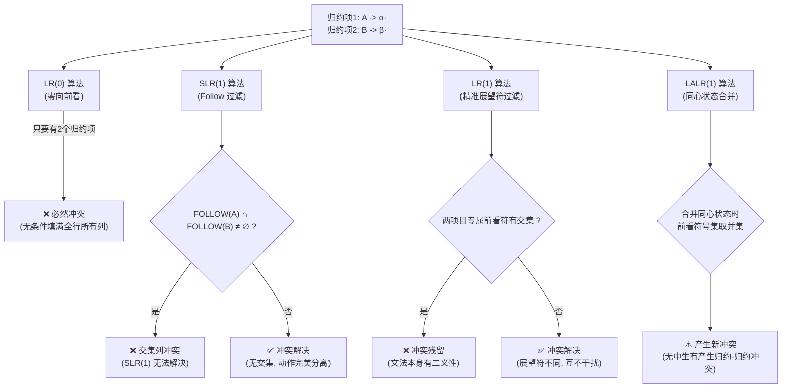

---
aliases:
- 归约-归约冲突（Reduce-Reduce Conflict）
- Reduce-Reduce Conflict
- 归约-归约冲突
- 归约-归约冲突：面对同批零件能拼成多种成品的混乱状态
created: 2026-06-10
english: Reduce-Reduce Conflict
source_chapter:
- 5
tags:
- 编译原理
- 语法分析
- 自底向上
- 冲突分析
title: 归约-归约冲突
type: conflict
used_in_chapter:
- 5
---
# 归约-归约冲突：面对同批零件能拼成多种成品的混乱状态

> English: **Reduce-Reduce Conflict**

---

## 1. 🌟 大白话通俗解释 (核心直觉)

> [!TIP]
> **多头经理比喻：**
> 想象你在公司里是一个初级行政人员，办公桌上放着一份填好的“请假条模板”。这时有两个不同部门的经理同时给你发了指示：
> * **部门经理 A** 吩咐：“如果你看到桌上有填好的请假条，立刻打包送往 **行政部 ($A$)** 。”
> * **部门经理 B** 吩咐：“如果你看到桌上有填好的请假条，立刻打包送往 **财务部 ($B$)** 。”
> 
> 现在你手里拿着请假条，看着这两个逻辑都说得通的指令，彻底陷入了纠结——我究竟该送往行政部，还是财务部？这种两个规则抢着要归并栈顶符号的困局，在编译原理中就是 **归约-归约冲突** 。

- **一句话总结** ：分析器在当前状态下，发现栈顶已匹配的内容同时满足两条不同产生式的右部，且下一个符号允许它们同时发生归约，导致不知道用哪条规则来合并的歧义。

---

## 2. 📝 学术规范定义 (考试硬核)

### 形式化数学定义
在 LR 分析表的构建中，当一个项目集状态（DFA 状态）中 **同时存在** 两个或以上的归约项目时，即构成归约-归约冲突的潜在条件：

1. **归约项目 1** ：
   $$
   A \to \alpha \cdot \quad (A \neq S')
   $$
2. **归约项目 2** ：
   $$
   B \to \beta \cdot \quad (B \neq S')
   $$

如果存在某个下一个输入符号 $a$，使得分析器在状态中既可以按 $A \to \alpha$ 归约，也可以按 $B \to \beta$ 归约，则在分析表的该状态第 $a$ 列中同时填入两个归约动作（如 $r_i / r_j$），发生冲突。

---

### 冲突在各算法下的表现

#### 1. LR(0)：毫无抵抗力
LR(0) 无向前看能力。只要状态中同时存在两个归约项目，分析表整行的所有终结符和结束符列上都会同时填入 $r_i$ 和 $r_j$， **百分之百发生归约-归约冲突** 。

#### 2. SLR(1)：基于 $\text{FOLLOW}$ 集的“全局区分”
SLR(1) 规定仅在输入符号属于产生式左部非终结符的 $\text{FOLLOW}$ 集合时才填入归约动作。
* **判定规则** ：
  * 若 $\text{FOLLOW}(A) \cap \text{FOLLOW}(B) = \varnothing$，则 SLR(1) 能够完美分离动作， **冲突解决** 。
  * 若 $\text{FOLLOW}(A) \cap \text{FOLLOW}(B) \neq \varnothing$，则在交集元素对应的列中依然同时存在两个归约动作， **冲突残留** 。

#### 3. LR(1)：基于项目专属“展望符（Lookahead）”的精确剥离
LR(1) 项目的形式为 $[A \to \alpha\cdot, a]$。
* **判定规则** ：
  只有当两个项目的专属前看符号集合有交集时才会冲突。由于前看符号是顺着语法推导局部传递的，其区分度比全局的 $\text{FOLLOW}$ 集高得多，能解决绝大部分 SLR(1) 遗留的归约-归约冲突。

#### 4. LALR(1)：“无中生有”的新冲突引入
LALR(1) 将 LR(1) 中核心项相同的同心状态进行合并，前看符号集取并集。
* **副作用** ：
  由于并集的引入，原本在 LR(1) 中由于前看符号不同而被成功分离在两个不同状态中的归约项目，合并后可能会在同一个状态中获得相同的展望符，从而 **无中生有地产生新的归约-归约冲突** 。

---

## 3. 🎯 应试痛点与解题模板 (拿分关键)

> [!IMPORTANT]
> **考试证明文法不是 LR(0) / SLR(1) / LR(1) / LALR(1) 的解题步骤与学术话术：**
> 
> * **第一步** ：构造增广文法，画出 DFA 状态机，定位并列出包含两个或以上归约项目的状态 $I_k$：
>   $$
>   I_k = \{ A \to \alpha \cdot, \; B \to \beta \cdot \}
>   $$
> * **第二步** ：计算相关的向前看集合（LR(0)/SLR(1) 计算 $\text{FOLLOW}$，LR(1)/LALR(1) 追踪专属 $\text{Lookahead}$）。
> * **第三步** ：应用规范学术话术判定并下结论。

### 🗣️ 考场高分应试话术模板

#### 1. 证明文法不是 LR(0) 归约-归约冲突话术
> **话术模板**：
> “在活前缀识别自动机（DFA）中，状态 $I_k$ 同时包含归约项目 $A \to \alpha \cdot$ 和 $B \to \beta \cdot$。由于 LR(0) 分析表在构建时不支持任何向前看，该状态在面临**所有**输入符号时都会同时填入按产生式 $A \to \alpha$ 与 $B \to \beta$ 进行归约的动作。此时分析表在整行单元格中均存在 **归约-归约冲突（Reduce-Reduce Conflict）**，因此该文法不是 LR(0) 文法。”

#### 2. 证明文法不是 SLR(1) 归约-归约冲突话术
> **话术模板**：
> “在自动机状态 $I_k$ 中，同时存在归约项目 $A \to \alpha \cdot$ 和 $B \to \beta \cdot$。首先求得两个非终结符的全局 FOLLOW 集合为：$\text{FOLLOW}(A) = \{\dots\}$，$\text{FOLLOW}(B) = \{\dots\}$。
> 计算其交集 $\text{FOLLOW}(A) \cap \text{FOLLOW}(B) = \{ a \}$。因为交集非空，当输入符号为 $a$ 时，分析表项 $ACTION[k, a]$ 会同时填入按 $A \to \alpha$ 归约和按 $B \to \beta$ 归约两个动作，产生了 **归约-归约冲突**，因此该文法不是 SLR(1) 文法。”

#### 3. 证明文法是 LR(1) 但不是 LALR(1) 话术
> **话术模板**：
> “在 LR(1) 分析阶段，状态 $I_x$ 包含项目 $[A \to \alpha \cdot, a]$ 与 $[B \to \beta \cdot, b]$，状态 $I_y$ 包含项目 $[A \to \alpha \cdot, b]$ 与 $[B \to \beta \cdot, a]$。由于其专属前看符号集合均不交，在 LR(1) 分析中不存在任何冲突。
> 然而，由于这两个状态的 LR(0) 核心相同，LALR(1) 算法会将其合并为新状态 $I_{xy}$，且前看符号取并集得到 $[A \to \alpha \cdot, \{a, b\}]$ 与 $[B \to \beta \cdot, \{a, b\}]$。此时在面临输入 $a$ 或 $b$ 时，分析表项 $ACTION[xy, a]$ 与 $ACTION[xy, b]$ 均同时指向两个不同的归约产生式，产生 **归约-归约冲突**。因此，该文法是 LR(1) 文法，但不是 LALR(1) 文法。”

---

### 📝 经典应试例题

#### 例题 1：最简归约-归约冲突分析
考虑文法：
$$
S \to A a \mid B a
$$
$$
A \to c
$$
$$
B \to c
$$

##### 1. 构造状态机
在初始状态 $I_0 = \text{CLOSURE}(\{ S' \to \cdot S \})$ 中：
* $S' \to \cdot S$
* $S \to \cdot A a$
* $S \to \cdot B a$
* $A \to \cdot c$
* $B \to \cdot c$

当输入为终结符 $c$ 时，状态跳转至 $I_1 = \text{GOTO}(I_0, c)$：
* $A \to c \cdot$ (归约项 1)
* $B \to c \cdot$ (归约项 2)

##### 2. 冲突判定
* **LR(0)** ：在状态 $I_1$ 中无条件归约，在所有输入列（如 `a` 列）均同时出现对 $A$ 和对 $B$ 的归约，存在 LR(0) 归约-归约冲突。
* **SLR(1)** ：计算 $\text{FOLLOW}(A) = \{ a \}$，$\text{FOLLOW}(B) = \{ a \}$。
  其交集为 $\{ a \} \cap \{ a \} = \{ a \} \neq \varnothing$。
  在输入符号 `a` 列中，依然会同时填入 `r(A->c)` 和 `r(B->c)`。因此， **SLR(1) 依然无法解决该冲突** ，文法不是 SLR(1)。

---

#### 例题 2：LALR(1) 合并同心状态“无中生有”产生冲突（高频难点）
考虑文法：
$$
S \to a A d \mid b B d \mid a B c \mid b A c
$$
$$
A \to e
$$
$$
B \to e
$$

##### 1. LR(1) 分析阶段
在构造 LR(1) DFA 时，我们会得到两个相互独立的同心状态：
* **状态 $I_x$** （对应读入 $a e$ 后）：
  * $[A \to e \cdot, \; d]$
  * $[B \to e \cdot, \; c]$
  *(在输入为 $d$ 时归约为 $A$，在输入为 $c$ 时归约为 $B$，LR(1) 无冲突)*
* **状态 $I_y$** （对应读入 $b e$ 后）：
  * $[A \to e \cdot, \; c]$
  * $[B \to e \cdot, \; d]$
  *(在输入为 $c$ 时归约为 $A$，在输入为 $d$ 时归约为 $B$，LR(1) 无冲突)*

##### 2. LALR(1) 合并阶段
由于 $I_x$ 与 $I_y$ 的核心项相同（均为 $A \to e \cdot$ 与 $B \to e \cdot$），LALR(1) 强制将它们合并为新状态 $I_{xy}$，前看符号集取并集：
* $[A \to e \cdot, \; c/d]$
* $[B \to e \cdot, \; c/d]$

##### 3. 冲突爆发
在新状态 $I_{xy}$ 中，在输入符号为 $c$ 或 $d$ 时：
* 输入为 $c$ 时：既可以归约为 $A$，也可以归约为 $B$。
* 输入为 $d$ 时：既可以归约为 $A$，也可以归约为 $B$。
* **结论** ：合并状态导致了 **“无中生有”地产生归约-归约冲突** 。文法是 LR(1) 的，但不是 LALR(1) 的。

---

### ⚡ 避坑指南与常见考试陷阱

> [!CAUTION] 考试防丢分指南
> 1. **悬挂 Else 绝不是归约-归约冲突** ：
>    在 `if-then-else` 文法中，遇到 `else` 时是“归约 `if-then` ($r$)”还是“移进 `else` ($s$)”的冲突，这属于 **移进-归约冲突** 。千万不要在考卷上把它写成归约-归约冲突。
> 2. **Yacc/Bison 的默认排解机制** ：
>    Yacc/Bison 遇到归约-归约冲突时，默认选择 **在文法文件中最先出现的产生式进行归约** ，但会发出警告。由于这通常意味着文法存在严重二义性，在工程实践中 **必须通过重构文法彻底消除** 。

---

## 4. 🔗 关联上下文 (双链图谱)

* **上级目录/章节** ：[[自底向上语法分析]]
* **孪生/对比概念** ：[[移进-归约冲突]]
* **下级细分/前置依赖** ：[[归约]]、[[LALR(1)分析算法]]、[[FOLLOW集合]]
