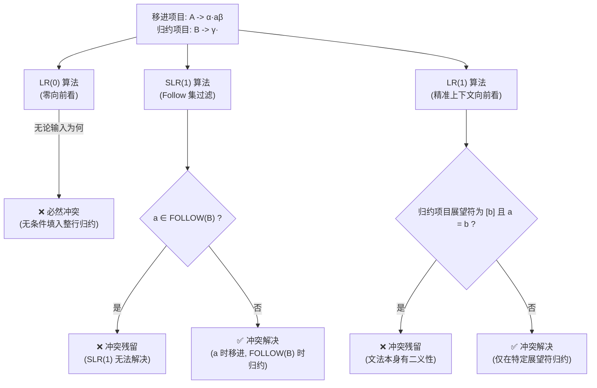

---
aliases:
- 移进-归约冲突（Shift-Reduce Conflict）
- Shift-Reduce Conflict
- 移进-归约冲突
- 移进-归约冲突：既想往前读又想归约的纠结状态
created: 2026-06-11
english: Shift-Reduce Conflict
source_chapter:
- 5
tags:
- 编译原理
- 语法分析
- 自底向上
- 冲突分析
title: 移进-归约冲突
type: conflict
used_in_chapter:
- 5
---
# 移进-归约冲突：既想往前读又想归约的纠结状态

**移进-归约冲突** 说白了就是状态机里**“苹果装箱工人的世纪纠结：我是该继续往里塞新苹果（移进），还是立刻把箱子盖上封好贴标签送走（归约）？”**。在同一个状态下，当分析器面临下一个输入符号时，既可以执行移进往前走，也可以执行归约原地折叠，由于两路都合法，分析器直接卡死。

---

## 1. 🌟 大白话通俗解释 (核心直觉)

> [!TIP]
> **流水线包装工比喻：**
> 想象你在一条苹果包装流水线上工作。你面前摆着一个已经塞了 3 个苹果的箱子，手里拿着第 4 个苹果。同时，传送带前方又送来了一个新的苹果。
> 此时你面临两种选择：
> 1. **移进（继续往里塞）** ：把传送带上新送来的苹果拿起来，塞进当前的箱子（期待它能装更多）。
> 2. **归约（封箱打包）** ：觉得 3 个已经够了，立刻把当前的箱子盖上封好，贴上“苹果箱”标签送走。
> 
> 如果没有明确的规则（比如“每个箱子必须装 4 个”或“看到红苹果就封箱”），你在这一瞬间就会陷入纠结——是该继续往里塞苹果，还是把箱子封口？这种纠结在编译原理中就是 **移进-归约冲突** 。

- **一句话总结** ：分析器在面对下一个符号时，既可以把它吃进栈内（移进），也可以把栈内已有的句柄合并（归约），两路都合法，从而陷入确定性危机的困局。

---

## 2. 📝 学术规范定义 (考试硬核)

### 形式化数学定义
在 LR 分析表的构建中，当一个项目集状态（LR(0) 状态或 LR(1) 状态）中 **同时存在** 以下两个项目时，即构成移进-归约冲突：

1. **移进项目 (Shift Item)** ：
   $$A \to \alpha \cdot a \beta \quad (a \in V_T)$$
   *意为：期待读入下一个终结符 $a$ 执行移进，跳转至下一状态。*
2. **归约项目 (Reduce Item)** ：
   $$B \to \gamma \cdot \quad (B \neq S')$$
   *意为：栈顶已匹配完产生式 $B \to \gamma$，可以执行归约。*

---

### 冲突解决的分水岭：算法能力演进

不同的 LR 分析算法在解决移进-归约冲突时的能力层次有着根本不同：



#### 1. LR(0)：全线崩溃
LR(0) **不支持任何向前看** 。一旦状态中存在归约项目 $B \to \gamma \cdot$，分析表在该行的 **所有终结符和结束符** 上都会填入归约动作 `r`。因此，只要该状态同时存在移进项目，在终结符 $a$ 对应的格子里就会同时出现 `s` 和 `r`，导致 LR(0) 无法解析。

#### 2. SLR(1)：基于 $\text{FOLLOW}$ 集的“全局拦截”
SLR(1) 引入了简单的向前看。它规定：仅当下一个输入符号 $a \in \text{FOLLOW}(B)$ 时，才允许执行归约动作。
* **消解判定** ：
  * 若 $a \notin \text{FOLLOW}(B)$，则输入为 $a$ 时执行 **移进** ，输入为 $\text{FOLLOW}(B)$ 中的符号时执行 **归约** ，冲突被消除。
  * 若 $a \in \text{FOLLOW}(B)$，则在输入符号 $a$ 处冲突依然存在，说明文法不是 SLR(1)。

#### 3. LR(1)：基于项目专属“展望符（Lookahead）”的精准消解
在 LR(1) 中，项目以 $[A \to \alpha \cdot \beta, b]$ 形式存在，带有明确的专属展望符 $b$。
* **消解判定** ：
  归约项目仅在下一个输入符号是 $b$ 时触发归约。因此只有当移进终结符 $a$ 与展望符 $b$ 相同（即 $a = b$）时，才会发生冲突。这使得其消解能力远强于 SLR(1)。

#### 4. Bison / Yacc：工程上的结合性与优先级规则
在实际编译器构建中，文法常带有二义性（如算术表达式）。Bison 使用以下规则解决移进-归约冲突：
1. **优先级比较** ：将移进符号 $a$ 的优先级与归约产生式 $B \to \gamma$ 的优先级（通常由右部最后一个终结符决定）进行对比。高优先级优先。
2. **结合性抉择** ：若优先级相同，若文法声明为 `%left` (左结合) 则优先 **归约** ；声明为 `%right` (右结合) 则优先 **移进** 。
3. **默认应急规则** ：如果用户没有声明优先级 and 结合性，Bison 遇到移进-归约冲突时，默认选择 **Shift (移进)** 。

---

## 3. 🎯 应试痛点与解题模板 (拿分关键)

> [!IMPORTANT]
> **考试证明文法不是 LR(0) / SLR(1) 的标准解题步骤与学术话术：**
> 
> * **第一步：构造增广文法，画出 DFA 状态机**（至少画到出现冲突的状态，确保编号清晰）。
> * **第二步：定位并写出包含冲突的状态 $I_k$**，列出对应的移进项目与归约项目。
> * **第三步：套用学术规范话术进行冲突判定与下结论**（核心高分得分点）。

### 🗣️ 考场高分应试话术模板

#### 1. 证明文法不是 LR(0) 文法话术
> **话术模板**：
> “在增广文法的活前缀识别自动机（DFA）中，状态 $I_k$ 内同时包含移进项目 $[A \to \alpha \cdot a \beta]$（期待移进终结符 $a$）和归约项目 $[B \to \gamma \cdot]$。在 LR(0) 分析表的构建中，状态 $I_k$ 面临输入符号 $a$ 时，既有移进动作 $s_j$（$GOTO(I_k, a) = I_j$），又有无条件归约动作 $r_p$（对应产生式 $B \to \gamma$）。由于在分析表项 $ACTION[k, a]$ 中同时存在移进与归约两个动作，产生了 **移进-归约冲突（Shift-Reduce Conflict）**，因此该文法不是 LR(0) 文法。”

#### 2. 证明文法不是 SLR(1) 文法话术
> **话术模板**：
> “在自动机状态 $I_k$ 中，存在移进项目 $[A \to \alpha \cdot a \beta]$ 和归约项目 $[B \to \gamma \cdot]$。首先求得归约非终结符 $B$ 的全局 FOLLOW 集合为：$\text{FOLLOW}(B) = \{\dots\}$。
> 因为输入符号 $a \in \text{FOLLOW}(B)$，根据 SLR(1) 分析表构造规则，在分析表项 $ACTION[k, a]$ 处，分析器既可以执行移进动作跳转至下一状态，又可执行按产生式 $B \to \gamma$ 进行归约的动作。此时冲突无法被 FOLLOW 集合过滤消除，依然存在 **移进-归约冲突**，因此该文法不是 SLR(1) 文法。”

---

### 📝 经典应试例题

#### 例题 1：经典的 `if-else` 悬挂歧义 (Dangling Else)
考虑文法：
$$S \to \textbf{if} \ e \ \textbf{then} \ S \mid \textbf{if} \ e \ \textbf{then} \ S \ \textbf{else} \ S \mid s_1$$

当分析器遇到如下状态时：
* $S \to \textbf{if} \ e \ \textbf{then} \ S \cdot$ （归约项）
* $S \to \textbf{if} \ e \ \textbf{then} \ S \cdot \textbf{else} \ S$ （移进项）

当面临下一个输入符号为 **`else`** 时：
* 如果执行 **归约** ，则将内层的 `if-then` 合并为一个完整语句，外层的 `else` 归属于外层的 `if`；
* 如果执行 **移进** ，则将 `else` 读入，使 `else` 归属于内层的 `if`。
* **消解方案** ：在语言设计中，我们要求 `else` 与最近的 `if` 配对。Bison 通过其“ **默认移进** ”规则完美匹配了该语义（移进 `else`，使其在后续归约时与内层 `if` 绑在一起）。

#### 例题 2：空产生式文法的移进-归约冲突
在 [[Ex5.2_SLR分析与LR0冲突_空产生式文法]] 中，对于增广文法：
```text
(0) S' → S
(1) S  → S ( S )
(2) S  → ε
```
在状态 **State 1** 中，包含项目：
* $S' \to S \cdot$ （归约项）
* $S \to S \cdot ( S )$ （移进项，面对输入为 `(`）

##### 1. 冲突分析
在面对输入为 **`(`** 时：
* **LR(0)** ：因为不知道展望符，在此状态既可以把栈顶的 $S$ 归约为 $S'$ 结束，也可以将 `(` 移进。这在 `(` 上引发了 **移进-归约冲突** 。因此文法不是 LR(0) 文法。

##### 2. SLR(1) 消除冲突
* 求出 $\text{FOLLOW}(S') = \{ \$ \}$。
* 根据 SLR(1) 规则，归约动作仅能在 $\text{FOLLOW}(S')$ 对应的列（即 `$` 列）填入；移进动作仅在 `(` 列填入。
* 由于 $\{ ( \} \cap \{ \$ \} = \varnothing$，分析表填入结果为：`ACTION[1, (] = s2`，`ACTION[1, $] = acc`。两动作完美分离， **冲突被 SLR(1) 成功解决** 。

---

## 4. 🔗 关联上下文 (双链图谱)

* **上级目录/章节** ：[[自底向上语法分析]]
* **孪生/对比概念** ：[[归约-归约冲突]]
* **下级细分/前置依赖** ：[[移进]]、[[归约]]、[[FOLLOW集合]]、[[ACTION表]]
