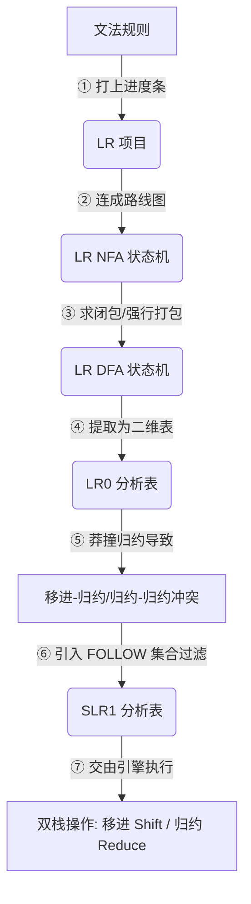
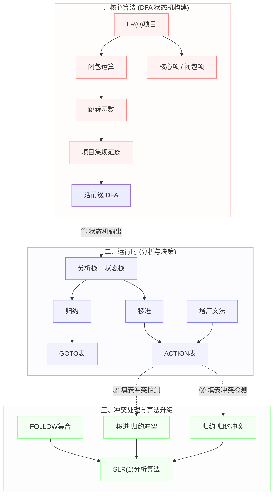

---
aliases:
- 自底向上语法分析（Bottom-Up Parsing）
- Bottom-Up Parsing
- 自底向上语法分析
- 自底向上语法分析：从零件组装成成品的逆向拼装法
created: 2026-06-10
english: Bottom-Up Parsing
source_chapter:
- 5
tags:
- 编译原理
- 语法分析
- 自底向上
title: 自底向上语法分析
type: overview
used_in_chapter:
- 5
---
# 自底向上语法分析：从零件组装成成品的逆向拼装法

> English: **Bottom-Up Parsing**

**自底向上语法分析** 是现代编译器（如 GCC、LLVM、Clang 以及解析器生成器 Yacc/Bison）的灵魂技术。它从输入的单词流（Token 串）出发，通过不断的“合体拼装”，最终逆向构建出语法树的根节点（起始符号）。

与脆弱的自顶向下分析（如 LL(1) 或递归下降）相比，自底向上分析**能力更广**——它能天然吃下**左递归文法**，且支持更大范围的上下文无关文法。

---

## 🗺️ 核心递演链路 (自底向上流水线)

通过以下步骤，编译器将抽象的语法规则一步步转化为可执行的查表程序：

* **一句话链路**：把看似模糊的语法规则，**打上进度条**（项目），**连成路线图**（NFA），**打包成状态节点**（DFA），**提炼为判定表格**（ACTION/GOTO），最后交给**双栈引擎**（状态栈与符号栈）去机械执行。当遇到冲突时，我们通过 **FOLLOW 集合** 进行前瞻过滤，实现从 LR(0) 到 SLR(1) 的平滑升级。

---

## 🚗 双轨直觉：乐高积木的“逆向重组” (Reverse Assembly)

> [!NOTE]
> **乐高城堡的“正向展开” vs. “逆向拼装”（大白话通俗解释）**
> 
> *   **自顶向下 (LL) $\rightarrow$ “按图索骥的拼图”**：
>     给你一张城堡的整体设计图（起始符号 $S$），你从屋顶的塔尖开始，拿着图纸一步步往下预测接下来应该出现什么样的小积木。如果猜错了，必须拆掉重拼（回溯）。
> *   **自底向上 (LR) $\rightarrow$ “废土拼装乐高”**：
>     你手头没有任何拼好的大部件，只有一地散落的乐高积木（Token 流）。你从最底层的小积木开始，把几块积木拼成一个窗户，再把窗户和墙面拼成一栋塔楼，**自底向上、层层合体**。最终，将所有零件收拢归并为唯一的城堡（起始符号 $S$）。

---

## 📐 数学灵魂：最右推导的逆过程 (Rightmost Derivation in Reverse)

自底向上分析在读入 Token 时是**从左往右**进行的，但它的数学实质却是**最右推导的逆过程**。这是期末考试和考研的高频考点，许多初学者在此处容易混淆。

### 1. 为什么是最右推导的“逆”？
在自底向上分析中，我们总是**从左往右扫描**输入，并寻找当前句型中**最左边的可归约子串（即句柄）**进行归约。
当我们把这一步步归约的过程反过来写时，它会完美对应一个**最右推导**（每次都优先替换最右侧的非终结符）。

### 2. 数学推导与实例对照
设文法规则为：
1. $E \to E + T$
2. $E \to T$
3. $T \to T * F$
4. $T \to F$
5. $F \to id$

我们来解析输入串 `id + id * id`。

#### ⬅️ 动作一：自底向上的归约轨迹 (Bottom-Up Reductions)
我们依次在最左侧定位句柄并将其替换（归约）：
$$\underline{id} + id * id \quad \xrightarrow{F \to id} \quad \underline{F} + id * id$$
$$\underline{F} + id * id \quad \xrightarrow{T \to F} \quad \underline{T} + id * id$$
$$\underline{T} + id * id \quad \xrightarrow{E \to T} \quad E + \underline{id} * id$$
$$E + \underline{id} * id \quad \xrightarrow{F \to id} \quad E + \underline{F} * id$$
$$E + \underline{F} * id \quad \xrightarrow{T \to F} \quad E + T * \underline{id}$$
$$E + T * \underline{id} \quad \xrightarrow{F \to id} \quad E + T * \underline{F}$$
$$E + \underline{T * F} \quad \xrightarrow{T \to T * F} \quad \underline{E + T}$$
$$\underline{E + T} \quad \xrightarrow{E \to E + T} \quad E \quad \text{（归约完成）}$$

#### ➡️ 动作二：最右推导的生成轨迹 (Rightmost Derivation)
从起始符号 $E$ 出发，每次都**只展开最右侧的非终结符**：
$$E \Rightarrow \underline{E + T}$$
$$\Rightarrow E + \underline{T * F}$$
$$\Rightarrow E + T * \underline{id}$$
$$\Rightarrow E + \underline{F} * id$$
$$\Rightarrow E + \underline{id} * id$$
$$\Rightarrow \underline{T} + id * id$$
$$\Rightarrow \underline{F} + id * id$$
$$\Rightarrow id + id * id$$

> [!TIP]
> **黄金对照**
> 将“最右推导”的每一步从下往上看，你会发现它与“自底向上归约”的每一步**完全重合**。这就是为什么自底向上分析（如 LR 分析）能够完美重现最右推导的原因。

---

## 🔍 核心要义：句柄 (Handle) 与 活前缀 (Viable Prefix)

自底向上分析的核心在于**“在正确的时间，剪掉正确的树枝”**。这引入了两个关键概念：

### 1. 句柄 (Handle) —— “名正言顺的归约子串”
*   **定义**：一个最右句型中，匹配某产生式右部、且将其替换后能得到上一步最右句型的子串。
*   **避坑指南**：**“匹配产生式右部” $\neq$ “句柄”**。
    例如，在句型 $E + T * id$ 中，虽然 $E+T$ 匹配了产生式 $E \to E+T$ 的右部，但它**不是句柄**！如果此时强行将 $E+T$ 归约为 $E$，句型会变为 $E * id$，而文法根本无法解析这个串。在这个句型中，真正的句柄是右侧的 $id$（它需要先归约为 $F$，再与 $T$ 结合）。

### 2. 活前缀 (Viable Prefix) —— “安全驾驶通道”
*   **直觉比喻**：活前缀是分析栈中内容安全的数学保证。只要分析栈中的符号序列还是一个“活前缀”，就说明**我们目前搭建的地基是绝对安全的**。虽然还没拼装出最终结果，但我们绝对没有拼错任何零件，也没有错过任何归约时机。
*   **定义**：活前缀是不含有当前句柄右侧符号的最右句型前缀。只要栈中内容是活前缀，未来的输入就一定存在某种合法后继，能帮我们顺利归约回起始符号。一旦栈中内容不再是活前缀，说明我们已经“翻车”（发生了无法挽回的语法错误）。

---

## ⚙️ 运行时发动机：移进-归约驱动动作 (Shift-Reduce)

LR 分析器依靠一个**符号-状态栈**和**分析表**（[[ACTION表]] 和 [[GOTO表]]）进行驱动。在运行时，它只做四个动作：

1.  **[[移进]] (Shift)**：
    读入当前的 Token，给它发一张状态角色卡，一起压入栈顶。输入指针向右前移。
2.  **[[归约]] (Reduce)**：
    当栈顶的若干符号刚好凑成句柄时，将它们连同状态一并弹出（弹栈），然后把对应的非终结符压回栈中。通过查询 [[GOTO表]] 指引，将新状态压入栈顶。**此时不消耗输入 Token**。
3.  **接受 (Accept - `acc`)**：
    栈中成功剩下起始符号，且输入流刚好读完（遇到 `$`），宣告分析成功，大戏圆满落幕！
4.  **报错 (Error)**：
    当栈顶状态与输入 Token 在 ACTION 表中对应空白格时，代表发生语法错误，抛出异常。

---

## ⚔️ LL(k) vs LR(k)：两大门派的华山论剑

| 维度特征 | 自顶向下 (LL) | 自底向上 (LR) |
| :--- | :--- | :--- |
| **推导方向** | 从根节点出发 $\to$ 叶子节点 | 从叶子节点出发 $\to$ 根节点 |
| **操作实质** | **展开**（预测替换） | **归约**（收网剪枝） |
| **数学性质** | 寻找**最左推导** | 寻找**最右推导的逆过程** |
| **数据结构** | 隐式/显式调用栈 | 显式符号-状态双栈 |
| **对左递归的支持**| ❌ 必须消除左递归，否则死循环 | ✅ 天然支持左递归（甚至左递归性能更好） |
| **文法表达能力** | 较窄（LL(k) 是 LR(k) 的子集） | 极宽（能识别几乎所有程序设计语言文法） |
| **错误定位** | 发生错误时能立即定位，易于报错 | 定位精准，可延迟到无法再移进/归约时报错 |

---

## 🗺️ 知识图谱全景

自底向上分析是一个极其注重“静态表生成”与“动态栈运行”配合的体系。本图谱的原子概念节点构成了完整的知识网络，您可以通过双链在它们之间直接跳转：

---

## 🗺️ 复习导航

想要深入探索自底向上分析的精髓，建议按照以下路线进行研读：

1.  **DFA 状态机的设计图纸**：
    学习 [[LR(0)项目]] 的形态，以及如何通过 [[闭包运算]] 与 [[跳转函数]] 自动构建 [[项目集规范族]]（活前缀 DFA）。
2.  **运行时的执行动作**：
    深入理解 [[移进]] 与 [[归约]] 的运行时状态变化，以及 [[ACTION表]] 和 [[GOTO表]] 是如何配合指挥它们的。
3.  **冲突的解决与算法升级**：
    掌握当分析器遇到 [[移进-归约冲突]] 与 [[归约-归约冲突]] 时，如何利用 [[FOLLOW集合]] 构建 [[SLR(1)分析算法]]，或者进一步分裂状态升级到高精度的 [[LR(1)分析算法]] 和工程折中的 [[LALR(1)分析算法]]。
